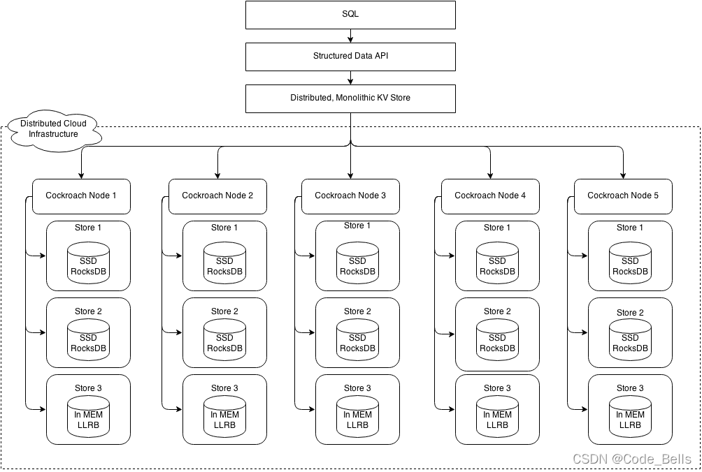
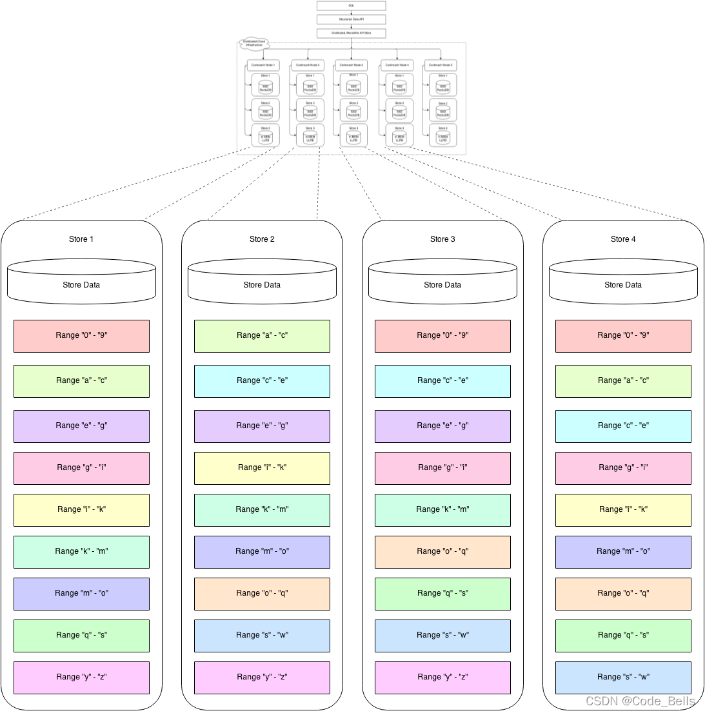
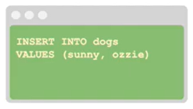
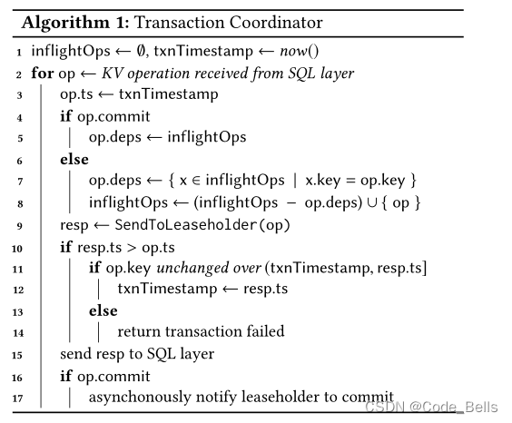

CockroachDB: The Resilient Geo-Distributed SQL Database

以下分享一下个人对于CRDB论文的些许浅见

首先说一点，CRDB只支持Serializable隔离级别，是我目前见到最极端的数据库，只支持这种强隔离级别，可以预见的是，他数据库的吞吐量应该不会太高，但是事务abort率应该也不会高，因为事务执行机制导致事务只能Serializable的隔离级别执行。这种工业级的数据库，强隔离级别的应用场景我觉得可能银行，股票这些比较适合吧？适用场景或许不是很多？

YugaByteDB和CRDB都是源于Google的Spanner，以后会看看YugaByteDB的论文

接下来看看CRDB论文，原文地址https://dl.acm.org/doi/pdf/10.1145/3318464.3386134

# 主要贡献

1.合理存放数据，性能，容错

2.支持一致且快速的Geo-distributed 事务

### 两个重点

write pipeline

parallel commit

# 架构

经典的分层架构，分别是为SQL层，事务KV层，Distribution层，Replication层，Storage层。如下图所示

**SQL层** 用于将用户SQL操作解析成对底层KV存储的操作

**事务KV层** 用于保证原子性和隔离级别，KV层可以对应多个存储层，分布式KV存储可以由任意数量的CockroachDB物理节点组成，即每个节点包含一个或多个Store

**Distribution层** 用于索引分区，查找物理地址用，将数据按一定逻辑分成最大不超过64Mb的块

**Replication层**，raft保证一致性和容错

**Storage层**，使用的是rocksDB(LevelDB变体)的存储，后来改成了pebble了，而每个Store包含多个Range，Range为KV层数据管理的最小单元，每个Range的多个副本之间使用Raft协议进行同步。如下图所示，每个Range有3个副本，同一Range的副本用相同颜色标识，副本之间使用Raft协议同步。

具体的事务执行过程是这样的

用户SQL请求=>KV读写请求=>distribution层路由请求=>找到leader节点=>磁盘读写

# 事务模型

### write pipeline以及parallel commit

我认为可以用一个例子解释这两个点

这一个SQL语句，通过SQL层转化为KV语句如下 

进行如下图所示的过程

右边的就是优化后的执行流程，原本执行流程是需要在sunny写完之后，leader节点返回ack信号表示写成功了，再进行写入下一个Ozzie，但是写流水线操作，就不需要等待，两个可以并行进行，sunny和Ozzie同时写，并且commit操作也是一个并行的，不需要和原来的一样，等到两个都返回写入成功了，再进行commit，但是不同的是，他并不是直接commit，他是发送的一个staged，表示我想要提交这些写入操作，然后在leader都返回写入成功的时候，这个stage也就会返回commit成功，然后这个事务才真正提交了。这样的话就会减少很多往返的等待时间。

write pipeline指的就是write Ozzie和write sunny以流水线的方式进行执行，parallel commit指的就是写入成功后就会发送一个可以提交这个写入操作的staged，等到所有都返回后，leader就会直接提交成功。

伪代码在论文中有提到，我们可以对其进行阅读

inflightOPs代表的是有依赖的操作，如果事务未提交(第6行)，那么当操作没有和前面的事务有依赖的情况可以立刻提交staged(第7行)，如果当操作和前面的操作有依赖关系就必须等待，会把当前的操作设置为inflight(第8行)。接下来coordinator吧op发给leaseholder等待回应(第9行)，response会包括一个时间戳(第10行)，这个时间戳可能会因为其他的事务读操作而进行调整，如果当前时间戳和response返回的时间戳之间这个数据没有被更改(第11行),就可以进行调整(第12行)，否则事务就失败了(第14行)，可能会进行事务重试，或者直接abort。如果提交了那就可以异步的通知leaseholder提交了(第17行)，这就是一个commit parallel。如果当前没有还在等待的op了，即全部都已经可以commit了，事务提交(第5行)

分享到这，各位应该对CRDB的和别人不太一样的东西有了了解。更详细的东西，可以去看看原文。

希望能帮助到大家。
