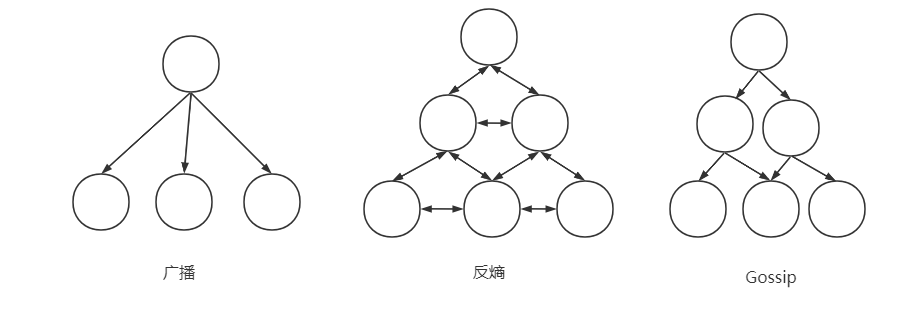
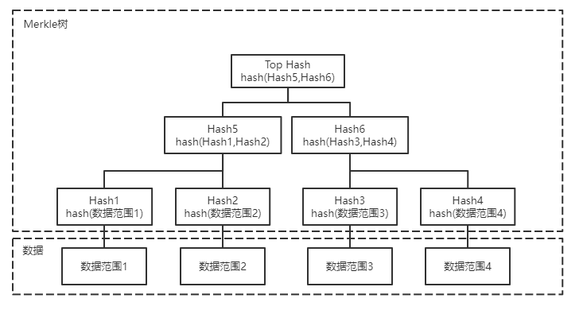

为了在整个分布式系统可靠的传播数据记录，我们需要传播节点本身是可用，并且可访问其他节点，这种的瓶颈明显在于传播数据的节点的吞吐量和带宽。快速可靠的传播所有数据在分布式系统就显得很难实现，但是我们可用仅快速传输某些急需的，重要的数据，来保证系统的性能，例如成员信息，节点状态，结构变更等，这些信息一般出现频率不高，但是需要快速被传播，这种更新传播一般有三种方法

- 广播，一个点广播给所有其他节点
- 反熵，定期点对点交换，存在一些信息交换组，在信息交换组中两点互相更新消息
- Gossip，合作广播，类似树状结构，一层一层的广播，每层可并行，这样可用把广播的时间复杂度N降为LogN

广播虽然最简单直接，但是一旦节点数量过多，广播的代价就显得很大，而且过度依赖一个节点，而且广播信息也很不可靠。

反熵可用允许某些节点传输失败，因为反熵会让节点之间重新同步，这样每个节点都有传播的责任。熵是一种衡量系统无序程度的属性，一般来说希望熵越低越好。

# 读修复

读取时最容易检测副本的差异，因此可以读多个副本，对比每个副本的查询结果，对结果进行检查，一般只限于查询客户端的请求，协调者执行这种读取时一般是乐观的去读取，如果响应不同，会将结果更新给相应的副本，这就是读修复。和[可调一致性](https://codebells.github.io/post/distribute-basic.html#%E5%8F%AF%E8%B0%83%E4%B8%80%E8%87%B4%E6%80%A7)很像，但是读修复需要将不一致的副本修复，而可调一致性不需要修复数据副本。读修复可以阻塞或者异步，因实现方法而异。

# 摘要读

实际上就是检查副本之间是否存在差异，通过发送请求并且通过本地副本计算哈希值，然后发送给协调者，协调者比对所有收到的哈希值是否相同，如果相同，那么所有副本一致，如果不同，则能判断存在副本不一致情况，但是不能确定在哪个节点滞后。通常使用非加密哈希来实现，因为需要尽快算出摘要判断。

# 提示移交

是一种写侧修复机制，当目标节点没有成功写入的时候，写入协调者或者某个副本会存放一条记录表示目标节点未写入成功，作为一个提示，当目标节点恢复后，这个记录会被立刻重放过去。

# Merkle树

在许多数据库中用于降低数据比对的成本。Merkle树是一个由哈希值构成的树。最底层的哈希值是通过扫描整个表的对应范围数据进行哈希得到的，而高层的哈希值是通过对下一层的某个范围进行哈希得到，从而建立一个层次结构，能够时间复杂度log级别检测不一致，缩小不一致的范围。

要确定两个副本之间是否存在不一致，只需要比较Merkle树的根节点哈希值即可，通过自顶向下比较，则可找到节点间存在差异的数据范围，进行修复。有一个缺点，因为Merkle树是自底向上进行生成的，所以当数据变更后，会触发整个子树的哈希值变化。

# 位图版本向量

Bitmap version vector，基于最新更新情况来解决数据冲突。

每次写入由某个协调者协调，由节点n协调的节点本地序列号为i的事件表示为(i,n)。序列号i从1开始，每次节点执行写则递增。节点本地使用本地逻辑时钟，表示该节点直接看到(该节点作为协调者)或者间接看到(其他节点协调并复制过来的)的写入。本身协调的事件是不会存在间隙的，而由别的节点协调复制过来的，则会包含间隙，为了弥补间隙，会让两个节点同步逻辑时钟，并将缺失的间隙补全。例如图，3个节点P1-P3，P1的3个数据无间隙，从别的节点复制过来5 7两个逻辑时钟的数据，这时存在间隙，那么将和其他节点进行同步，补全这间隙，此时的状态可表示为$ P_1 {\rightarrow}(3,0101_2) $其中，3代表同步到逻辑时钟3，后续的二进制0101代表3之后的4个位置分别是无数据，有数据，无数据，有数据，即看到其他节点的逻辑时钟为5 7的值，同理可知$ P_2 {\rightarrow}(1,011001_2) $$ P_3 {\rightarrow}(2,0011_2) $

上述都是反熵的各种方法。

# Gossip传播

Gossip协议是一种概率性的通信过程，类似于谣言和疾病传播方式，只要还有想听(易感染)的人，谣言(疾病)就会继续传播。持有需要传播记录的进程称之为有***传染性的***，而任何尚未收到更新的进程称为***易感染的***。传染性的进程经过一段时间后的主动传播后，不再传播新的状态，称之为***已删除的***。所有进程都从易感染的开始，每当某个数据记录到达之后，状态转换为有传染性的，开始将更新分发给其他随机的相邻进程，一旦传染性的进程确定更新已经传播，那么就会变成已删除状态。

Gossip协议的效率取决于在将发送冗余消息的开销保持最低的情况下，能多快的感染尽可能多的节点。

多用于在大规模系统中可靠的分发消息，检测故障，维护成员信息。

> 参考《数据库系统内幕》 Alex Petrov
