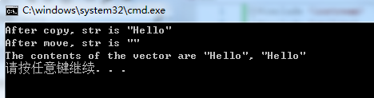
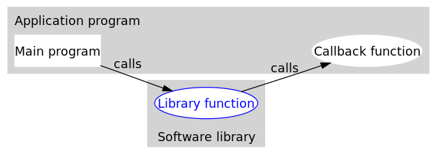

# 智能指针

C++98/03 标准中，支持使用 auto_ptr 智能指针来实现堆内存的自动回收；C++11 新标准在废弃 auto_ptr 的同时，增添了 unique_ptr、shared_ptr 以及 weak_ptr 这 3 个智能指针来实现堆内存的自动回收。

C++ 智能指针底层是采用**引用计数**的方式实现的。

简单的理解，智能指针在申请堆内存空间的同时，会为其配备一个整形值（初始值为 1），每当有新对象使用此堆内存时，该整形值 +1；反之，每当使用此堆内存的对象被释放时，该整形值减 1。当堆空间对应的整形值为 0 时，即表明不再有对象使用它，该堆空间就会被释放掉。

## shared_ptr\<T>

shared_ptr\<T> 类模板中，提供了多种实用的构造函数

```c++
std::shared_ptr<int> p1;             //不传入任何实参
std::shared_ptr<int> p2(nullptr);    //传入空指针 nullptr
std::shared_ptr<int> p3(new int(10));// 在构建 shared_ptr 智能指针，明确其指向。
std::shared_ptr<int> p3 = std::make_shared<int>(10);//C++11 标准中还提供了 std::make_shared<T> 模板函数，可以用于初始化 shared_ptr 智能指针
//调用拷贝构造函数
std::shared_ptr<int> p4(p3);//或者 std::shared_ptr<int> p4 = p3;
//调用移动构造函数
std::shared_ptr<int> p5(std::move(p4)); //或者 std::shared_ptr<int> p5 = std::move(p4);
```

&(*xxx_ptr\<T>)将智能指针转换为普通指针，与xxx_ptr\<T>.get()相同

# std标准库

## 左值右值

简单意义上来说，左值就是等式左边的值，右值就是等式右边的值。

一般意义上来说，

左值是表达式结束后依然存在的持久对象(代表一个在内存中占有确定位置的对象)

右值是表达式结束时不再存在的临时对象(不在内存中占有确定位置的表达式）

便携方法：对表达式取地址，如果能，则为左值，否则为右值

**无论左值引用类型的变量还是右值引用类型的变量，都是左值，因为它们有名字。**

### 左值引用

```text
int a = 10;
int &b = a;  // 定义一个左值引用变量
b = 20;      // 通过左值引用修改引用内存的值
// int &b = 10;是无法编译的，因为10是右值
const int &var = 10;//可以通过编译，因为这属于是常引用来引用常量数字10
//此刻内存上产生了临时变量保存了10，这个临时变量是可以进行取地址操作的，因此var引用的其实是这个临时变量
```

左值引用在汇编层面其实和普通的指针是一样的；定义引用变量必须初始化，因为引用其实就是一个别名，需要告诉编译器定义的是谁的引用。

### 右值引用

```text
int &&var = 10;
```

右值引用用来绑定到右值，绑定到右值以后本来会被销毁的右值的生存期会延长至与绑定到它的右值引用的生存期。

在汇编层面右值引用做的事情和常引用是相同的，即产生临时量来存储常量。但是，唯一 一点的区别是，右值引用可以进行读写操作，而常引用只能进行读操作。

右值引用的存在并不是为了取代左值引用，而是充分利用右值(特别是临时对象)的构造来减少对象构造和析构操作以达到提高效率的目的。

## std::move()

通过调用std::move函数来**获得绑定到左值上的右值引用**

```c++
#include <iostream>
#include <utility>
#include <vector>
#include <string>
int main()
{
    std::string str = "Hello";
    std::vector<std::string> v;
 
    // uses the push_back(const T&) overload, which means 
    // we'll incur the cost of copying str
    v.push_back(str);
    std::cout << "After copy, str is \"" << str << "\"\n";
 
    // uses the rvalue reference push_back(T&&) overload, 
    // which means no strings will be copied; instead, the contents
    // of str will be moved into the vector.  This is less
    // expensive, but also means str might now be empty.
    v.push_back(std::move(str));
    std::cout << "After move, str is \"" << str << "\"\n";
    std::cout << "The contents of the vector are \"" << v[0]
                                         << "\", \"" << v[1] << "\"\n";
}
```

move告诉编译器：我们有一个左值，但我们希望像一个右值一样处理它。我们必须认识到，调用move就意味着：除了对 str 赋值或销毁外，我们再使用它。在调用move之后，我们不能对moved-from对象（即str）做任何假设。

上述程序执行结果为



## std::forward

完美转发

std::forward会将输入的参数原封不动地传递到下一个函数中，这个“原封不动”指的是，如果输入的参数是左值，那么传递给下一个函数的参数的也是左值；如果输入的参数是右值，那么传递给下一个函数的参数的也是右值。

### 原理

`std::forward`定义如下：

```cpp
template<class _Ty>
_NODISCARD constexpr _Ty&& forward(remove_reference_t<_Ty>& _Arg) noexcept
{	// forward an lvalue as either an lvalue or an rvalue
	return (static_cast<_Ty&&>(_Arg));
}

CData* Creator(T&& t)
{
	return new CData(std::forward<T>(t));
}
12345678910
```

1. 如果T为`std::string&`,那么`std::forward<T>(t)` 返回值为`std::string&&&`, 折叠为`std::string&`，左值引用特性不变。
2. 如果T为`std::string&&`,那么`std::forward<T>(t)` 返回值为`std::string&&&&`, 折叠为`std::string&&`，右值引用特性不变。
3. 如果调用者为`std::string`,调用将会转换成为`std::string&`，为类型1.

# folly库

Facebook开源的基于C++14的库，在facebook内部广泛使用。Folly的全称为Facebook Open-source Library，目的不是为了替代标准库，而是对标准库的一种补充，尤其是大规模下的性能。

边记录接触到的组件

## Futures

[promise/future](https://github.com/facebook/folly/blob/main/folly/docs/Futures.md) 是一个非常重要的异步编程模型，它可以让我们摆脱传统的回调陷阱，从而使用更加优雅、清晰的方式进行异步编程。c++11中已经开始支持std::future/std::promise，但是提供的future过于简单，而folly的实现中最大的改进就是可以为future添加回调函数（比如then）

### 回调函数

当程序跑起来时，一般情况下，应用程序（application program）会时常通过API调用库里所预先备好的函数。但是有些库函数（library function）却要求应用先传给它一个函数，好在合适的时候调用，以完成目标任务。这个被传入的、后又被调用的函数就称为**回调函数**（callback function）。



回调函数通常和应用处于同一抽象层（因为传入什么样的回调函数是在应用级别决定的）。而回调就成了一个高层调用底层，底层再**回**过头来**调**用高层的过程。

```c++
#include <folly/futures/Future.h>
using namespace folly;
using namespace std;

void foo(int x) {
  // do something with x
  cout << "foo(" << x << ")" << endl;
}

// ...

  cout << "making Promise" << endl;
  Promise<int> p;
  Future<int> f = p.getFuture();
  f.then(foo);
  cout << "Future chain made" << endl;

// ... now perhaps in another event callback

  cout << "fulfilling Promise" << endl;
  p.setValue(42);
  cout << "Promise fulfilled" << endl;
```

  代码非常简洁，首先定义一个Promise，然后从这个Promise获取它相关联的Future(通过getFuture接口)，之后通过then为这个Future设置了一个回调函数foo，最后当为Promise赋值填充时（setValue），相关的Future就会变为ready状态（或者是completed状态），那么它相关的回调（这里为foo）会被执行。这段代码的打印结果如下：

```
making Promise
Future chain made
fulfilling Promise
foo(42)
Promise fulfilled
```

# 虚函数和纯虚函数

定义一个函数为虚函数，不代表函数为不被实现的函数

定义他为虚函数是为了允许用基类的指针来调用子类的这个函数。

定义一个函数为纯虚函数，才代表函数没有被实现。

定义纯虚函数是为了实现一个接口，起到一个规范的作用，规范继承这个类的程序员必须实现这个函数。

我们想要的是在程序中任意点可以根据所调用的对象类型来选择调用的函数，这种操作被称为**动态链接**，或**后期绑定**。

## 虚函数

```c++
class A
{
public:
    virtual void foo()
    {
        cout<<"A::foo() is called"<<endl;
    }
};
class B:public A
{
public:
    void foo()
    {
        cout<<"B::foo() is called"<<endl;
    }
};
int main(void)
{
    A *a = new B();
    a->foo();   // 在这里，a虽然是指向A的指针，但是被调用的函数(foo)却是B的!
    return 0;
}
```

虚函数它虚就虚在所谓"推迟联编"或者"动态联编"上，一个类函数的调用并不是在编译时刻被确定的，而是在运行时刻被确定的。由于编写代码的时候并不能确定被调用的是基类的函数还是哪个派生类的函数，所以被成为"虚"函数。

那什么是纯虚函数呢

## 纯虚函数

纯虚函数是在基类中声明的虚函数，它在基类中没有定义，但要求任何派生类都要定义自己的实现方法。在基类中实现纯虚函数的方法是在函数原型后加 **=0**:

```c++
virtual void funtion1()=0
```

纯虚函数存在的意义

1. 为了方便使用多态特性，我们常常需要在基类中定义虚拟函数。
2. 在很多情况下，基类本身生成对象是不合情理的。例如，动物作为一个基类可以派生出老虎、孔雀等子类，但动物本身生成对象明显不合常理

为了解决上述问题，引入了纯虚函数的概念，将函数定义为纯虚函数（方法：**virtual ReturnType Function()= 0;**），则编译器要求在派生类中必须予以重写以实现多态性。同时含有纯虚拟函数的类称为抽象类，它不能生成对象。这样就很好地解决了上述两个问题。

声明了纯虚函数的类是一个抽象类。所以，用户不能创建类的实例，只能创建它的派生类的实例。

**纯虚函数最显著的特征是**：它们必须在继承类中重新声明函数（不要后面的＝0，否则该派生类也不能实例化），而且它们在抽象类中往往没有定义。

定义纯虚函数的目的在于，使派生类仅仅只是继承函数的接口。

纯虚函数的意义，让所有的类对象（主要是派生类对象）都可以执行纯虚函数的动作，但类无法为纯虚函数提供一个合理的默认实现。所以类纯虚函数的声明就是在告诉子类的设计者，"你必须提供一个纯虚函数的实现，但我不知道你会怎样实现它"。

类中**至少有一个函数被声明为纯虚函数，则这个类就是抽象类**。纯虚函数是通过在声明中使用 "= 0" 来指定的

# 读写IO流

## 读文件

```c++
#include <fstream>
#include <iostream>
ifstream infile; 
infile.open("/root/codetest/ip.txt"); 
infile>>destIpAddress;
infile>>selfIpAddress;
infile.close();
std::cout<<destIpAddress<<" "<<selfIpAddress<<endl;
```

## 写文件

```c++
fstream outfile;
outfile.open("/root/codetest/out.txt",ios::out|ios::app);//追加
for(auto it : kv){
   outfile<<it.first<<"-----"<<it.second<<endl;
}
outfile<<"------------------------------------"<<endl;
outfile.close();
```

# int  string转换

```c++
sstring s = "12";
int a = atoi(s.c_str());
s = std::to_string(a);
```

