在基于 Percolator 提交协议的分布式数据库被提出的时期，学术研究上还出现了一种叫确定性数据库的技术。确定性数据库就是输入事务集合，数据库执行后会是固定的结果。

例如，$T_1,T_2$可能是并发执行的，没有偏序关系，这时如果$T_1$比$T_2$先执行，结果就是(x,2),(y,3)，而如果$T_2$比$T_1$先执行，那么结果就是就是(x,2),(y,2)，这就导致了不同的结果。为了达到确定性的结果，在事务执行前，我们就需要对其进行排序。

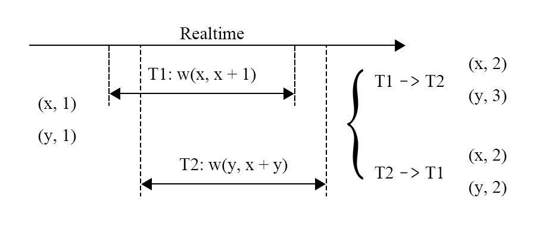

而如何确定偏序关系呢，一般来说需要一个管理者来管理这个先后顺序，如图，在事务执行之前，需要对其排序，向事务管理器申请ID，那么事务的执行顺序就可以按照ID的顺序机型，所以事务必须按照$T_1\rightarrow T_2 \rightarrow T_3$的顺序执行才能产生正确的结果。

还有就是避免死锁的产生，死锁产生的原因就是交互式事务存在中间过程，$T_1,T_2$都尝试写入key，然后$T_1$ 尝试写入 $T_2$  的 Key，$T_2$  尝试写入 $T_1$  的 Key，这时就产生了死锁，需要abort其中之一。 而确定性数据库可以看作，数据库在事务开始的时候就知道事务会做什么操作，那么在上面的例子中就能知道$T_1，T_2$ 存在依赖关系。需要等待$T_1$ 后才能执行$T_2$ ，那么此时就不会有死锁。而且，死锁发生时对于abort的事务没有要求，因此这也可能产生不确定的结果。

确定性是一个约束非常强的协议，一旦事务的先后顺序被确定，结果就被确定了，基于这一特点，确定性数据库能够**优化副本复制协议所带来的开销**。因为能保证写入成功，在有些实现中还能够预测读的结果。

# Calvin

Calvin 提出于 2012 年，和 Spanner 出现于同一时期，尝试利用确定性数据库的特点解决解决当时数据库的扩展性问题，在前一篇讲了个大致的事务执行流程。

这次讲如何在这个架构下replica内保证确定性输入，replica间保证一致性结果的。

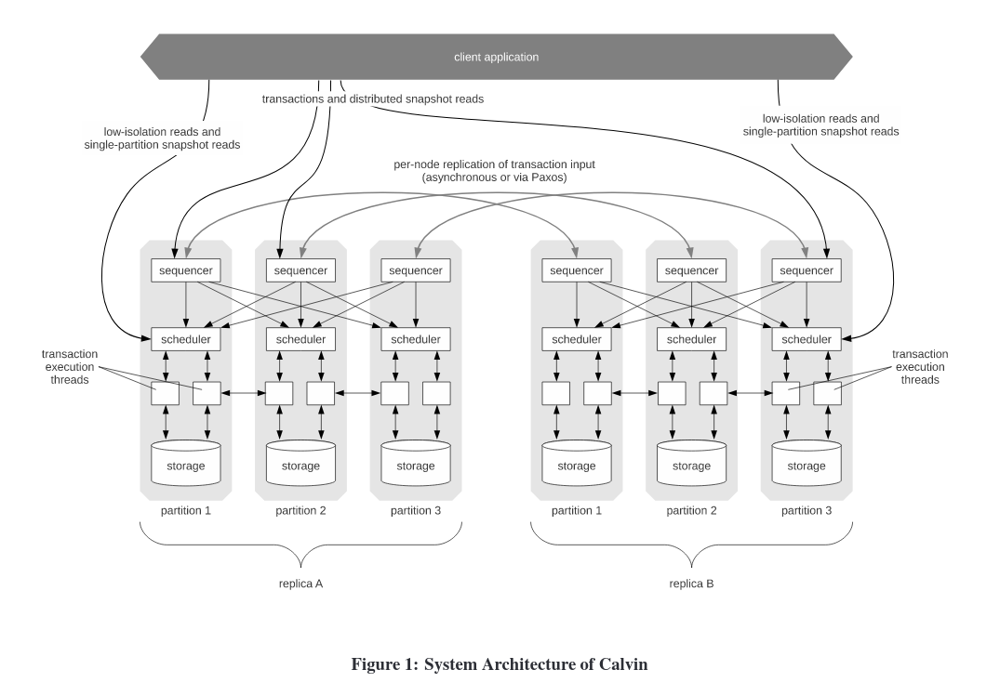

如图的事务，假设3个sequencer，现在已经打包了两个batch，目前以上帝视角可以看出$T_1,T_{10}$存在冲突，根据确定性协议的要求，顺序必须是$T_1\rightarrow T_{10}$，因为ID号小的优先，这些事务 batch 会在被发送到 scheduler 之前通过 Paxos 进行复制，然后batch 被发送到对应的 scheduler 之上，在scheduler上进行锁分配。此时有两种情况，1. 如果$T_{10}$持有锁，那么$T_{1}$抢占该锁，并执行。2. 如果$T_{10}$不持有锁，那么$T_{1}$加锁并且开始执行。反正都是$T_{1}$先执行。

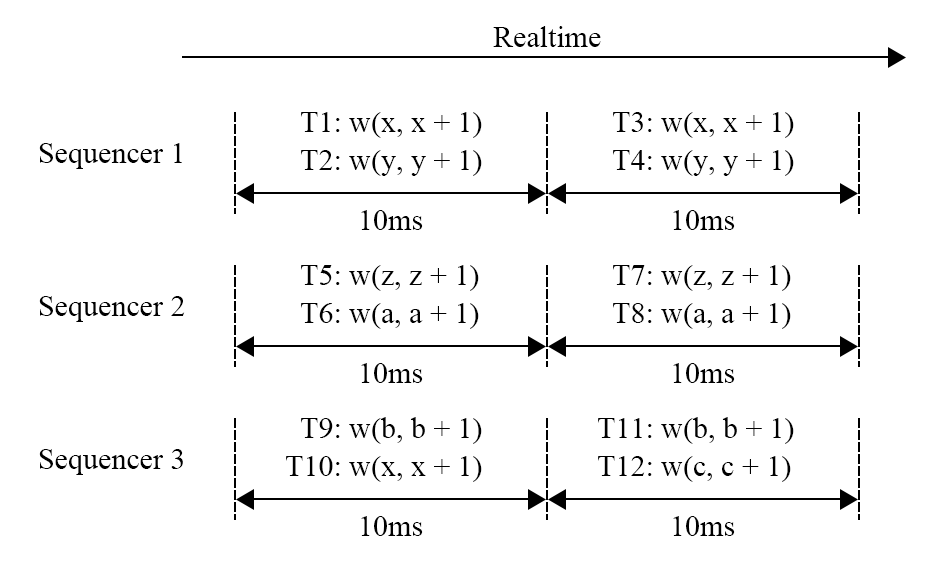

但是可能存在另一种情况，就是$T_{10}$先发送过去，过了很久$T_{1}$才到，但是此时$T_{10}$已经执行完了，这时就发生了不确定性问题。Calvin解决这个问题的方法十分粗暴，使用全局的Coordinator协调，强制要求当scheduler没有收齐当前batch的事务之前不能进行执行，这样就解决了，但是这样在当前Calvin的架构会出现新的问题，就是你怎么确定事务应该发送到哪个分片？因为有些 predicate 语句的读写集合在被执行前是没有被确定的，这种情况下 Calvin 无法对事务进行分析，所以Calvin会在sequencer中有一个试探读取阶段，来确定读写集，如果这个试探读取的读取集被改变了，那么会将事务重启。

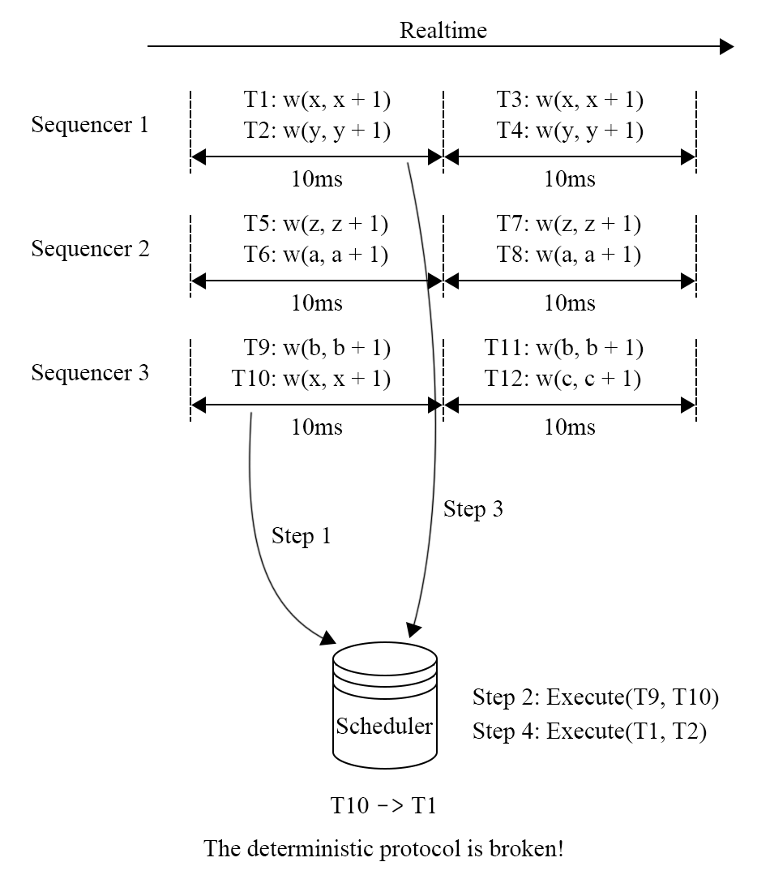

上述的问题可能出现在replica之间，这会造成replica的不一致，这是不合理的，所以为了解决这个问题，所有的副本同步都需要在一个 Paxos 组之内进行以保证**全局的顺序性**，这些都可能成为一个瓶颈。Coordinator可能还存在降低可用性的问题，即它崩了，有可能整个集群就不可靠了。

# BOHM & PWV

首先先解释什么是依赖分析，写后写，写后读，读后写，由此来定义事务之间的先后关系，通过依赖图是否出现环来判断事务执行是否破坏隔离性。只要执行过程中避免依赖图中的环，那么执行的过程就是满足事先给定的隔离级别要求的，从这个思路出发，就可以让原本无法并行执行的事务并发执行。

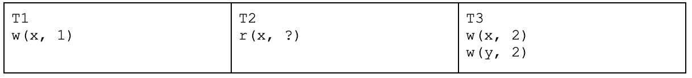

如图，$T_{1}$和$T_{2}$具有写后读依赖，$T_{2}$和$T_{3}$具有读后写依赖，$T_{1}$和$T_{3}$具有写后写依赖，那么这三个事务无法并发执行，需要按照$T_{1}\rightarrow T_{2}\rightarrow T_{3}$这个顺序执行，并发度降低。

BOHM就通过对MVCC的改进来解决这个问题，使得其可以并发执行，它记录每条数据的有效时间以及上一个版本的指针，如图所示，$T_{100}$数据的有效期是$100 \leq id \leq 200$，而$T_{200}$的数据有效期为$200 \leq id \leq \infty$，这就实现了写事务的并发。

而PWV是基于BOHM的读可见的优化，让事务能更早的被读到。 为了实现这个目的，PWV对事务的可见性方式和abort原因进行分析。

- 提交可见。BOHM，延迟高
- 释放锁后可见。存在级联abort

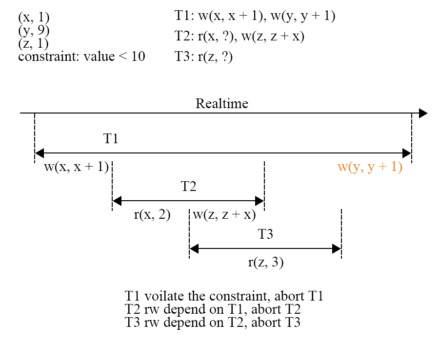

$T_{1}$ 写入的 x 被 $T_{2}$读取到，$T_{2}$的写入进一步的被$T_{3}$ 读取到，之后$T_{1}$ 在 y 上的写入发现违反了约束（value < 10），因此 $T_{1}$ 必须 abort。但是根据事务的原子性规则，$T_{1}$ 对 x 的写入也需要回滚，因此读取了 x 的 $T_{2}$需要跟着 abort，而读取到$T_{2}$ 的$T_{3}$ 也需要跟着 $T_{2}$被 abort。

abort产生有几种因素

- 逻辑原因，违反约束条件
- 系统原因，产生死锁，系统问题，写冲突等

**确定性数据库能够排除因系统原因产生的 abort**，例如死锁和写冲突。那么只要确保逻辑原因的 abort 不发生，一个事务就一定能够在确定性数据库中成功提交。PWV基于这点，想到一个办法，先对事务分割成piece，然后寻找其中的Commit点，规定提交点含义为，在提交点后的就不可能发送逻辑原因的abort。

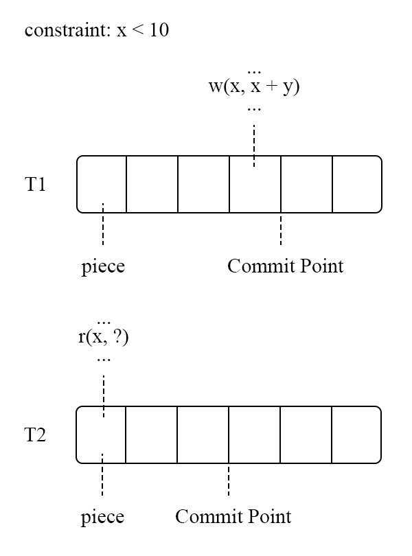

图中 $T_2$ 需要读取$T_1$ 的写入结果，只需要等待 $T_1$ 执行到 Commit Point 之后在进行读取，而不需要等待$T_1$完全执行成功。通过对事务执行过程的进一步细分，PWV 降低了读操作的延迟，相比于 BOHM 进一步提升了并发度。BOHM 和 PWV 通过对事务间依赖的分析来获取冲突场景下的高性能，但是这一做法需要知道全局的事务信息，计算节点是一个无法扩展的单点。

# ARIA

Calvin 的实现具有扩展性，但是基于依赖分析的 BOHM 和 PWV 在这方面的表现不好；而得益于依赖分析，BOHM 和 PWV 在冲突场景下防止性能回退的表现较好，但 Calvin 在这一情况下的表现不理想。

在分布式系统中为了并发执行而进行依赖分析是比较困难的，所以 Aria 使用了一个预约机制，完整的执行过程是：

- 一个 sequence 层为事务分配全局递增的 id；
- 将输入的事务持久化；
- 执行事务，将 mutation 存在执行节点的内存中；
- 对持有这个 key 的节点进行 reservation；
- 在 commit 阶段进行冲突检测，是否允许 commit，没有发生冲突的事务则返回执行成功；
- 异步的写入数据。

输入事务在经过 sequencer 层之后被分配了全局递增的事务 id，此时执行结果就已经是确定性的了。经过 sequencer 层之后，事务被发送到 node 上，如图，$T_1$和 $T_2$在 node1 上，$T_3$ 和 $T_4$ 在 node2 上。先不管$T_{5-8}$，假设第一个batch只有这四个事务，在执行时，batch 中的事务执行结果会放在所属 node 的内存中，然后进行下一步。

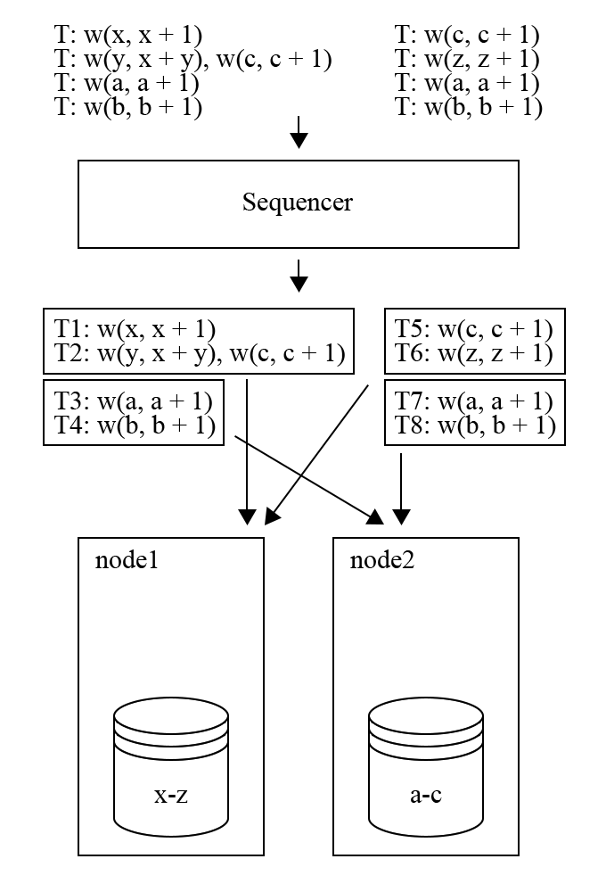

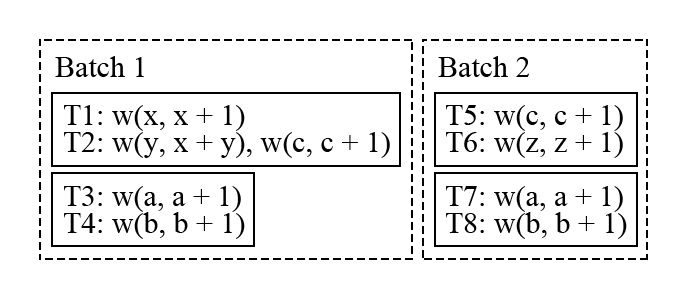

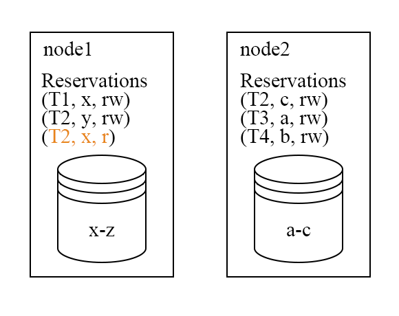

上图是 batch1 中的事务进行 reservation 的结果，需要注意的是执行事务的 node 不一定是拥有这个事务数据，但 reservation 的请求会发送到拥有数据的 node 上，所以 node 一定能知道和自身所存储的 Key 相关的所有 reservation 信息。在 commit 阶段，会发现在 node1 上 $T_2$ 的读集合与$T_1$ 的写集合冲突了，因此$T_2$ 需要被 abort 并且放到下一个 batch 中进行执行。对于没有冲突的 $T_1$，$T_3$和 $T_4$，则会进入写入的阶段。因为在 sequencer 层已经持久化了输入结果，所以 Aria 会先向客户端返回事务执行成功并且异步进行写入。

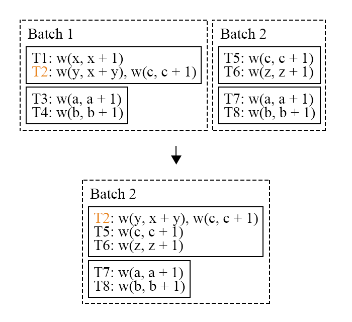

$T_2$ 加入到了 batch2 之中。但是在 batch2 中，$T_2$  享有最高的执行优先级（在 batch 中的 id 最小），不会无限的因为冲突而被推迟执行，而且这一策略是能够保证唯一结果的。

和Calvin一样，也存在不确定性问题，如果$T_2$在$T_1$还没开始reservation之前就开始尝试提交，那么就无法发现冲突，$T_2$就比$T_1$先执行了，破坏了确定性的要求。为了解决这个问题，Aria也存在coordinator，利用coordinator保证所有节点处于同阶段。在$T_1$ 所在的 node1 完成 reservation 之前，node2 不能够进入 commit 阶段。

确定性数据库的优势是只需要有一个确定的事务顺序即可，所以可以根据输入事务进行重排序，Aria认为可以安全的并行执行WAR(读后写)依赖，所以它在commit阶段时对reservation的结果进行冲突检测时将RAW转化为转化为WAR。如图，只要不形成依赖环，那么就不需要abort，提高并行度的。

但是Aria存在barrier 限制，具体表现为，如果一个 batch 中存在一个事务的执行过程很慢，例如大事务，那么这个事务会拖慢整个 batch。

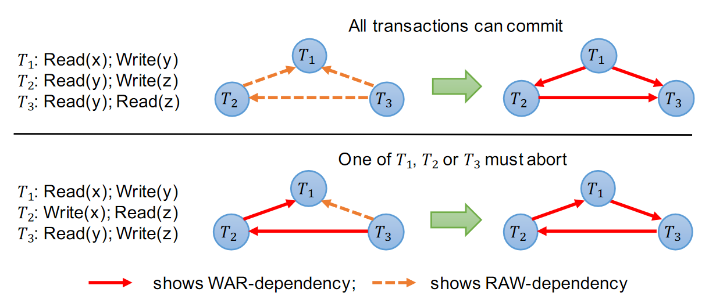

基于依赖分析的 BOHM 和 PWV：

-  充分利用 MVCC 的并发性能
- 能够防止冲突带来的性能回退
- 单节点扩展困难，不适合大规模数据库

分布式设计的 Calvin 和 Aria：

- 单版本，存储的数据简单
- 长事务、大事务可能拖慢整个集群
- barrier 机制需要 coordinator 进行实现，存在 overhead
- 如果一个节点出现故障，整个集群都将进入等待状态

相比之下，基于 Percolator 提交协议的分布式数据库，只需要单调递增的时钟就能够实现分布式事务，对事务的解耦做的更加好。

> https://pingcap.com/zh/blog/transaction-frontiers-research-article-talk3
