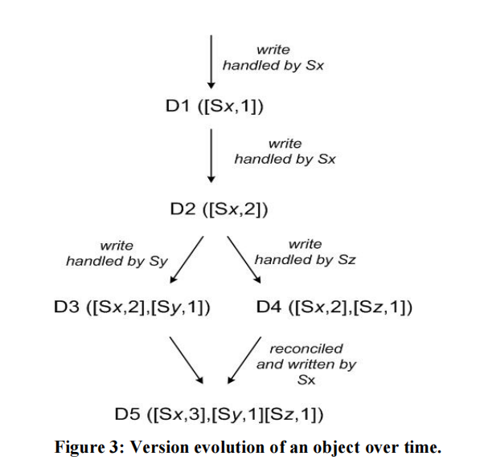

一致性模型很重要，他解释了多数据副本系统的数据可见性的语义和行为。

- 容错。当系统中某个组件出现故障时，系统仍能正确运行。主要目标就是使用冗余的部件来消除单点故障。
- 数据复制。通过在系统中维护多个副本来引入冗余，如何快速的原子性的更新多个副本数据成为问题。允许节点之间存在某种程度上的差异，而数据在用户感知下是完全一致。

**CAP定理**

通常，分布式系统可能会出现故障，而为了系统的高可用，尽可能减少系统的停机时间，我们需要容忍一台节点或者多台节点出现问题不可用的情况，这样就需要引入冗余，而一旦添加了冗余机制，那么就会涉及到多副本的同步问题以及节点恢复问题。

而CAP定理就将实际问题抽象出3个概念，一致性(consistency)，可用性(Availability)，分区容忍性(Partition tolerance)。首先理解这三个概念

- 一致性：各个数据副本数据的一致情况
- 可用性：客户端的访问能得到回应
- 分区容忍性：在一定时间内各个节点能够通信，达成数据一致

CAP定理指出，无法同时满足上述三个特性，因为如果要满足高一致性，那么必须等待数据副本的数据同步，那么可用性即降低，如果保证高可用性，那么就无法花太多时间等待数据副本同步。而如果想要同时满足CA，那么，节点之间需要互相通信以同步数据，这样分区容忍性无法保证，但是实际情况下，网络分区无法控制，所以，只能于CA中选择一个，或者CP，或者AP。

CAP中的C和ACID中的C是完全不一样的，ACID中的C是，事务将数据库从一个有效状态到另一个有效状态，这个有效状态即没有违反任何完整性约束条件。而在CAP中的C意味着事务的原子性和一致性，不让数据处于不一致的状态；CAP中的A和数据库的高可用性也是不一样的。CAP的A对延迟没有限制，而是需要客户端的访问都能得到响应。而系统中的高可用性并不要求每个非故障节点响应每个请求。

# 数据一致性

一致性。比较复杂，涉及理论一致性和并发模型，在这精简描述一下，一致性模型可以看成参与者之间的约定，及用户在发出读写请求时期望得到什么结果，描述了在存在多份并发访问的情况下可能出现的结果。这是从值传播的角度考虑一致性。

## 严格一致性

任何进程的任何写入都可以立即被任何进程的后续读操作读取。涉及全局时钟的概念，即在全局情况下，时间戳靠后的事务一定能够读取到时间戳靠前的事务的数据。不可能实现，理论模型。

## 可线性化

是最强的单对象、单操作一致性模型。写操作的效果严格一次性的对所有读取者可见，可线性化可能存在不同的方式来确定事件的全序关系，在一个系统中，这个顺序应该一致的，也就是读取到的值必须是至少与之前读取的值是一样新的，也就是单调的读取。

原子原语，例如原子写和原子比较-交换(CAS)操作。原子写无需考虑当前寄存器值，这和CAS仅在前一个值没有变化的时候才能从一个值变为另一个值，也就是交换值，因为需要避免ABA问题。ABA问题就是A被存入寄存器中的时候，可能会又两个并发写入操作，设置了值B并切换回值A，也就是A不变，并不能保证A从上次读取后就没有更改。

**线性化点**也就是，在线性化点之前，旧值可见，之后新值可见。

目前大部分系统避免可线性化，因为开销过高，即使是CPU访问主存也不提供可线性化，因为同步指令开销太大了，严重影响速度，但是可以使用CAS来引入可线性化，可以先准备结果，准备好后，交换指针即可使结果可见。

## 顺序一致性

可线性化的代价太高，可以放松模型的同时仍提供相当强的一致性保证。顺序一致性允许对事务进行排序，保证了同属一台进程的顺序不变，但是全局的顺序有可能不按照真实时间排序，但是要注意一点，其他节点观测到的顺序也必须是一致的。

## 因果一致性

存在因果关系的操作保证顺序，其他的可以不保证相同的顺序被读取者观测。

因果一致性可以使用逻辑时钟实现，而且使用因果一致性可以在消息无序传递的情况下重新构建事务序列，填补消息空隙，直到收集所有的操作依赖项并恢复因果顺序。Dynamo和Riak使用向量时钟建立因果关系。

**向量时钟**是一种用于在事件中建立偏序关系，检测和解决事件链分歧的结构。向量时钟是更细粒度的在数据上追加，而逻辑时钟是在本地进行维护

如图Dynamo

1. client 端写入数据，该请求被 Sx 处理并创建相应的 vector ([Sx, 1])，记为数据 D1
2. 第 2 次请求也被 Sx 处理，数据修改为 D2，vector 修改为([Sx, 2])
3. 第 3、4 次请求分别被 Sy、Sz 处理，client 端先读取到 D2，然后 D3、D4 被写入 Sy、Sz
4. 第 5 次更新时 client 端读取到 D2、D3 和 D4 3个数据版本，通过类似向量时钟判断同时发生关系的方法可判断 D3、D4 是同时发生的事件，因此存在数据冲突，最终通过一定方法解决数据冲突并写入 D5

版本向量借鉴了向量时钟中利用向量来判断事件的因果关系的思想，用于检测数据冲突，和向量时钟不是一个东西。

# 会话模型

也成为以客户端为中心的一致性模型，从客户端的角度看分布式系统的状态，

**读自己写**(read own write)一致性模型，当写操作完成后，在相同或其他副本上的读操作必须可以观测到写入的值。

**单调读**模型读到的值一定不会是旧的。

**单调写**模型同一客户端写入操作的执行顺序和写入的值的顺序一致。

**读后写**确保写入被排在之前的读取操作返回结果之后。

将单调读单调写读自己写结合，就可以提供流水线随机访问存储器(PRAM)一致性，保证来自一个进程的写操作将按照进程执行的顺序传播。顺序一致性来自不同进程的写入可以以不同的顺序被观测

# 最终一致性

更新被异步的传播，最终所有的访问都会返回最新的写入结果，没有时间限制多久必须达成一致，非常不可靠。

# 可调一致性

使用三个参数调节数据复制读取和写入。

复制因子 N，存储数据副本的节点数

写入一致性 W，需要确认成功写入的节点数

读取一致性 R，需要确认成功读取的节点数。

通过调整参数保证W+R>N来达成一致性。保证读取到的一定是最新的值，类似抽屉原理，读取和写入的集合总是存在重叠。

Quorum协议是可以容忍不超过半数节点故障的可调一致性。即N和W为N/2+1或N/2.

为了降低存储成本，可以将副本分为见证者副本和拷贝副本，见证者副本仅存储部分记录，表示写操作发生过的关键源信息。

## 见证者副本

正常存储副本需要大量单调数据冗余，我们可以通过见证者副本来降低存储成本，我们不需要在每个副本上存储数据记录的拷贝，而是将副本划分成两种，一个是拷贝副本，一个是见证者副本，见证者副本仅存储一些关键记录，表示写操作曾经发生过，可调一致性的写入因子就必须小于等于拷贝副本数量，但是当拷贝副本宕机过多，导致拷贝副本小于写入因子时，那么此时可以将见证者副本临时代替拷贝副本存储数据，等到原来的拷贝副本恢复再将数据迁移并且恢复原来状态，或者其他操作。

# 强最终一致性和CRDT

在可线性化和最终一致性之间，还存在一个可能的中间地带，强最终一致性，提供了两种模式各自的好处。在这种一致性下，更新可能会延迟或者无序的传播到其他节点，但当所有更新都发送过去的时候，冲突可以被解决，他们最终将合并产生相同的有效状态，也就是conflict-free replicated data type(CRDT)，无冲突复制数据类型。

可能存在网络分区，但是可以独立的在每个节点执行操作，当通信恢复时，所有节点的数据可以进行协调合并，网络分区期间执行的操作不会丢失。

最简单的例子**CmRDT**(Commutative Replicated Data Type)，基于操作的可交换复制数据类型。需要满足三点

- 无副作用，操作不会改变系统状态
- 可交换，顺序无关紧要，即操作满足交换律
- 按照因果关系排序，操作成功传递依赖的前提条件是，确保系统已经到达操作可以应用的状态

CvRDT(Convergent Replicated Data Type)，基于状态的同步，需要满足

- 幂等律，不管发送多少次，结果总是一样的
- 单调的

> 参考[DISTRIBUTED ALGORITHMS IN NOSQL DATABASES](https://highlyscalable.wordpress.com/2012/09/18/distributed-algorithms-in-nosql-databases/)
>
> 《数据库系统内幕》 Alex Petrov

