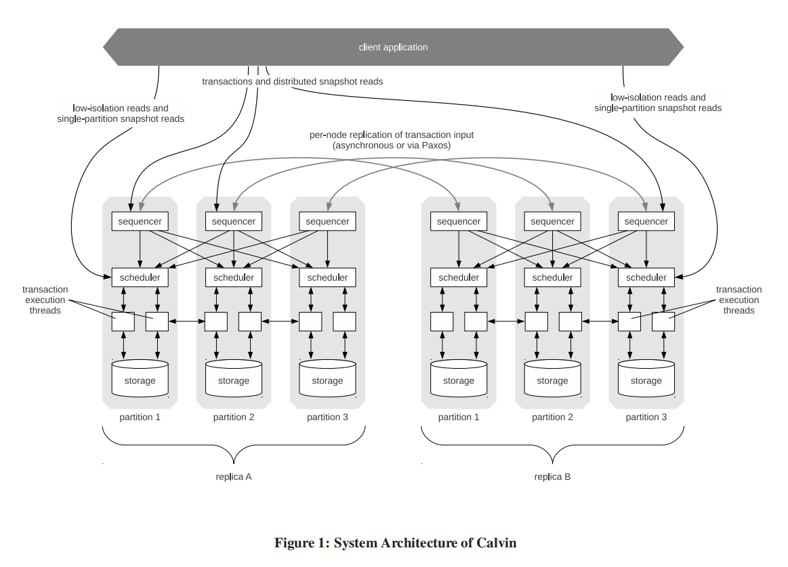
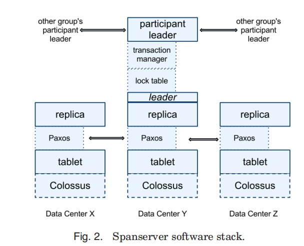
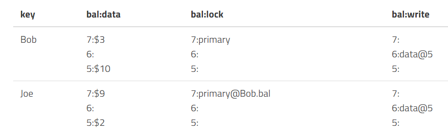
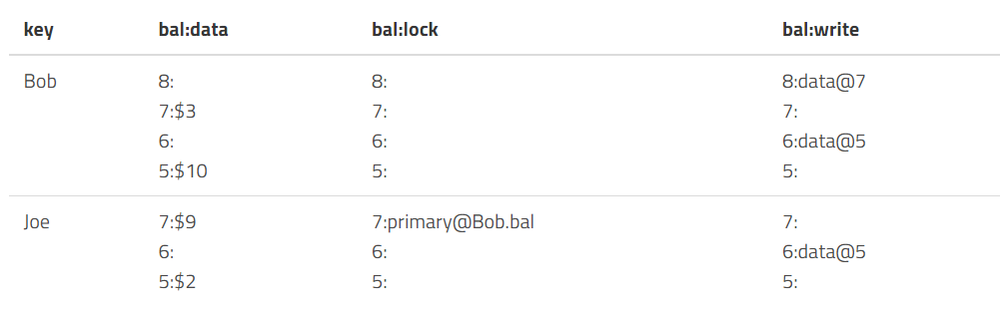

首先简单回顾事务的定义。事务包含了一个序列的对数据库的读/写操作，这些操作构成一个逻辑的整体，这个整体要么都执行成功，要么都执行不成功，数据库从一个一致性状态转移到另一个一致性状态，即事务的操作要么全对数据库产生影响，要么全不对数据库产生影响，事务就是数据库最小的逻辑执行单元。由此引出事务的ACID特性，即原子性，一致性，隔离性，持久性。维基百科对[ACID](https://en.wikipedia.org/wiki/ACID)的描述如下：

> Atomicity（原子性）：一个事务（Transaction）中的所有操作，或者全部完成，或者全部不完成，不会结束在中间某个环节。事务在执行过程中发生错误，会被回滚（Rollback）到事务开始前的状态，就像这个事务从来没有执行过一样。即，事务不可分割、不可约简。
>
> Consistency（一致性）：在事务开始之前和事务结束以后，数据库的完整性没有被破坏。这表示写入的资料必须完全符合所有的预设约束、触发器、级联回滚等。
>
> Isolation（隔离性）：数据库允许多个并发事务同时对其数据进行读写和修改的能力，隔离性可以防止多个事务并发执行时由于交叉执行而导致数据的不一致。事务隔离分为不同级别，包括未提交读（Read Uncommitted）、提交读（Read Committed）、可重复读（Repeatable Read）和串行化（Serializable）。
>
> Durability（持久性）：事务处理结束后，对数据的修改就是永久的，即便系统故障也不会丢失。

一般来说原子性和一致性通过UndoLog实现，隔离性通过锁或者MVCC实现，持久性通过RedoLog实现。

分布式事务和单机事务定义一样，分布式事务就是由单机事务演变而来的，因为单机数据库无法承担过大数据量的负载，所以必须将数据拆分到不同的节点上去进行执行，这就涉及到一个问题，涉及多台数据库的事务如何保证ACID特性？

一般来说，微观的看事务，例如银行转账的例子，希望同时完成A账户减10，B账户加10的操作，这明显是多个操作，步骤涉及多个子操作，节点收到请求，解析请求，磁盘查找数据，写操作，最后确认，这是一个很繁琐的过程，要保证事务的特性就意味着我们必须先执行事务，再让结果可见。

# 数据库分区

首先我们定义什么是数据库分区，单机数据库将数据存储在一个节点上，但是一台机器总有存不下的时候，很自然的我们想到，每个节点存一部分数据，最直接的方法就是将数据划分范围，并且允许每个副本集只管理特定的分区。执行查询的时候，客户端或者查询协调者将读写请求路由到正确的副本集即可。这种分区的方案通常称为分片，每个副本集作为数据某个子集的单个来源。

为了让集群的运行更加有效率，考虑负载的分布并确定分区，将负载较重的节点再分区，从而分散负载。而当集群添加或者删除节点时，数据库必须重新分区数据以保持均衡，为了保证数据迁移的一致性，我们必须让请求等待，直到数据迁移完毕。一般使用哈希来进行路由查找某些键的存储位置，使用哈希确定副本位置可以减少范围热点问题，因为哈希比较分散，最简单的方式就是对键值的哈希值取模，但是每当节点数量变动时，大部分数据都要被移动。这时候，一致性哈希就能派上用场。

## 一致性哈希

Cassandra和Riak就使用了一致性哈希的分区方案。还是同样的方法，每个键计算哈希值，返回的哈希值被映射到环上，以便在超过最大值后回到最小值。每个节点在环上拥有自己的位置，负责前一个节点到当前节点之间的值范围。

使用一致性哈希能减少维持数据均衡所需要的移动次数，节点离开或者加入指挥影响到环上与该节点直接相邻的节点，而不是整个集群，当哈希表大小变化时，如果我们有K和可能的哈希值，和n个节点，平均只需要移动K/n个键。这样影响就小了许多。

# 多个操作的原子性

为了让多个节点的操作看起来是原子的，我们需要一类称为原子提交的算法。也就是不允许参与者出现不一致的情况，即A提交，B不提交。这就意味着只要有一个参与者反对，那么整个事务就不能提交，也就是所有参与者必须达成共识。但是当存在拜占庭故障时(节点可能发送错误消息)，这种算法就无法正常工作了，因为一旦一个节点发送错误消息，即导致整个事务出现不同的结果。

## 两阶段提交(2PC)

最简单，最经典的分布式提交协议，保证多分区的原子更新。整个执行分为两阶段，第一阶段分发决定的值并收集投票，第二阶段，节点仅需要修改指针，让第一阶段的结果可见即可。

2PC中存在一个Leader或者Coordinator负责保存状态、收集投票、并作为协商的主要参考依据，其他节点称为参与者。通常来说，每个参与者负责一个分区，在这些数据上执行事务。协调者和每个参与者都会未所有执行过的步骤保留本地操作日志。

每个步骤中，协调者和参与者都必须将各个操作的结果写入持久性存储中，以便在发送了本地故障的情况下重建状态并恢复，并且可以帮助其他参与者重放操作。

### 故障

#### 参与者故障问题

如果其中一个参与者在准备阶段故障，也就是还没返回投票信息的时候故障了，那么协调者无法继续进行提交，因为2PC要求所有投票都是赞成票。如果一个节点不可用，那么协调者将中止事务，2PC会影响可用性，单节点故障即阻止事务提交。一些系统，例如Spanner，在Paxos组而非2PC的核心思想在于参与者的承诺，一旦做出了同意的投票就无法反悔，因此只有协调者能中止事务。

如果其中一个参与者在同意投票后发生故障，它必须到协调者去了解实际结果才能直到正确的值，因为有可能其他节点不同意投票，导致事务回滚。因此当参与者节点恢复时，必须和协调者的决定保持一致，为此通常将决策保留在协调者端，并且将决定的值复制给故障的参与者，在此之前，参与者无法处理请求，因为还处于不一致的状态。

并且在协议中可能出现阻塞状态，进程需要等待，那么如果消息丢失，进程会无限等待，如果协调者没有收到某个节点的投票，不会无限等待，而会触发超时机制，进行中止事务。

#### 协调者故障问题

两种情况，协调者在收集投票信息并传播了决定给部分节点后故障，那么此时，协调者已经做出了决定，但是没有发送给某个副本，这种情况，参与者可以从其他参与者的事务日志或者是备份协调者的日志中找到决策。因为决定一定是一致的，在一个参与者中提交，意味着其他所有参与者都必须提交。

如果协调者在发送决策之前故障，那么此时，没有参与者知道协调者是否做出了决策，而协调者只要不恢复，结果就永远不知道。因为这个原因，我们说2PC是一个阻塞原子提交算法。如果协调者始终无法恢复，那么只能重新为该事务执行2PC。三阶段提交解决了这个问题。

## 三阶段提交(3PC)

为了在协调者故障的情况下保持可用性，避免进入阻塞状态，3PC增加了一个额外的步骤，并且参与者和协调者都有超时机制，使得参与者在协调者发生故障时仍然可以继续提交或中止。3PC假定同步网络模型，并且不存在通信故障。

3PC在提交阶段之前加了一个准备阶段，也就是用于协调者将投票的结果通知参与者的，通过投票，并且所有的参与者都决定要提交，则协调者会发送一条准备消息，指示他们准备提交，否则将Abort，并退出3PC流程。

我认为3PC和2PC最大的区别在于参与者和协调者都有超时机制，这样可以当协调者在发送决策之前故障时，直接超时Abort，而不用等待恢复了，网上说的2PC无法从协调者故障恢复，我认为协调者故障的第一种情况可以恢复，第二种情况引入协调者超时机制也能和3PC一样的效果。不太理解，希望有懂哥教我一下。

# Calvin分布式事务

传统数据库使用两阶段锁或者乐观并发控制来执行事务，并没有确定的事务顺序。这就意味着必须协调各节点以保证事务顺序。而确定性事务顺序消除了执行阶段的协调开销，因为所有副本有相同的输入，所以输出也是相同的。这种方法通常称为Calvin一种快速的分布式事务协议。FaunaDB是一个著名的例子。

为了获得确定性顺序，Calvin使用了sequencer，他是所有事物的入口点。这个sequencer确定了事务的执行顺序，为了最大限度的减少竞争以及批量的进行决策，Calvin将时间线切分成epoch。Sequencer收集事务并将其分组到短时间窗口(10ms)，这些窗口称为复制单元，因此不需要为每个事务单独通信。

而当一批事务被成功复制后，sequencer会将其转发给scheduler，负责编排事务的执行。调度器使用确定性调度协议，可以并行的执行部分事务，同时保留sequencer指定的串行执行顺序。

**总结：**

- Sequencer 负责副本复制，并在每 10ms 打包所收到的事务，发送到相应的 scheduler 之上；
- Scheduler 负责执行事务并且确保确定性的结果；
- Storage 是一个单机的存储数据库，只需要支持 KV 的 CRUD 接口即可。

Calvin中每个事务有读写集，读集即依赖，写集即结果。

事务执行线程分为四个步骤执行

1. 分析事务的读写集，用读集确定节点本地的数据记录，并创建活跃参与者(包含写集元素并且将对这些数据修改)的列表
2. 收集执行事务所需的本地数据，收集到的数据转发给相应的活跃参与者。
3. 如果当前执行线程在一个活跃参与者上执行，他将接收其他参与者发送的数据记录，并收集事务所需本地数据。
4. 以Epoch为粒度持久化到本地存储。不用讲结果转发到其他节点，因为事务是确定性的

# Spanner分布式事务

Calvin和Spanner常常放在一起说，Spanner也是很有名的一个数据库，基于Spanner实现的数据库最有名的是CockroachDB和YugaByteDB。Calvin通过在Sequencer上达成共识顺序来建立全局事务执行顺序，Spanner则在每个分区的共识组使用2PC。Spanner的架构相当复杂。

每个Spanner的server也就是副本，包含了多个tablet，每个tablet对应一个Paxos状态机。副本被分组为副本集，也就是paxos组，这是数据放置和复制的单元，每个paxos组有一个长期的领导者，在处理跨分片的事务时，领导者相互通信即可。

每个写入操作必须通过Paxos组的领导者，而读取可以在最新副本的tablet上进行，领导者上有锁表，和事务管理器，锁表用于使用两阶段锁机制来实现并发控制，事务管理器负责跨分片的分布式事务。需要同步的事务(事务内的读写操作)必须先从锁表中获取锁，而其他操作(快照读)就可以直接访问数据。

对于跨分片事务，Paxos组领导者必须协调并且执行两阶段提交来保证一致性，并且使用两阶段锁保证隔离性。2PC算法需要所有参与者都存活才能成功提交，因而可能会损害可用性。而Spanner使用Paxos组代替单个节点作为参与者，解决了这个问题，意味着拥有了容错能力。在Paxos组中，只有领导者会参与2PC。

Paxos组用于在多个节点之间一致的复制事务管理器的状态。在执行事务时，Paxos组的领导者先获取写锁，并且选择一个写入时间戳，这个时间戳必须大于之前任何事务的时间戳，然后通过paxos记录一条2PC的prepare日志。事务协调者收集时间戳，然后生成一个大于任何准备时间戳的提交时间戳，并通过paxos记录commit日志，然后，事务协调者需要等待直到提交时间戳过后，因为必须保证客户端只能看到时间戳已经过去的事务结果。之后将这个时间戳发送给客户端和各个领导者，领导者将commit日志和新的时间戳一同记录到paxos后，释放锁。

Spanner读写事务提供了外部一致性的序列化顺序，事务时间戳反映了序列化顺序，外部一致性具有可线性化等效的实时属性，$T_1$在$T_2$之前提交，那么$T_2$时间戳大于$T_1$的时间戳。

总结，Spanner使用Paxos进行一致性的事务日志复制，使用两阶段提交进行跨分片事务，使用TrueTime进行确定性事务排序。相比于Calvin，Spanner跨分区事务成本更高，因为有2PC。

# Percolator分布式事务

先了解什么时快照隔离，快照隔离保证事务内的所有读取结果和数据库中的某个快照一致。快照包含了在事务的开始时间戳之前提交的所有值。如果存在写写冲突，那么只有一个能够提交成功。这种策略通常称为首个提交者胜利(First committer wins)。

快照隔离能避免读偏斜(read skew)，但是不能避免写偏斜(write skew)，简单来说就是两个事务，修改的集合不相同，每个事务单独本身也不违反约束条件，但是两个都执行成功并提交就会违反约束。在读已提交级别会存在读偏斜，例如存在约束x+y必须等于100，$T_1$时刻x和y的值都为50，$Txn_1$ 读x，读到50，$Txn_2$更新$x=30,y=70$，这时如果$Txn_1$继续读y，就会读取到70，就出现了问题，而快照隔离就能解决该问题，$Txn_1$和$Txn_2$读$T_1$时刻快照，基于$T_1$只会读到$x=50,y=50$。写偏斜就不一样了。比如说约束条件为$x+y\leq100$，$T_1$时$x=30,y=50$，此时不管是读快照还是读已提交，$Txn_1$更新x=50，$Txn_2$更新y=70，都可以成功，但是最终得到的结果为$x=50,y=70$不满足约束。快照隔离的优势就是读的效率高，因为无需加锁。

## Percolator

[Percolator](https://tikv.org/deep-dive/distributed-transaction/percolator/)就是一个在分布式数据库BigTable上实现事务API的库，实现了BigTable不支持的ACID事务以及Snapshot isolation隔离级别。Percolator使用不同的列来保存数据记录，已提交的数据点的位置和锁信息还有其他一些信息。

每个事务必须和同步时钟节点(timestamp oracle)通信两次，一次是获取事务开始时间戳，另一次是在提交的时候。写入会先被缓存，最后有客户端驱动进行2PC。

### 写入

看一看percolator如何使用2PC进行写入

- PreWrite阶段。事务尝试为所有的写入涉及的数据单元格加锁，其中一个被标记为主锁(primary lock)，用于客户端恢复。事务会检查是否存在可能的冲突：是否存在其他食物已经用了更新的时间戳写入了数据，或者是还存在未释放的锁，如果检测到，那么中止事务。

  1. 先从同步时钟拿个时间戳作为事务的start_ts
  2. 为事务涉及到的每个数据在lock列加锁，并且写入数据并附带start_ts，其中一个锁被选择为主锁，剩下的为副锁(secondary lock)，额外记录主锁的位置。

  

- Commit阶段。成功获取所有锁，执行完成事务，客户端开始释放锁，先放主锁，用写记录替换锁，通过该操作让写入对外可见，并且更新写入源数据作为最新数据节点的时间戳。

  1. 从同步时钟获取commit_ts。
  2. 释放主锁，写记录进入write列并附带start_ts，
  3. 重复操作，处理所有副锁

  

  例如上图，8：data@7，8是commit_ts，7是start_ts。数据存在start_ts的data列。

### 读取

读操作步骤如下

1. 先从同步时钟获取一个时间戳ts
2. 检查读取的行在[0,ts]中有无上锁
   - 有锁，意味着被别的更早开始的事务上锁了，我们不能确定那个事务是否会在ts之前提交，这时，就回退读事务，过段时间再进行。
   - 无锁，可以继续下面的操作
3. 通过commit_ts读取最新的数据，也就是找[0,ts]中最新的commit_ts.
4. 找对应的start_ts行的data列读取数据。

例如

1. 获得时间戳9
2. 查看Bob行没上锁，所以继续下一步
3. 在[0,9]找最新的commit_ts，找到8，有start_ts=7
4. 所以去7时间戳对应的行去读取data，读到$3

这种读取方式就可以无锁的进行读取，以及可以读取历史版本。例如，如果读的时间戳是7，那么我们看到的就是$10。

> 参考《数据库系统内幕》 Alex Petrov
