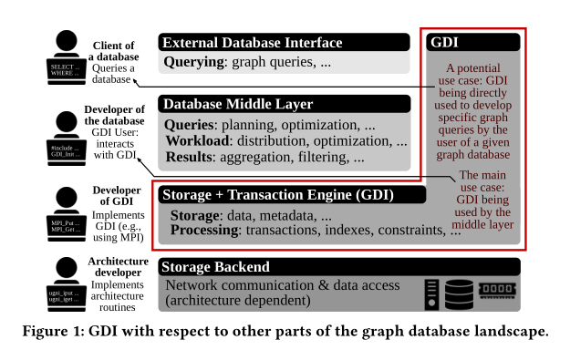
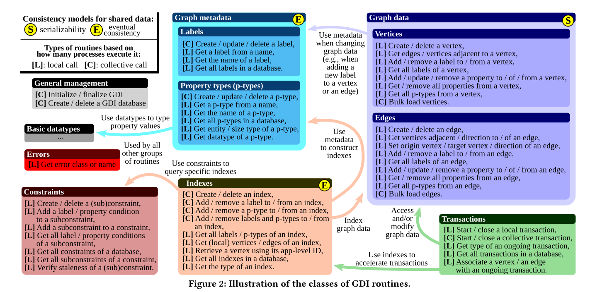
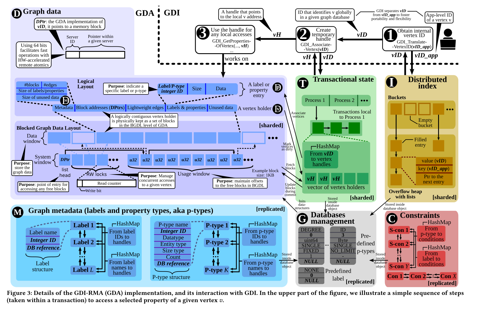
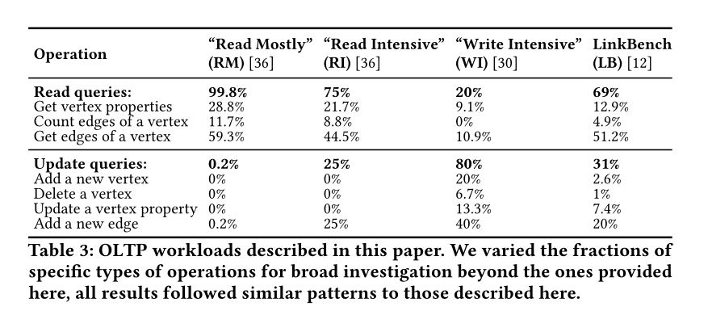

首先定义了一个图数据库接口，然后用这个图数据库接口，为分布式RDMA架构设计一个图数据库，利用RDMA架构单边通信以及集合通信操作，提供高可扩展性，能够线性扩展十万核

# 挑战

1. 数据集大而复杂
2. 目前业界既有OLTP数据库也有OLAP，OLSP，即OLTP(online transactional processing)、OLAP(online analytical processing)、OLSP(online serving processing)，如何满足高性能、可扩展的数据库的同时可以同时支持这三种工作环境
3. portability可移植性，将数据库代码移植到有不同硬件环境的机器的代价非常昂贵
4. 满足上述所有条件的数据库很难理解、debug、维护、扩展，如何解决？

## 方式

1. 分析Neo4j、TinkerPop、JanusGraph的源码，规范出了一套可移植、可编程的图数据库接口（GDI）

   - 数据存储层：包括事务、索引、数据、数据源信息等

   为什么可移植性高？因为解耦出了信息传递接口(MPI)，用于数据交互

2. 给出了一套高性能实现方案，RDMA实现分布式内存。

   - RDMA在云数据中心以及超级计算领域一直是可扩展性问题的很好的解决方案
   - 分布式存储层
   - one-sided non-blocking RDMA communication
   - collective communication

利用HPC(高性能计算)的技术，例如collectives，one-sided RDMA

# 贡献

## 第一

分析Neo4j、TinkerPop、JanusGraph的源码，将其规范成了一套可移植、可编程的图数据库接口（GDI）

- 数据存储层：包括事务、索引、数据、数据源信息等

为什么可移植性高？因为解耦出了信息传递接口(MPI)，用于数据交互

## 第二

给出了一套高性能实现方案，RDMA实现分布式内存。

- RDMA在云数据中心以及超级计算领域一直是可扩展性问题的很好的解决方案
- 分布式存储层
- one-sided non-blocking RDMA communication
- collective communication

利用HPC(高性能计算)的技术，例如collectives，one-sided RDMA

## 第三

支持几乎所有function，并且可以提供独立的底层硬件的理论性能分析

## 第四

描述了怎么用GDI来跑一些工作负载，如LDBC，LinkBench

## 第五

开发了一个可以根据配置生成内存数据的工具，可以快速生成具有label、属性的图数据

## 第六

可扩展性，实验评估做了超大规模的实验

## 第七

开源！

# GDI

## GDI和图数据库的关系

查询从**Client**发起时，**数据库中间层**会将其分散成子查询到多个机器并收集多个机器的结果返回，这个中间层依赖于GDI所在的**存储事务引擎**。这部分直接与数据交互，所以GDI这一层会提供大部分如增删改查的接口，最后后端存储提供真实存储，如RAM、CSV、JSON

## GDI的结构与功能

1. 灰色为基础模块，必须被初始化
2. 蓝色为CRUD标签与属性
3. 紫色为CRUD节点与边 
4. 绿色为事务处理
5. 橙色为索引处理
6. 暗红色为约束条件检查
7. 红色为错误处理

C(Collective)：所有存活协程都作为一个参与者进行集合通信(Collective communications)

L(Local)：无需通信，本机即可完成操作

## 高性能事务

不对事务做任何限制

Collective transaction：涉及到多个处理的事务，类似分片2pc事务处理

Local transaction：单个processor即可处理，涉及少量数据

## 快速高效存取数据

GDI对存储层的节点id/边id等会进行内部重新编id，使得其更加portable，independent

volatileID：临时使用，用于图数据负载均衡

permanentID：减少远程操作数量，但是妨碍数据动态负载均衡

## 句柄

提高可用性，使用句柄可以直接0拷贝使用数据

## 一致性

提供了不同的一致性模型，为index以及meta数据提供最终一致性，为数据提供线性一致性。

更灵活，清晰定义了每种数据的一致性

# 可伸缩性GDI RDMA的实现

基于MPI并且利用RDMA单边通信（一个进程直接读取另一个进程的内存数据而不需要显式的通信），这让通信性能以及可伸缩性得到很大提升

实现内存图数据库

GMC三部分是在每个分片上都存在全副本的，其他数据是分片的

## Graph data

### Logical Layout

抽象出来的接口层，方便开发人员写代码，与BGDL存在地址映射

### Blocked Graph Data Layout

一个节点的相关数据不要求存储在同一个节点，因为RDMA，可以低代价访问远端内存。

性能优化可以直接在这完成，而不需要修改上层代码

轻型边：每条边最多带一个lable

## 事务

抽象出一个模块，专门执行2pl，2pc，保存了当前事务的状态，GDA可编程性不会有影响

## 总结

每个模块都可以单独分析性能，并且依赖深度并不深，即一个数据/事务不会涉及到非常多个模块，都是常数级，最多也就10-20个

# 实验

环境：瑞士国家超级计算机中心，1813台XC40（2x18 vcpu，64GB RAM） 5704台XC50（12vcpu，64GB RAM）

