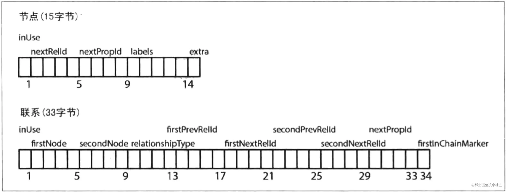

## 图数据库的内部结构

### 原生图处理

如果图数据库存在免索引邻接属性，那么就说它有原生处理能力,也就是使用免索引邻接的数据库引擎中每个节点都会维护其对相邻节点的引用。所以每个节点都是其附近节点的微索引，这种比使用全局索引代价小很多。也就意味着查询时间和图的整体规模无关，仅仅与搜索图的数量成正比。

而非原生图数据库引擎使用全局索引连接各个节点，这些索引对每个遍历都添加一个间接层，就会导致更大的计算成本。

找Alice必须查找索引表，找到物理位置，再去读取Alice对应数据，通过Alice找到Davina后，想要级联查找，就必须再查找一次索引表，找到Davina的物理位置读取数据。一般来说查找索引的时间复杂度为$O(log(n))$，查找物理联系的复杂度为$O(log(1))$，所以在这方面使用原生图存储查找数据会更有优势

以上是原生图处理高效遍历查询写入的关键。

### 原生图存储

Neo4j把图数据存储在不同的文件中，每个文件包含图的特定部分的数据

存储还是以图的形式存储，宏观上来讲，分四块

- 节点：可以看成ER图中的实体，每个节点有多个属性，属性以KV键值对的形式存在，每个节点有不同的label标记，也是以KV存在
- 关系：关系是有向的，存在开始节点和终止节点，也可以有属性
- 属性
- 标签

一个重要的设计点是 store 中存储的 record 都是**固定大小的**，固定大小带来的好处是：因为每个 record 的大小固定，因此给定 id就能快速进行定位。

**节点**（指向联系和属性的单向链表，neostore.nodestore.db）：第一个字节，表示是否被使用的标志位，后面4个字节，代表关联到这个节点的第一个关系的ID，再接着的4个字符，代表第一个属性ID，后面紧接着的5个字符是代表当前节点的标签，指向该节点的标签存储，最后一个字符作为保留位.

**关系**（双向链表，neostore.relationshipstore.db）：第一个字节，表示是否被使用的标志位，后面4个字节，代表起始节点的ID，再接着的4个字符，代表结束个节点的ID，然后是关系类型占用5个字节，然后依次接着是起始节点的上下联系和结束节点的上下节点，以及一个指示当前记录是否位于联系链的最前面.

