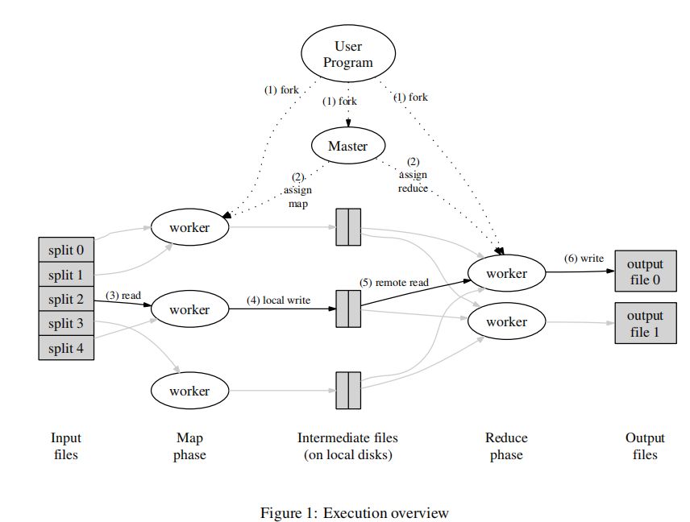

懒得写了

[论文链接](https://static.googleusercontent.com/media/research.google.com/zh-CN//archive/mapreduce-osdi04.pdf)

[中翻链接](https://www.cnblogs.com/fuzhe1989/p/3413457.html)

就说一下mapreduce的思路吧

首先MapReduce大体来看就是一个分治思想，将任务拆分成小任务交给Worker，Worker经过处理后得到各自的结果，然后通过再经过Reduce将结果输出。

详细过程如上图。用户程序将拆分好的文件作为inputFiles，每个inputFile可以看成一个MapTask，由Worker执行。但是这个分配任务的过程是由Mapreduce集群中的Master节点来控制的，可以将每个Worker看成一个机器节点，由Worker向Master请求任务，Master向空闲的Worker节点发送Map任务或者Reduce任务。Worker读取对应的输入文件的内容，将其根据自定义的规则解析出Key/Value值，然后将这些值作为中间文件存储在内存中。缓存的数据对会被周期性的由划分函数分成Reduce节点的数量，并写入本地磁盘中。这些缓存对在本地磁盘中的位置会被传回给主节点，主节点负责将这些位置再传给reduce工作节点。

当一个reduce工作节点得到了主节点的这些位置通知后，它使用RPC调用去读map工作节点的本地磁盘中的缓存数据。当reduce工作节点读取完了所有的中间数据，它会将这些数据按中间key排序，这样相同key的数据就被排列在一起了。同一个reduce任务经常会分到有着不同key的数据，因此这个排序很有必要。如果中间数据数量过多，不能全部载入内存，则会使用外部排序。reduce工作节点遍历排序好的中间数据，并将遇到的每个中间key和与它关联的一组中间value传递给用户的reduce函数。reduce函数的输出会写到由reduce划分过程划分出来的最终输出文件的末尾。

当所有的map和reduce任务都完成后，主节点唤醒用户程序。此时，用户程序中的MapReduce调用返回到用户代码中。成功完成后，MapReduce执行的输出都在R个输出文件中（每个reduce任务产生一个，文件名由用户指定）。通常用户不需要合并这R个输出文件——他们经常会把这些文件当作另一个MapReduce调用的输入，或是用于另一个可以处理分成多个文件输入的分布式应用。

看看论文中的例子就大概懂了。

例举了一些有趣的程序，它们都可以很轻松的用MapReduce模型表达。

**分布式Grep：**map函数在匹配到给定的pattern时输出一行。reduce函数只是将给定的中间数据复制到输出上。

**URL访问频次统计：**map函数处理网页请求的日志，对每个URL输出〈URL, 1〉。reduce函数将相同URL的所有值相加并输出〈URL, 总次数〉对。

**倒转Web链接图：**map函数在source页面中针对每个指向target的链接都输出一个〈target, source〉对。reduce函数将与某个给定的target相关联的所有source链接合并为一个列表，并输出〈target, list(source)〉对。

**每个主机的关键词向量：**关键词向量是对出现在一个文档或一组文档中的最重要的单词的概要，其形式为〈单词, 频率〉对。map函数针对每个输入文档（其主机名可从文档URL中提取到）输出一个〈主机名, 关键词向量〉对。给定主机的所有文档的关键词向量都被传递给reduce函数。reduce函数将这些关键词向量相加，去掉其中频率最低的关键词，然后输出最终的〈主机名, 关键词向量〉对。

**倒排索引：**map函数解析每个文档，并输出一系列〈单词, 文档ID〉对。reduce函数接受给定单词的所有中间对，将它们按文档ID排序，再输出〈单词, list(文档ID)〉对。所有输出对的集合组成了一个简单的倒排索引。用户可以很轻松的扩展这个过程来跟踪单词的位置。

**分布式排序：**map函数从每条记录中提取出key，并输出〈key, 记录〉对。reduce函数不改变这些中间对，直接输出。这个过程依赖于4.1节介绍的划分机制和4.2节介绍的排序性质。

[源码地址](https://github.com/Codebells/Raft/tree/go_imp/src/mr)

可以看看[mrapps](https://github.com/Codebells/Raft/tree/go_imp/src/mrapps)文件夹的代码，里面有各种map和reduce的实现，很简单，帮助理解mapreduce
