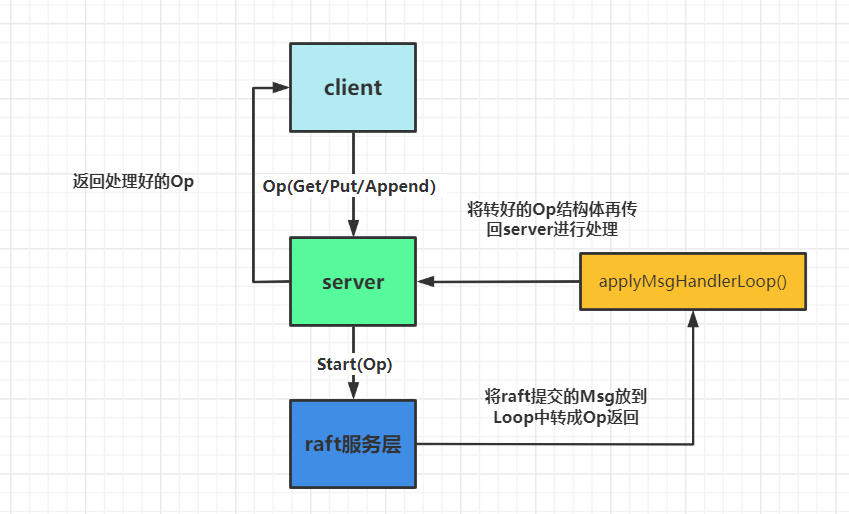
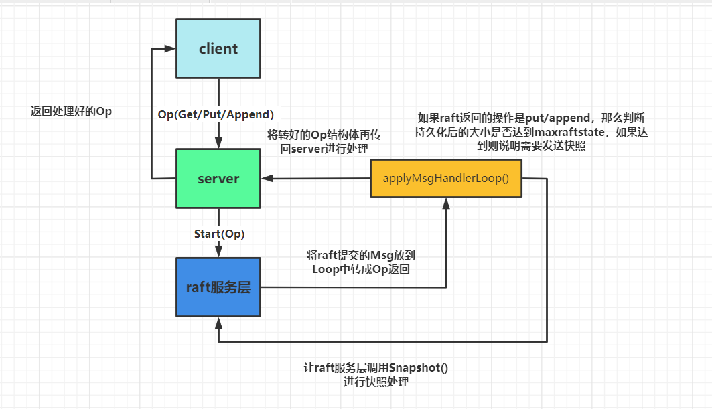

对于3A来说的话，整体实现并不是很难，在paper中主要对应的是 section8。这次的实验就是实现在lab2中[raft](https://so.csdn.net/so/search?q=raft&spm=1001.2101.3001.7020)服务层的上一层service与client的交互。



- 我们需要进行在client中去编写make,put/get/append等关于RPC又或者clerk初始化的函数。
- 然后这个函数的RPC会传到server中对应的put/get/append函数中，再由这些函数调用raft服务层，在raft进行共识。
- 最后由raft服务层apply到server中的applyCh中，但是这里返回的msg为raft封装好的command我们需要用自定义的Loop将command封装回传进来的op结构体给server，最后再返回回去。

# 代码结构

```go
type Clerk struct {
	servers []*labrpc.ClientEnd
	// You will have to modify this struct.

	seqId    int
	leaderId int // 确定哪个服务器是leader，下次直接发送给该服务器
	clientId int64
}
```

- **对于seqId其实是为了这种情况:**

> if the leader crashes after committing the log entry but before responding to the client, the client will retry the command with a new leader, causing it to be executed a second time。

- 如果这个leader在commit log后crash了，但是还没响应给client，client就会重发这条command给新的leader，这样就会导致这个op执行两次。
- 而这种解决办法就是每次发送操作时附加一个唯一的序列号去为了标识操作,避免op被执行两次。

> If it receives a command whose serial number has already been executed, it responds immediately without re-executing the request.

- **而leaderId其实是为了下次能够直接发给正确leader（在hint中也有提到）**

> You will probably have to modify your Clerk to remember which server turned out to be the leader for the last RPC, and send the next RPC to that server first. This will avoid wasting time searching for the leader on every RPC, which may help you pass some of the tests quickly enough.



对于lab3B来说就是要引入raft2D的快照，去尽可能的减少时间。这里重新画下加上snapshot的结构图.其实就只要在写入操作时，判断持久化的大小需不需要进行快照存储就行。
