Natto: Providing Distributed Transaction Prioritization for High-Contention Workloads论文阅读记录

Natto，支持事务划分优先级的Geo-distributed database system。
每个分片处理事务的顺序不是按照到达的顺序，而是用网络估计事务到最远分片的时刻，根据该时刻来为事务分配时间戳建立全局顺序，其中引入某些优化建立事务优先级。

<!-- more -->

Q：数据库如何自动给事务赋优先级？

- 对某些时间敏感的事务分配高优先级，避免它与实时性要求不高的事务并发导致的影响
- 初始低优先级但abort多次的事务，避免饥饿现象

# 主要贡献

Natto，基于Carousel数据库完成，通过实现对事务划分优先级来降低具有高优先级事务的延迟

- 使用网络测量来估计事务到达最远分片的时间，根据这个物理时间去为每个事务分配一个物理时间戳，在分配该时间戳之前，不会在任何分片处理该事务
- 引入conditional prepare以及priority abort和提前转发提交结果(减少事务延迟，降低事务完成时间)

Natto和Carousel都是以2FI事务为前提的数据库

## 背景

分片复制到多数据中心，分片的Leader可能不在同一个数据中心，事务Coordinator一般选事务发起的客户端所在的DataCenter，可能不是事务涉及的数据分区的Leader，但是必须是某个分区的Leader

可能DC1：**1shard** 2shard，DC2：1shard **3shard**，DC3：**2shard** 3shard

# 2FI事务

即2-round Fixed-set interactive 事务，读写涉及的key必须提前知道

一个特殊的读写事务，第一轮是读，读后跟着一轮写，在第一轮读完成后，读的值就都知道了，有些Read modified write可以直接借助于第一轮的结果实现

所有的读操作可以在第一轮时并发执行

_为什么要2FI事务？_

- 直接在事务中实现read modified write，而非依赖于CPU架构
- 事务的读操作在第一轮可以并行执行

# Carousel的事务流程

Coordinator是replica的Leader，分区的Leader可能和Coordinator不同

通过2PC和2FI事务的第二轮写重合来缩短事务完成时间

如图是Carousel的2FI事务执行流程

> 首先客户端有一个涉及两个分区的事务，客户端首先发送 ①read-and-prepare request给数据涉及分区的Leader来执行事务，这个request包含了事务读和写涉及的所有key，因为所有key都知道，所以这轮就可以知道事务是否存在冲突，进而进行并发控制，②将读取的结果返回给客户端，然后③各个分区将准备阶段的数据同步到副本，同时，当客户端收到读的结果后④客户端将写入的数据随着commit request一起发送给协调者，⑤当协调者将写入的数据同步给副本后，而事务涉及到的数据分区Leader也已经将准备阶段的数据同步完，并且无冲突，返回prepared，⑥Coordinator接收到所有涉及的分区Leader返回的信息后，⑦则确定是否可以提交，因为此时已经将要写的数据同步给了Coordinator的副本，所以已经具有容错能力，则可以返回给客户端提交信息。此时异步的将这些数据同步给涉及的数据分区，数据分区Leader将所有数据同步给副本后，则该写入可见。

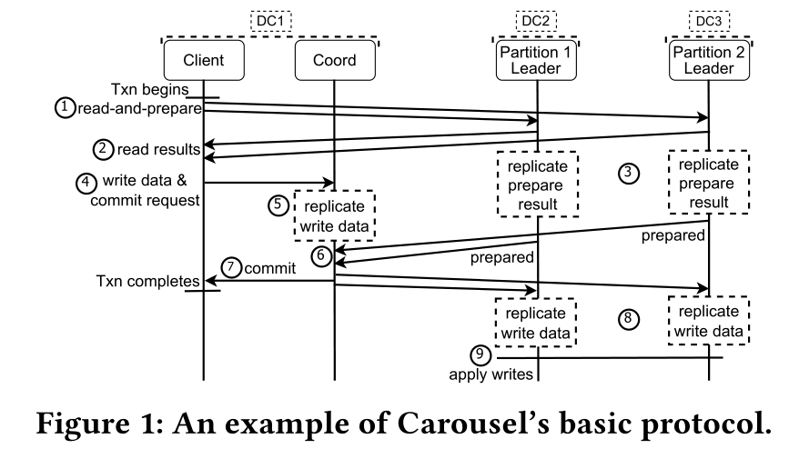

# 估计请求到达时间

复用Domino的技术，通过定期心跳探测服务器的本地时间，利用两次差值计算服务器的单向延迟，将一段时间内收集到的延迟信息中的95分位点作为估计值

# Natto

基于Carousel实现Natto，类似于Carousel，Natto数据分区存储，数据分区可以分布在不同的数据中心。每个分区在不同的数据中心存放分区副本来实现容错，对于每个分区都会选择一个副本来作为分区的Leader。

Participant Leader：分区Leader
Participant Follower：分区Raft的Follower

只分两个优先级：低优先级，高优先级

## 基于时间戳的优先级排序

收到事务的第一轮读取和准备请求后，分区Leader在到时间戳之前不会处理该请求，如下图，预估到最远的分区Leader需要25ms，那么将事务时间戳设置为当前时间戳$T_0$ +25ms，那么在这个时间戳之前，不会处理该事务。如果有多个事务具有相同时间戳，那么则按照事务ID先后顺序执行。 

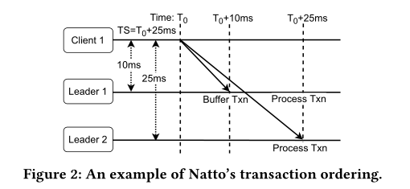

对于不同优先级事务，使用不同的并发控制算法，对于低优先级事务，使用OCC，高优先级事务使用锁机制，避免不必要的中止高优先级事务。

处理高优先级事务的时候，需要获取所有读写涉及到的key的锁，当没有任何涉及到该key的其他事务处于Prepared阶段时，才能获取该key的锁。

如果事务晚于预期时间到达，如果和现在正在执行的事务有冲突，那么直接abort，因为可能造成死锁

## 基于优先级的准备和中止

### priority  abort

基于时间戳会存在一个abort window，在abort window中的低优先级事务如果和到来的高优先级事务有冲突，就不让它开始，或者abort，以此来减少高优先级事务的延迟。

> 例，$Txn_1$和$Txn_2$在分区A上存在冲突，当$Txn_1$预计时间戳为$T_0$ +25ms，$Txn_2$预计时间戳为$T_0$+30ms，但是$Txn_1$在$T_0$+10ms就到达了分区A，需要等待到$T_0$+25ms才能执行，而$Txn_2$在$T_0$+20ms到达分区A，发现与$Txn_1$存在冲突，此时$Txn_1$还没开始执行，所以，直接预先将其abort掉，防止延长高优先级事务的完成时间。

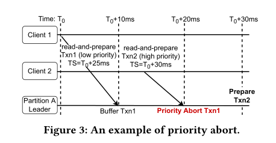

但是存在一种情况，就是可能高优先级事务的预计开始执行时间很大，这时候无需中止低优先级事务，因为低优先级事务很可能在高优先级事务开始前就执行完成，而此时根据Natto，是会中止低优先级事务的，这样就有可能导致不断中止低优先级事务，造成饥饿现象，即一直无法执行低优先级事务，可以使用现有的方法解决饥饿问题，如中止多次则提高优先级。

### conditional prepare

如果在事务返回中止请求之前就能确定该事务就要被abort，那么和这个事务存在冲突的高优先级事务可以乐观的进行准备，以此来减少高优先级事务的延迟。

由于事务到达每个分区Leader的时间不一样，所以有可能存在一种情况就是，分区A知道存在高优先级事务与其冲突，需要priority abort，交予高优先级事务先执行，但是在分区B中，高优先级事务还未到达，而低优先级事务已经开始执行了，那么此时，分区B无法对低优先级事务进行中止，只能等待2PC的abort命令才能让高优先级事务持有锁。这就导致高优先级事务的等待。为了解决这个问题，引入conditional prepare，根据事务预计到达每个分区Leader的时间来判断，其他分区Leader会abort该低优先级事务，如果会，那么就乐观的进行准备

> 例，低优先级$Txn_1$和高优先级$Txn_2$在分区A和B上存在数据冲突，预计$Txn_1$最远到达时间为$T_0$+25ms，而预计$Txn_2$最远到达时间为$T_0$+30ms，分区A上$Txn_1$到达时间为$T_0$+10ms，$Txn_2$到达时间为$T_0$+20ms，发生priority abort。而分区B在$T_0$+20ms收到$Txn_1$时，一直到$T_0$+25ms还没有收到$Txn_2$，此时$Txn_1$到达执行时间，开始执行，当时间到达$T_0$+30ms时，$Txn_2$终于到达，此时$Txn_1$已经执行，根据Client传来的预计到达各分区Leader的信息，发现在分区A上已经发生Priority Abort，那么，无需等待，进行conditional prepare

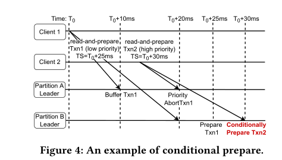

## 提前提交状态转发

当无法priority abort低优先级事务的时候，高优先级事务必须等待，直到低优先级事务提交后并将数据同步至follower才能进行。为了解决这个问题，提出Early committed state forwarding(ECSF)，来允许提交的事务更新，尽早的对后续冲突事务可见。

### Local ECSF

一旦分区Leader收到一个从Coordinator的已提交事务的数据更新，他会将数据对下一个冲突的事务可见，以此来减少所有事务的延迟

> 例，$T_0$时刻$Txn_1$开始写A，在$ T_{20} $开始执行$Txn_2$但是因为有数据冲突，必须等待$Txn_1$执行完，并且对$Txn_2$可见才能执行$Txn_2$，一旦分区Leader收到协调者发来的$Txn_1$提交请求，那么使用LECSF，使$Txn_2$提前拿到这个值，而不需要等待数据同步以维持容错的过程，这就减少了事务延迟。

### Remote ECSF

提交的事务更新首先要在Coordinator上同步，实现容错，然后再转发给分区Leader。分区Leader必须等待更新的commit信息，才能处理后续的高优先级事务。RECSF目的为了减少高优先级事务的等待时间。

方法就是，当分区Leader处理事务的时候，它知道在等待的高优先级事务的前一个冲突事务，分区Leader将其读取请求转发给冲突事务的Coordinator，让Coordinator返回提交的结果即可。

> 例，前段类似于LECSF，但是当处理$Txn_2$时，分区Leader不再等待Coordinator的提交更新数据传来，而是会将读取$Txn_1$的请求先转发给Coordinator，一旦Coordinator确定了要提交$Txn_1$，那么就会回应$Txn_2$的读取请求，这样就节省了时间。

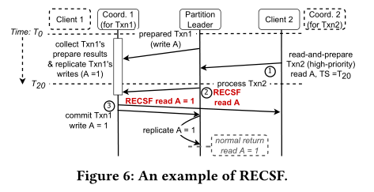

LECSF和RECSF的区别在于，LECSF是被动的，Coordinator将commit命令发送给分区Leader时，其他事务再来这个Leader读数据就已经是可见的了，不需要其他操作，所以对于使用OCC的低优先级事务也可以适用；而RECSF是主动的，因为高优先级事务是2PL的，所以必须等待事务释放锁，才可以进行执行，但是在等待途中，就可以取Coordinator去取这个数据，一旦Coordinator上发出这个事务的commit命令，就可以直接将结果返回给客户端。

# 实验

和Carousel(2PC+OCC)，TAPIR(2PC+OCC)，类似Spanner(2PC+2PL)的系统对比，在本地集群模拟广域网延迟以及云服务器集群，使用三种不同负载，YCSB-T(KV事务测试)，Retwis(类似Twitter的工作负载)，SmallBank(模拟银行工作负载)

5分区3副本，每个数据中心最多存放一个分区的一个副本

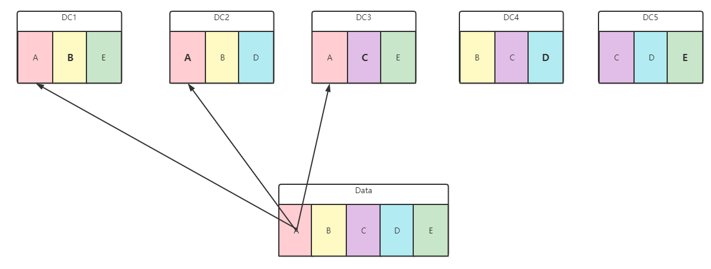

10%的事务被标记为高优先级事务，每100ms获取一次各分区的延迟信息

## YCSB-T

当事务输入速率从50增加到350txn/s时，carousel和2PL+2PC及TAPIR的高优先级事务的延迟显著增加，Natto增加的就不明显

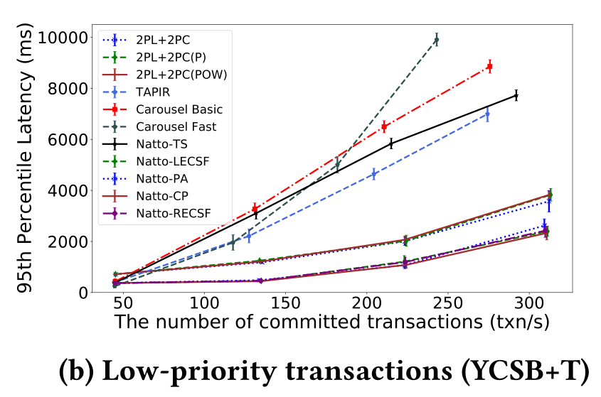

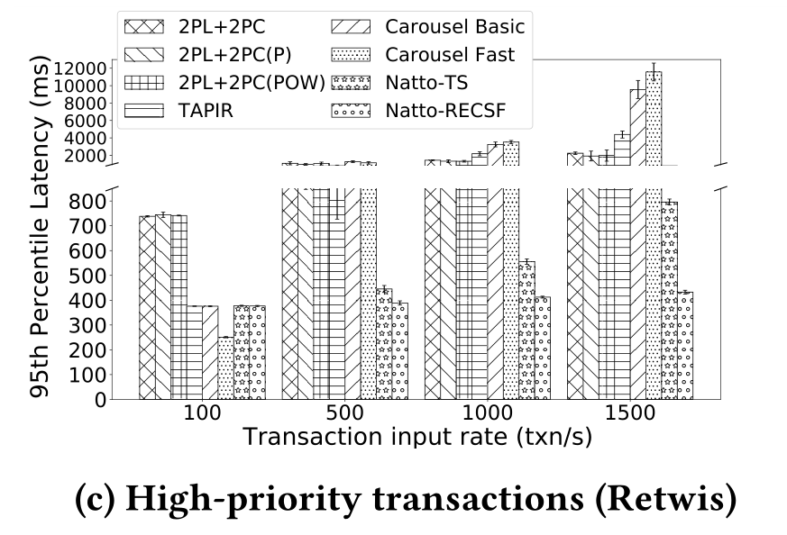

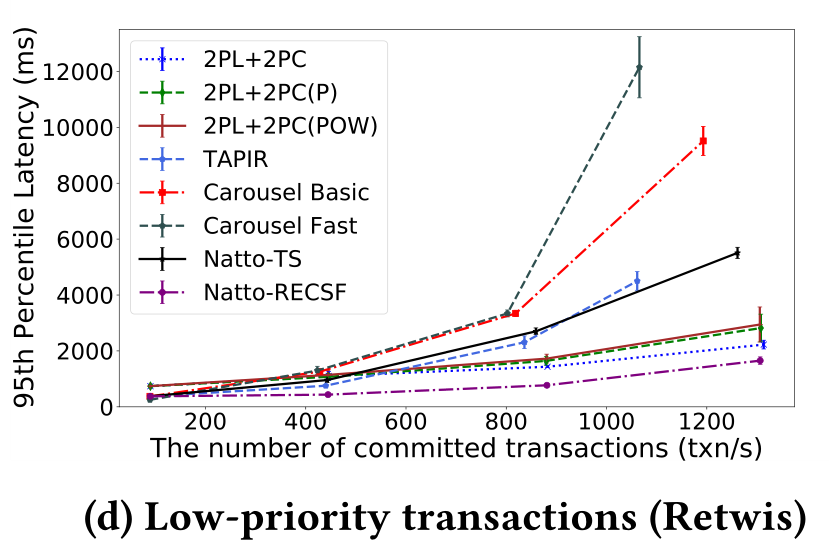

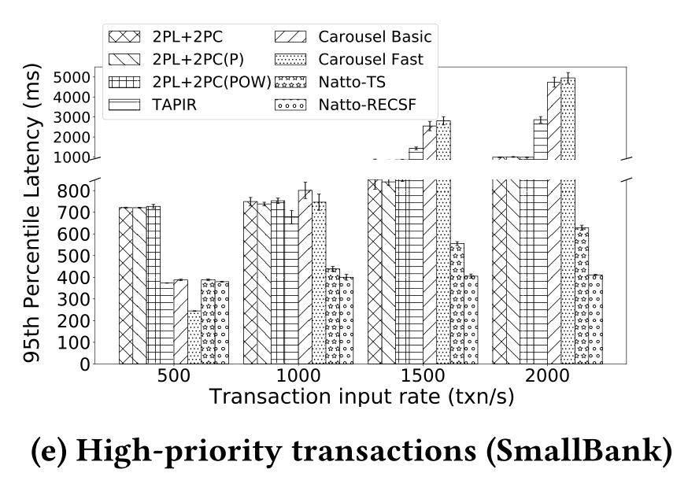

xxxxxxxxxx sstring s = "12";int a = atoi(s.c_str());s = std::to_string(a);c++

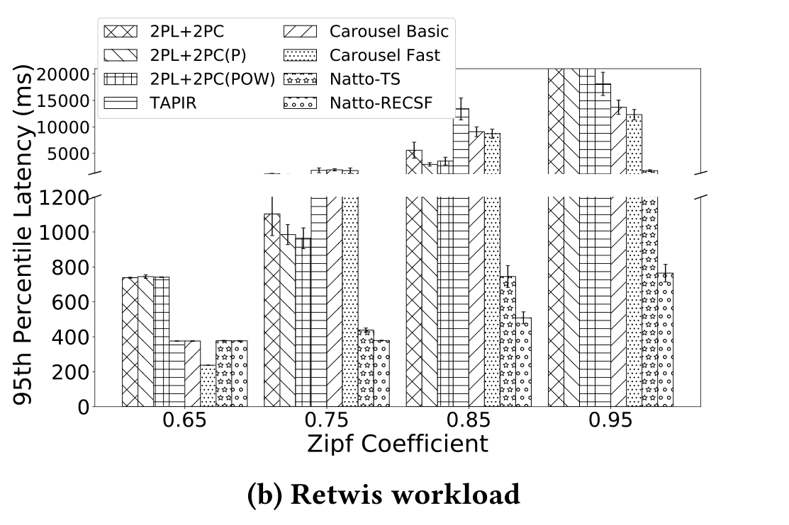

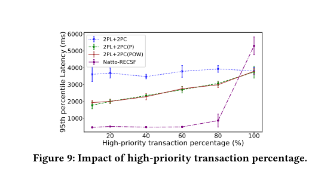

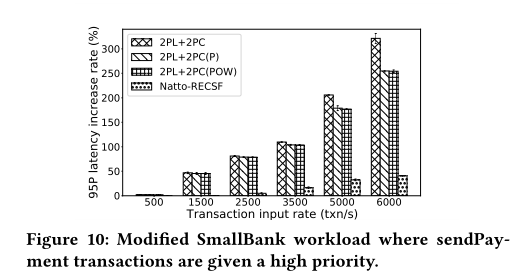

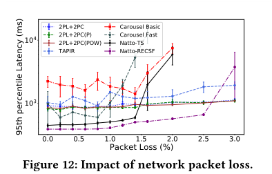

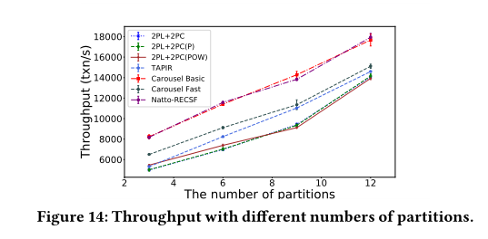

