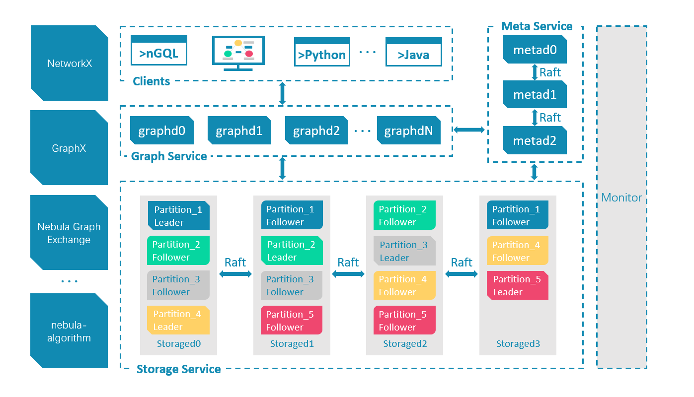
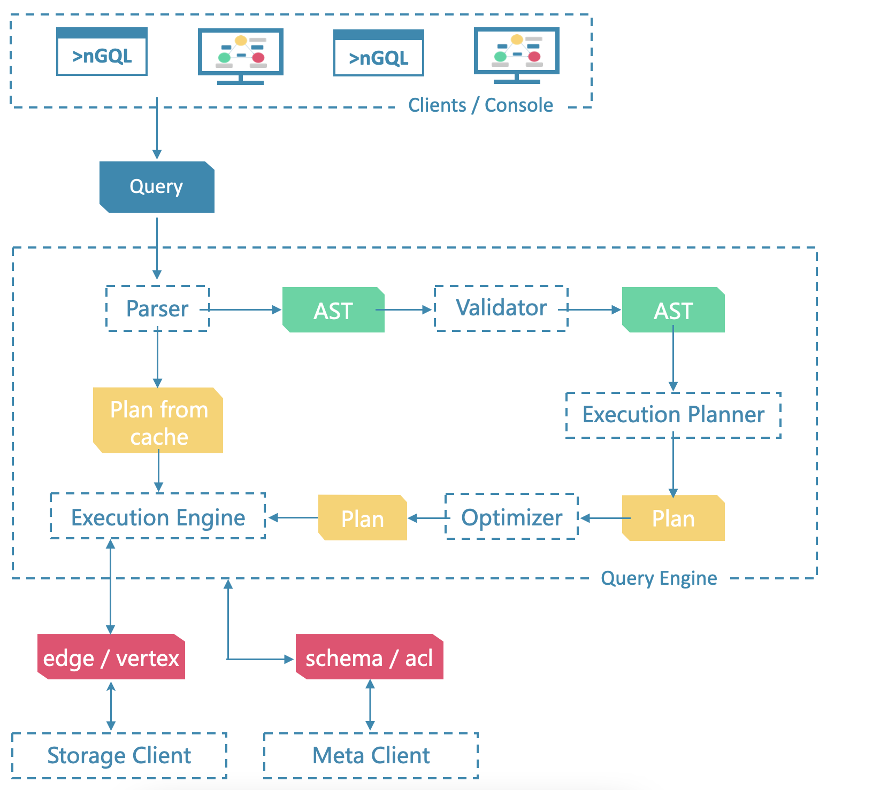
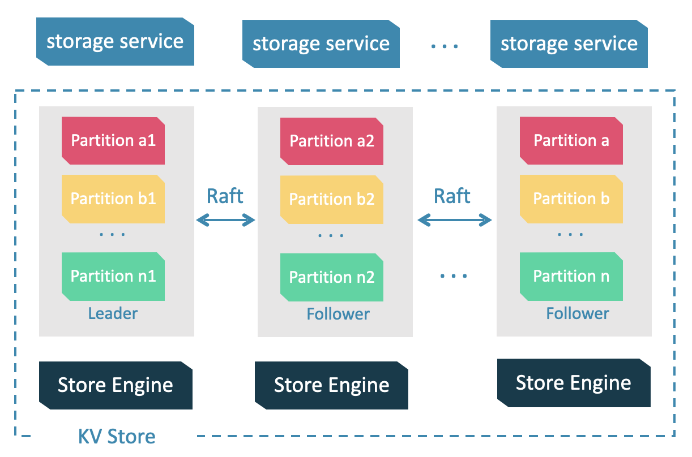

# 代码架构总览

解析引擎查询引擎存储引擎的代码都在其中，当客户端来了一个Query时，首先进入解析引擎，开始语义分析语法分析，抽象成AST树，经过validator验证正确后，生成执行计划，再进行执行计划的优化，优化后的AST树，进入执行引擎执行，通过并发控制算法进行事务的并发处理，和下层存储进行交互。下层存储分为meta service和data service，分别是源信息管理和数据管理。

Storage 包含两个部分， 一是 meta 相关的存储， 我们称之为 Meta Service ，另一个是 data 相关的存储， 我们称之为 Storage Service。

Storage Service 共有三层：最底层是 Store Engine；之上便是我们的 Consensus 层，实现了 Multi Group Raft；最上层，便是我们的 Storage interfaces，这一层定义了一系列和图相关的 API。

---

- conf/：查询引擎配置文件目录
- package/：nebula打包脚本
- resources/：资源文件
- scripts/：启动脚本
- src/：源码目录
  - src/client/: 内置客户端
  - src/codec/: 序列化反序列化工具
  - src/common/: 内核工具包
  - src/console/: 命令台安装脚本
  - src/daemons/:  存储引擎和元数据引擎及图引擎主进程
  - src/graph/:  查询引擎源码
    - src/graph/context/: 查询的上下文信息，包括 AST（抽象语法树），Execution Plan（执行计划），执行结果以及其他计算相关的资源。
    - src/graph/executor/：执行器，各个算子的实现
    - src/graph/optimizer/：RBO（基于规则的优化）实现，以及优化规则
    - src/graph/planner/：算子，以及执行计划生成
    - src/graph/scheduler/：执行计划的调度器
    - src/graph/service/：查询引擎服务层，提供鉴权，执行 Query 的接口
    - src/graph/session/：Session 管理
    - src/graph/stats/：执行统计，比如 P99、慢查询统计等
    - src/graph/util/：工具函数
    - src/graph/validator/：语义分析实现，用于检查语义错误，并进行一些简单的改写优化
    - src/graph/visitor/：表达式访问器，用于提取表达式信息，或者优化
  - src/interface/: Thrift外接RPC框架，graph、meta、storage 服务的接口定义
  - src/kvstore/：基于 raft 的分布式 KV 存储实现
  - src/meta/：基于 KVStore 的元数据管理服务实现，用于管理元数据信息，集群管理，长耗时任务管理等
  - src/mock/：
  - src/parser/：词法解析，语法解析，：AST结构定义
  - src/storage/：基于 KVStore 的图数据存储引擎实现
  - src/tools/：一些小工具实现
  - src/version/：
  - src/webservice/：
- tests/：基于 BDD 的集成测试框架，测试所有 NebulaGraph 提供的功能

## 内核工具包

- src/common/clients/：meta，storage 客户端的 CPP 实现
- src/common/datatypes/：NebulaGraph 中数据类型及计算的定义，比如 string，int，bool，float，Vertex，Edge 等。
- rc/common/expression/：nGQL 中表达式的定义
- src/common/function/：nGQL 中的函数的定义
- src/common/interface/：graph、meta、storage 服务的接口定义

# 代码笔记

在执行阶段，执行引擎通过 Scheduler（调度器）将 Planner 生成的物理执行计划转换为一系列 Executor，驱动 Executor 的执行。 Executor，即执行器，物理执行计划中的每个 PlanNode 都会对应一个 Executor。

---

## Scheduler

- src/graph/scheduler/：
  - AsyncMsgNotifyBasedScheduler.cpp
  - AsyncMsgNotifyBasedScheduler.h
  - CMakeLists.txt
  - Scheduler.cpp
  - Scheduler.h

Scheduler 抽象类定义了调度器的公共接口，可以继承该类实现多种调度器。 目前实现了 AsyncMsgNotifyBasedScheduler 调度器，它基于异步消息通信与广度优先搜索避免栈溢出

## Storage

src/storage/BaseProcessor :

> BaseProcessor定义了Promise以及获取它相关联的Future(通过getFuture接口)，以及处理时的一些记录结果

src/storage/transaction/TransactionManager: 

> worker是处理工作的线程，一个事务的处理过程是prepareLocal，processRemote，processLocal，finish
>
> onFinished()记录latency之类的数据
>
> commit时，首先addChainTask，再通过future来异步执行事务处理流程

src/storage/mutate:

> 是transaction文件夹中的cpp文件使用的公共父类
