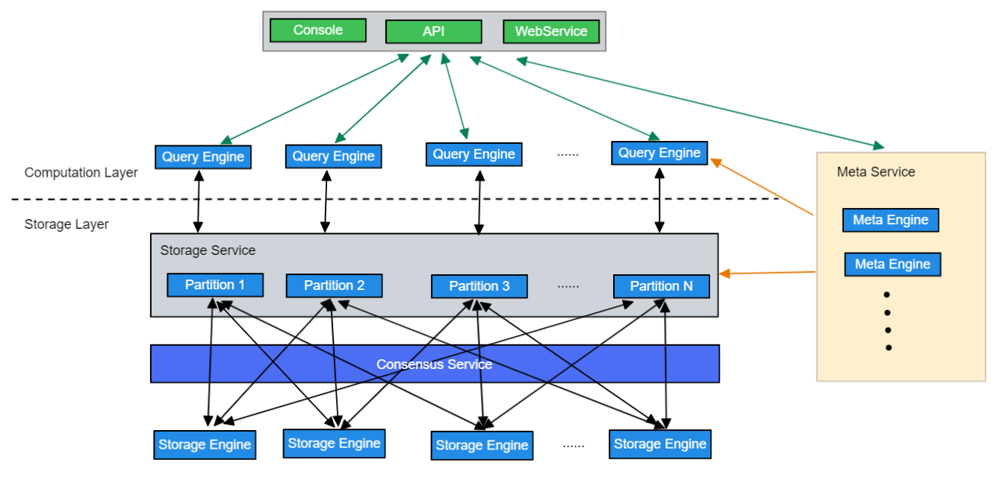

# Nebula编译安装

## 源码安装build

```shell
apt-get install -y m4 git wget unzip xz-utils curl lsb-core build-essential libreadline-dev ncurses-dev  bzip2
git clone --branch release-3.3 https://gitee.com/Codebells/nebula.git
cd nebula
mkdir build && cd build
cmake -DCMAKE_INSTALL_PREFIX=/usr/local/nebula -DENABLE_TESTING=OFF -DCMAKE_BUILD_TYPE=Release ..

make -j 30 2>&1 | tee log.txt
make install
rename "s/.default//g" /usr/local/nebula/etc/*.conf.default 

```

## 源码安装的nebula卸载

/usr/local/nebula/scripts/nebula.service stop all

rm -rf /usr/local/nebula

ps -aux|grep nebula

rm -rf /usr/local/nebula/data

## Run Nebula

/usr/local/nebula/scripts/nebula.service start all

/usr/local/nebula/scripts/nebula.service status all

/usr/local/nebula/scripts/nebula.service stop all

## 安装nebula console

chmod 111 nebula-console

pushd ~

./nebula-console -addr 127.0.0.1 -port 9669 -u root -p wucaiyi

ADD HOSTS 127.0.0.1:9779

ADD HOSTS 172.31.16.44:9779,172.31.16.45:9779,172.31.16.46:9779

show hosts

BALANCE LEADER;

DROP HOSTS 127.0.0.1:9779

### nGQL语句

```
CREATE SPACE nebula (vid_type = FIXED_STRING(30));
USE nebula;
CREATE TAG IF NOT EXISTS person (name string, age int);
CREATE TAG INDEX IF NOT EXISTS person_index on person(name(10));
INSERT VERTEX person(name,age) VALUES "vid1" :("wcy",23);
INSERT VERTEX person(name,age) VALUES "vid2" :("hsj",24);
INSERT VERTEX person(name,age) VALUES "vid3" :("ych",25);
CREATE EDGE IF NOT EXISTS relate(relation string);
INSERT EDGE relate(relation) VALUES "vid1"->"vid2":("homate");
INSERT EDGE relate(relation) VALUES "vid1"->"vid3":("homate2");
FETCH PROP ON person "vid1" YIELD properties(VERTEX);
REBUILD TAG INDEX person_index;
MATCH (v:person{name:"wcy"})--(v2:person) WHERE id(v) =='vid1' RETURN v2 AS AllProp;
MATCH (v:person{name:"wcy"})-->(v2:person) RETURN v2 AS AllProp;
SUBMIT JOB STATS;
SHOW STATS;
SHOW JOB $(jobId);

INSERT VERTEX person(name,age) VALUES "vid2" :("hsj",24);
INSERT VERTEX person(name,age) VALUES "vid3" :("ych",25);
INSERT VERTEX person(name,age) VALUES "vid21" :("hsj",24);
INSERT VERTEX person(name,age) VALUES "vid31" :("ych",25);
INSERT VERTEX person(name,age) VALUES "vid22" :("hsj",24);
INSERT VERTEX person(name,age) VALUES "vid32" :("ych",25);

CREATE SPACE IF NOT EXISTS stress_test_0331(PARTITION_NUM = 24, REPLICA_FACTOR = 1, vid_type = int64);
USE stress_test_0331;
CREATE TAG IF NOT EXISTS `Person`(`firstName` string,`lastName` string,`gender` string,`birthday` string,`creationDate` datetime,`locationIP` string,`browserUsed` string);
CREATE TAG INDEX IF NOT EXISTS `person_first_name_idx` on `Person`(firstName(10));
INSERT VERTEX Person(firstName, lastName, gender, birthday, creationDate, locationIP, browserUsed) VALUES 9333:("Mahinda", "Perera", "male", "1989-12-03", datetime("2010-02-14T15:32:10.447"), "119.235.7.103", "Firefox");
```

# k6 LDBC测试

```shell
sudo apt-get install -y \
     git \
     wget \
     python3-pip \
     python \
     openjdk-8-jdk \
     maven 

export JAVA_HOME=/usr/lib/jvm/default-java/
git clone https://github.com/vesoft-inc/nebula-bench.git 
cd nebula-bench
pip3 install --user -r requirements.txt
python3 run.py --help
wget https://dl.google.com/go/go1.17.8.linux-amd64.tar.gz
tar -xf go1.17.8.linux-amd64.tar.gz -C /usr/local
sudo vim /etc/profile

export GOROOT=/usr/local/go
export GOPATH=/home 
export GOBIN=$GOPATH/bin
export PATH=$PATH:$GOROOT/bin
export PATH=$PATH:$GOPATH/bin

source /etc/profile
go version
export GOPROXY=https://goproxy.cn
/bin/bash scripts/setup.sh

python3 run.py data  -s 1

python3 run.py nebula importer -a 172.31.16.44:9669,172.31.16.45:9669,172.31.16.46:9669

./scripts/nebula-importer --config  ./importer_config.yaml
python3 run.py stress scenarios -a 172.31.16.44:9669,172.31.16.45:9669,172.31.16.46:9669
python3 run.py stress run -scenario  insert.InsertScenario --space='stress_test_0401' --args='-u 50 -d 3s'
python3 run.py stress run -scenario fetch.FetchEdge --args='-u 50 -d 60s'
CREATE SPACE IF NOT EXISTS stress_test_0331(PARTITION_NUM = 24, REPLICA_FACTOR = 1, vid_type = int64);
USE stress_test_0331;
CREATE TAG IF NOT EXISTS `Person`(`firstName` string,`lastName` string,`gender` string,`birthday` string,`creationDate` datetime,`locationIP` string,`browserUsed` string);
CREATE TAG INDEX IF NOT EXISTS `person_first_name_idx` on `Person`(firstName(10));
INSERT VERTEX Person(firstName, lastName, gender, birthday, creationDate, locationIP, browserUsed) VALUES 9333:("Mahinda", "Perera", "male", "1989-12-03", datetime("2010-02-14T15:32:10.447"), "119.235.7.103", "Firefox");

 INSERT VERTEX `Tagclass`(`name`,`url`) VALUES  155: ("Royalty","http://dbpedia.org/ontology/Royalty"), 141: ("NascarDriver","http://dbpedia.org/ontology/NascarDriver"), 233: ("EurovisionSongContestEntry","http://dbpedia.org/ontology/EurovisionSongContestEntry");
```


## Docker nebula安装

git clone -b release-3.1 https://github.com/vesoft-inc/nebula-docker-compose.git

cd nebula-docker-compose/

docker-compose up -d

docker exec -it nebula-docker-compose-console-1 /bin/sh

./usr/local/bin/nebula-console -u root -p wucaiyi --address=graphd --port=9669

### Docker-compose安装

sudo curl -L "[https://github.com/docker/compose/releases/download/v2.12.2/docker-compose-](https://github.com/docker/compose/releases/download/v2.2.2/docker-compose-)$(uname -s)-$(uname -m)" -o /usr/local/bin/docker-compose

sudo chmod +x /usr/local/bin/docker-compose

sudo ln -s /usr/local/bin/docker-compose /usr/bin/docker-compose

docker-compose version

# 代码架构总览

解析引擎查询引擎存储引擎的代码都在其中，当客户端来了一个Query时，首先进入解析引擎，开始语义分析语法分析，抽象成AST树，经过validator验证正确后，生成执行计划，再进行执行计划的优化，优化后的AST树，进入执行引擎执行，通过并发控制算法进行事务的并发处理，和下层存储进行交互。下层存储分为meta service和data service，分别是源信息管理和数据管理。


Storage 包含两个部分， 一是 meta 相关的存储， 我们称之为 Meta Service ，另一个是 data 相关的存储， 我们称之为 Storage Service。

Storage Service 共有三层：最底层是 Store Engine；之上便是我们的 Consensus 层，实现了 Multi Group Raft；最上层，便是我们的 Storage interfaces，这一层定义了一系列和图相关的 API。


---

- conf/：查询引擎配置文件目录
- package/：nebula打包脚本
- resources/：资源文件
- scripts/：启动脚本
- src/：源码目录
  - src/client/: 内置客户端
  - src/codec/: 序列化反序列化工具
  - src/common/: 内核工具包
  - src/console/: 命令台安装脚本
  - src/daemons/:  存储引擎和元数据引擎及图引擎主进程
  - src/graph/:  查询引擎源码
    - src/graph/context/: 查询的上下文信息，包括 AST（抽象语法树），Execution Plan（执行计划），执行结果以及其他计算相关的资源。
    - src/graph/executor/：执行器，各个算子的实现
    - src/graph/optimizer/：RBO（基于规则的优化）实现，以及优化规则
    - src/graph/planner/：算子，以及执行计划生成
    - src/graph/scheduler/：执行计划的调度器
    - src/graph/service/：查询引擎服务层，提供鉴权，执行 Query 的接口
    - src/graph/session/：Session 管理
    - src/graph/stats/：执行统计，比如 P99、慢查询统计等
    - src/graph/util/：工具函数
    - src/graph/validator/：语义分析实现，用于检查语义错误，并进行一些简单的改写优化
    - src/graph/visitor/：表达式访问器，用于提取表达式信息，或者优化
  - src/interface/: Thrift外接RPC框架，graph、meta、storage 服务的接口定义
  - src/kvstore/：基于 raft 的分布式 KV 存储实现
  - src/meta/：基于 KVStore 的元数据管理服务实现，用于管理元数据信息，集群管理，长耗时任务管理等
  - src/mock/：
  - src/parser/：词法解析，语法解析，：AST结构定义
  - src/storage/：基于 KVStore 的图数据存储引擎实现
  - src/tools/：一些小工具实现
  - src/version/：
  - src/webservice/：
- tests/：基于 BDD 的集成测试框架，测试所有 NebulaGraph 提供的功能

## 内核工具包

- src/common/clients/：meta，storage 客户端的 CPP 实现
- src/common/datatypes/：NebulaGraph 中数据类型及计算的定义，比如 string，int，bool，float，Vertex，Edge 等。
- rc/common/expression/：nGQL 中表达式的定义
- src/common/function/：nGQL 中的函数的定义
- src/common/interface/：graph、meta、storage 服务的接口定义

# 代码笔记

在执行阶段，执行引擎通过 Scheduler（调度器）将 Planner 生成的物理执行计划转换为一系列 Executor，驱动 Executor 的执行。 Executor，即执行器，物理执行计划中的每个 PlanNode 都会对应一个 Executor。

---

## Scheduler

- src/graph/scheduler/：
  - AsyncMsgNotifyBasedScheduler.cpp
  - AsyncMsgNotifyBasedScheduler.h
  - CMakeLists.txt
  - Scheduler.cpp
  - Scheduler.h

Scheduler 抽象类定义了调度器的公共接口，可以继承该类实现多种调度器。 目前实现了 AsyncMsgNotifyBasedScheduler 调度器，它基于异步消息通信与广度优先搜索避免栈溢出

## Storage

src/storage/BaseProcessor :

> BaseProcessor定义了Promise以及获取它相关联的Future(通过getFuture接口)，以及处理时的一些记录结果

src/storage/transaction/TransactionManager: 

> worker是处理工作的线程，一个事务的处理过程是prepareLocal，processRemote，processLocal，finish
>
> onFinished()记录latency之类的数据
>
> commit时，首先addChainTask，再通过future来异步执行事务处理流程

src/storage/mutate:

> 是transaction文件夹中的cpp文件使用的公共父类


# 系统架构总览



上层计算层对下层存储层分片不感知，Meta Service管理分片状态，上层计算层无状态

Partition是逻辑分区，每个Partition存在Raft组，读写数据是到分区raft组的leader节点读写。每个Storage Engine保存多个分区数据，可能有主分区也可能没有

# 源码

```c++
/**
   * @brief Write multiple key/values to kvstore asynchronously
   *
   * @param spaceId
   * @param partId
   * @param keyValues Key/values to put
   * @param cb Callback when has a result
   */
  void asyncMultiPut(GraphSpaceID spaceId,
                     PartitionID partId,
                     std::vector<KV>&& keyValues,
                     KVCallback cb) override;

  /**
   * @brief Remove a key from kvstore asynchronously
   *
   * @param spaceId
   * @param partId
   * @param key Key to remove
   * @param cb Callback when has a result
   */
  void asyncRemove(GraphSpaceID spaceId,
                   PartitionID partId,
                   const std::string& key,
                   KVCallback cb) override;

  /**
   * @brief Remove multible keys from kvstore asynchronously
   *
   * @param spaceId
   * @param partId
   * @param key Keys to remove
   * @param cb Callback when has a result
   */
  void asyncMultiRemove(GraphSpaceID spaceId,
                        PartitionID partId,
                        std::vector<std::string>&& keys,
                        KVCallback cb) override;

  /**
   * @brief Remove keys in range [start, end) asynchronously
   *
   * @param spaceId
   * @param partId
   * @param start Start key
   * @param end End key
   * @param cb Callback when has a result
   */
  void asyncRemoveRange(GraphSpaceID spaceId,
                        PartitionID partId,
                        const std::string& start,
                        const std::string& end,
                        KVCallback cb) override;

  /**
  update
   * @brief Async commit multi operation, difference between asyncMultiPut or asyncMultiRemove
   * is this method allow contains both put and remove together, difference between asyncAtomicOp is
   * that asyncAtomicOp may have CAS
   *
   * @param spaceId
   * @param partId
   * @param batch Encoded write batch
   * @param cb Callback when has a result
   */
  void asyncAppendBatch(GraphSpaceID spaceId,
                        PartitionID partId,
                        std::string&& batch,
                        KVCallback cb) override;

  /**
  
   * @brief Do some atomic operation on kvstore
   *
   * @param spaceId
   * @param partId
   * @param op Atomic operation
   * @param cb Callback when has a result
   */
  void asyncAtomicOp(GraphSpaceID spaceId,
                     PartitionID partId,
                     MergeableAtomicOp op,
                     KVCallback cb) override;

```

实验服务器和压测机为同一台物理机配置为32 vCPU 64 GiB，测试数据采用 LDBC-SNB SF10数据集，SF10据集大小为 10G，共有 29,987,835 个点以及 176,623,382 条边。测试用的图空间分区数为 24，节点数为 3。vu表示的是 k6 使用的概念“virtual user”，即性能测试中的并发数；测试使用50_vu 表示 50 个并发用户，目前，以Nebula3.3版本性能作为基准，Taas测试为单taas节点连接三台nebula节点，即将nebula看成单机数据库连接同一台taas节点作为分布式事务处理模块，Nebula原始的 InsertVertex的吞吐量在59.1k，平均latency为2.2ms，FetchEdge的吞吐量在101k，latency为1.1ms，加入Taas后，InsertVertex性能为35.3k，平均latency为8.35ms平均性能下降40%，FetchEdge的吞吐量在96.1k，latency为1.03ms，平均性能下降6%左右。
