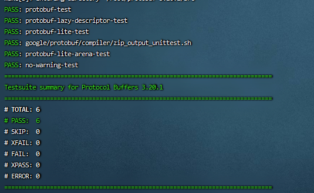

安装的是c++版本protobuf

到下面去下载想要的版本

> https://github.com/protocolbuffers/protobuf/releases

我下载的是`protobuf-cpp-3.20.1.tar.gz`

```shell
sudo apt-get install autoconf automake libtool curl make g++ unzip
tar xvfz protobuf-cpp-3.20.1.tar.gz
cd protobuf-3.20.1
# $(nproc) ensures it uses all cores for compilation
./configure
make -j$(nproc) 
make check
sudo make install
# refresh shared library cache.
sudo ldconfig 
```



在2.2.0版本后，在编译时需要传递各种链接才能完成编译，protobuf使用pkg-config管理

```shell
pkg-config --cflags protobuf         # print compiler flags
pkg-config --libs protobuf           # print linker flags
pkg-config --cflags --libs protobuf  # print both
```

For example:

```shell
c++ my_program.cc my_proto.pb.cc `pkg-config --cflags --libs protobuf`
```

protobuf Example

```shell
cd examples
make cpp
./add_person_cpp addressbook.data
./list_people_cpp addressbook.data
```

通过查看代码，在.proto文件里有数据的最基本定义

```protobuf
syntax = "proto3";
package tutorial;

import "google/protobuf/timestamp.proto";//导入想要使用的包
message Person {
  string name = 1;
  int32 id = 2;  // Unique ID number for this person.
  string email = 3;

  enum PhoneType {
    MOBILE = 0;
    HOME = 1;
    WORK = 2;
  }

  message PhoneNumber {
    string number = 1;
    PhoneType type = 2;
  }

  repeated PhoneNumber phones = 4;

  google.protobuf.Timestamp last_updated = 5;
}

// Our address book file is just one of these.
message AddressBook {
  repeated Person people = 1;
}
```

在使用时，使用protoc 

# 使用记录

## mutable_*()

protobuf mutable_* 函数

从该函数的实现上来看，该函数返回指向该字段的一个指针。同时将该字段置为被设置状态。

若该对象存在，则直接返回该对象，若不存在则新new 一个。

## string和bytes类型

protobuf中有string 和 bytes两种数据类型， 相对应于python中的 string和 bytes类型。但在C++

中有std::string 却没有bytes类型。他们之间怎么转换。

看了一些介绍得到的结论是：

（1）在C++中，protobuf的[string类](https://so.csdn.net/so/search?q=string类&spm=1001.2101.3001.7020)型和bytes类型都对应与C++的std::string类型

（2）区别是，protobuf中string 对应的 std::string 类型需进行UTF8字符的检查，而bytes对应的std::string类型三不进行UTF8字符检查的
