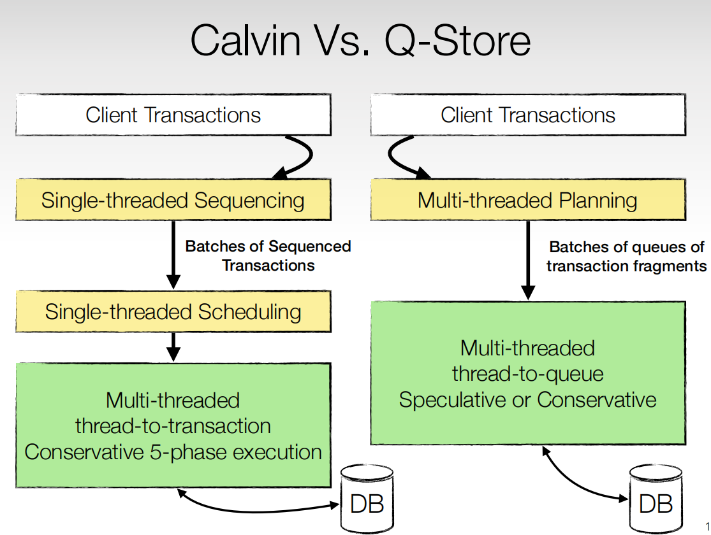
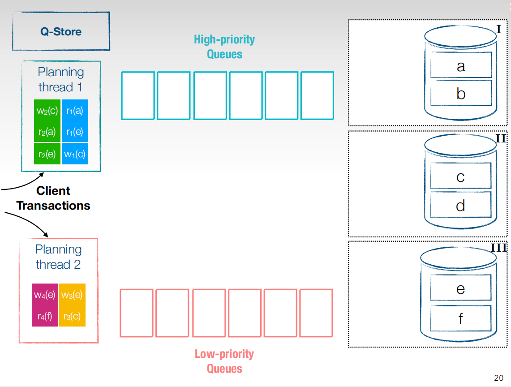
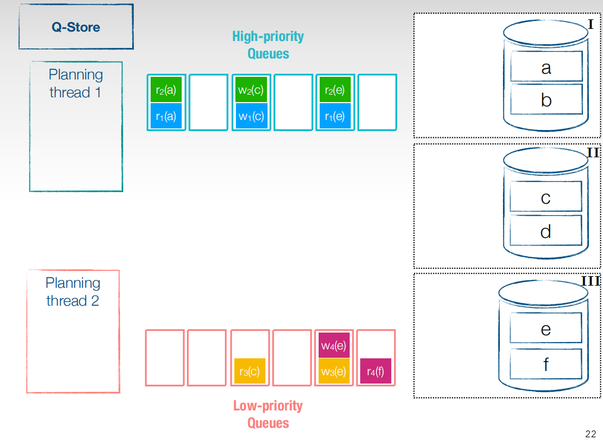
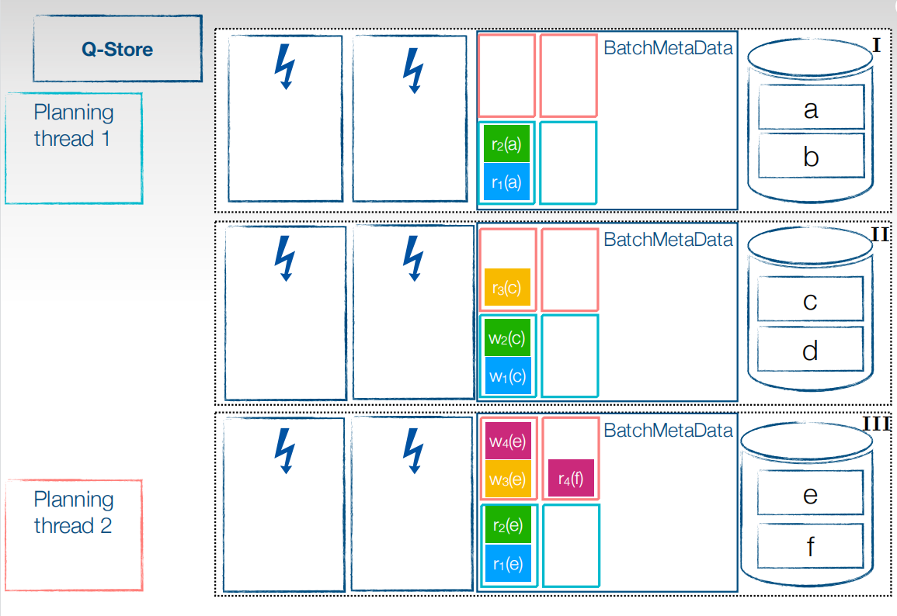
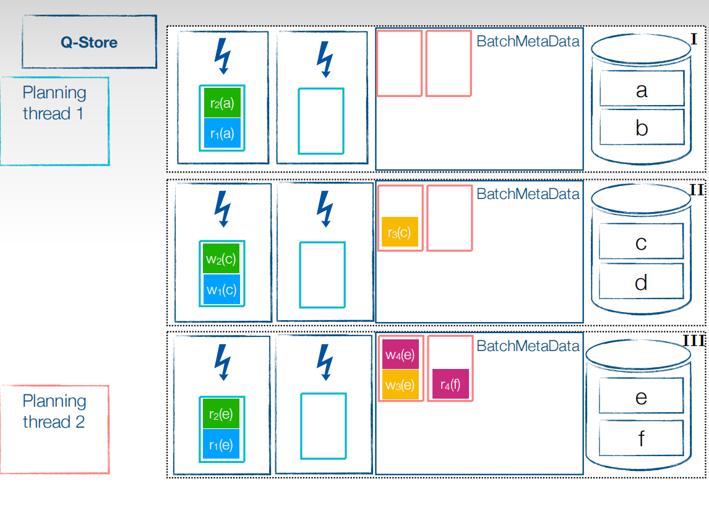
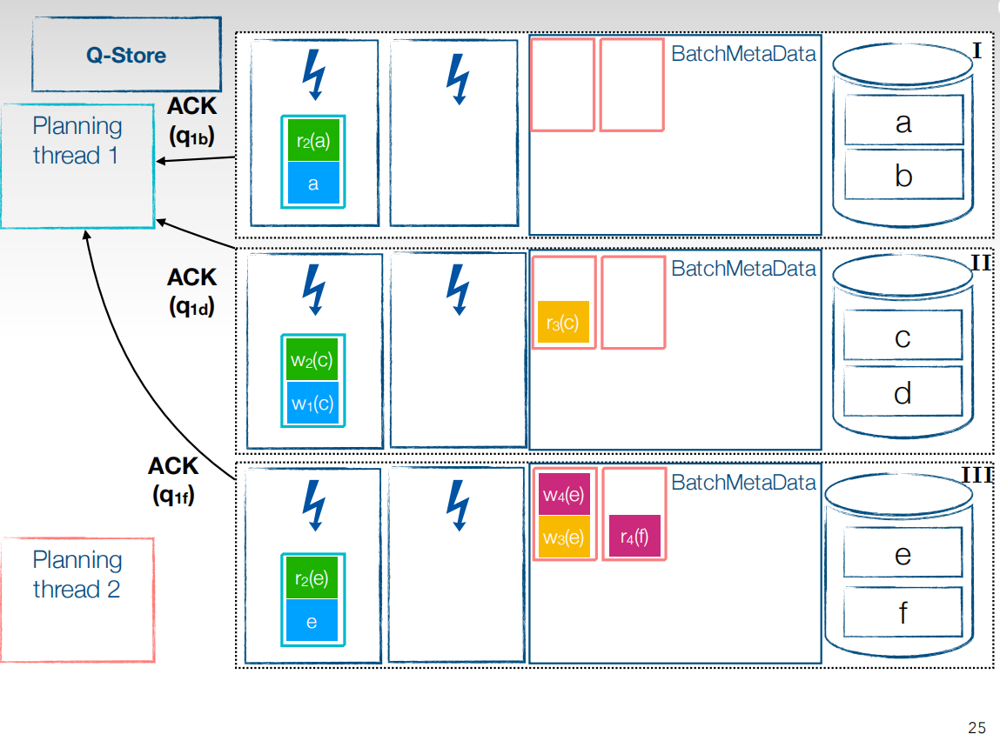
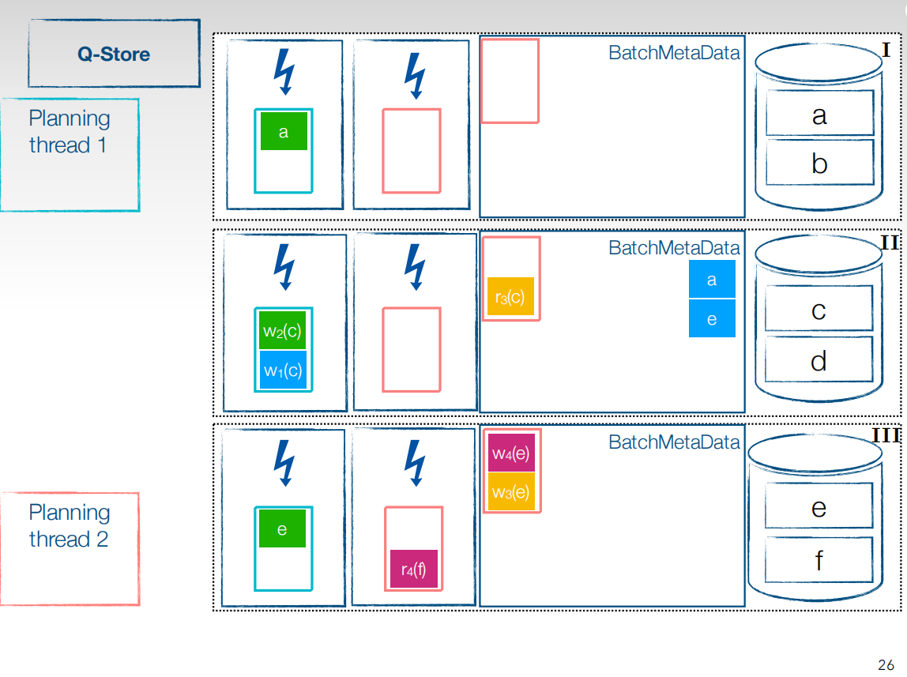
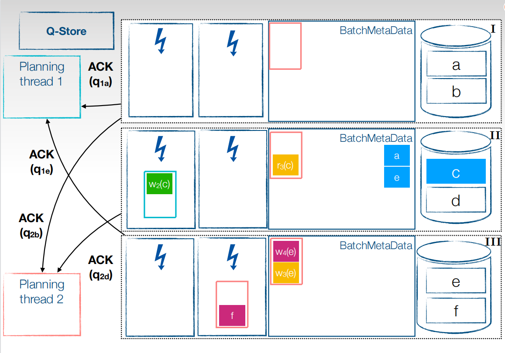
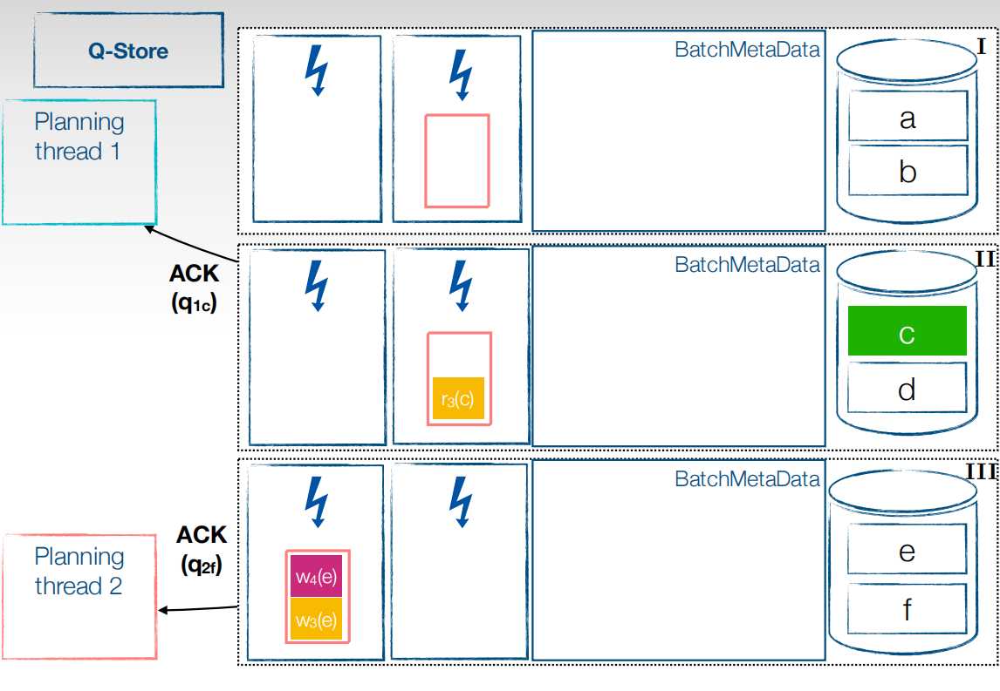
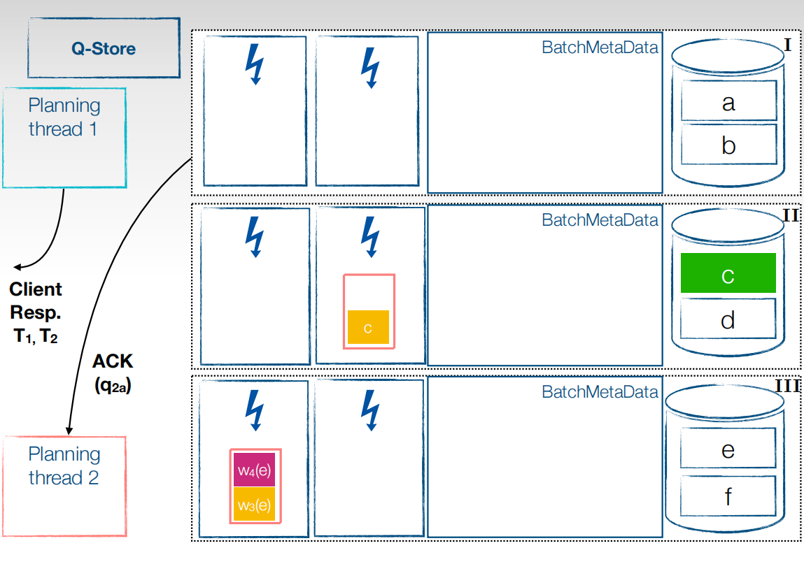

和Quecc一个思路，将该思路实现到数据库上进行实验测试，简单来说可以看成是一个将原先确定性数据库的事务单线程加锁或排序问题看成并发加锁排序。论文对比Calvin确定性数据库利用单线程进行schedule事务的思路，利用提高batchsize来达到Calvin的单点瓶颈，以展现自身性能。

<!-- more -->

思路建议看Quecc这篇论文，Qstore这篇论文对思路解释的没有那么清晰，偏向去证明各个隔离级别的思路正确性。[PPT](https://expolab.org/papers/QStore-EDBT20-final.pdf)也比较清晰的解释了思路。这篇博客就用PPT来记录一下它的思路。

# 背景

提出很多分布式数据库事务处理存在问题，并且随着现在硬件CPU核数越来越多，大部分数据库都无法完全利用CPU的性能。而且分布式系统的需要跨分区操作数据，为了达成各分区并发执行的结果一致性，就必须存在某种规则协议来约束。通常来说，我们使用2PC来保证。但是2PC是一个瓶颈，因为它需要节点之间的协调，存在单点瓶颈。后提出确定性数据库来解决这个问题，确定性数据库提前知道事务读写集，确定性数据库的概念可以看我[前一篇文章](https://codebells.github.io/post/deterministic-database.html)，这样各节点就不需要协调了。但是在确定性数据库中也存在并发度不够的问题，这篇论文就是充分利用CPU的并行能力执行事务。

# Calvin和Qstore对比

[Calvin流程](https://codebells.github.io/post/distribute-transaction.html#Calvin%E5%88%86%E5%B8%83%E5%BC%8F%E4%BA%8B%E5%8A%A1)看之前的就行。

Qstore流程和Calvin的不同就是，Calvin需要经过事务排序并且batch打包后，经过单线程的Scheduler来调度事务的执行。而Qstore可以多线程的对事务进行排序并且拆分分区，排列出优先级顺序后，高优先级顺序的并且不在同一个分区的事务就可以并行执行了。这样在调度和执行阶段都可以并行了。下面详细看看这个过程。

接收到客户端的事务，进入到planing线程，planning线程是存在优先级的，进入优先级高的线程就可以先并行执行。

将planning线程中的事务拆分成子事务，加入到优先级队列中，低优先级planning线程对应加入到低优先级队列，低优先级队列会映射分区，同一个分区的子事务会按照在planning线程中的顺序进行排序串行执行，不同分区的子事务可以并行执行。接下来将分类好的子事务分发到对应的各个分区上去。

首先需要将子事务存储在分区的BatchMetaData中，按照之前分好的低优先级高优先级以及分区来标注好，分类存储。接下来就可以进行并行执行阶段了。

先将高优先级的子事务放到执行线程去执行，对于read，可以直接读本地，而无需等待，高优先级队列中的所有事务都执行完了后，才会执行低优先级事务。

Ack $q{_n}{_m}$各个符号代表的意思是，n为优先级为多少的planning线程，m代表哪个分区提交的，默认为节点的最后一个分区。当执行线程执行完后会给planning线程发送ACK信号。代表执行完成，可以放对应分区的下一个优先级了。

这样依次类推，将所有事务执行完成后有不同的提交策略。第一个比较麻烦，当事务的所有子事务都执行完成后，提交事务，让结果可见，还有一种就比较简单，以batch为粒度提交事务。图中是以事务为粒度提交，

这样就可以在事务流程中全部并行，让Cpu的利用率达到最大。

这就是Qstore和quecc的基本思路。
