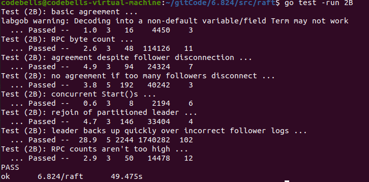
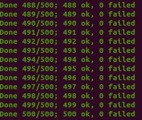

继续将Mit6.824的2b部分实现，以及踩的坑，对于2B，也是运行了上千次，都能pass，比较稳健，记录一下踩的坑以及思路解释

<!-- more -->

# 思路

对于日志增量的思路其实论文中也很多，大体上和前文讲到的[日志增量](https://codebells.github.io/post/raft-paper.html#%E6%97%A5%E5%BF%97%E5%A4%8D%E5%88%B6)区别不大，但是对于很多细节需要好好把握，在其中，最重要的还是并发问题。首先当节点成为Leader时，需要立刻广播AppendEntries，在没有日志时，我们可以理解成心跳，在存在日志时，这个心跳包应当携带Follower需要的日志，将其Append到Follower节点的日志中。而如何对Follower所需要的日志进行判断，需要raft的Leader节点维护一个NextIndex[]数组，以及MatchIndex[]数组，分别代表各节点下一个插入的日志应该在哪个index以及各节点已经确定同步的日志index位置。这两个数据在新Leader出现时初始化值NextIndex为leader的log长度+1，MatchIndex为0，通过心跳包的试探，不断回退NextIndex值，直到匹配上日志。节点的日志都是相同顺序，在相同index上一定是相同日志，所以一旦从后往前匹配到相同日志，说明之前日志都是相同的，这时即可找到MatchIndex和NextIndex的值，再对后续的日志数据进行同步。

同步的过程可以一条日志一条日志的同步，也可以多条日志放在同一个心跳包中一起同步，找匹配NextIndex时，也有一个小优化点，可以尽快达到同步点，放在后面代码说。


# Start

通过对test代码的查看，知道2B测试时，先是调用start函数，对leader的日志进行插入，然后检查日志是否成功写入是通过applyChan实现，通过查看applych这个Channel信息来检测是否成功同步日志，具体可以对测试源码进行查看，对于返回值，注释说的很清楚，第一个是该日志的index，第二个int是当前term，第三个返回当前Server是否为Leader。

```go
func (rf *Raft) Start(command interface{}) (int, int, bool) {
	rf.mu.Lock()
	defer rf.mu.Unlock()
	if rf.state != Leader {
		return -1, rf.currentTerm, false
	}
	term := rf.currentTerm
	rf.logs = append(rf.logs, LogEntry{term, command})
	rf.persist()
	return rf.getLastIndex(), term, true
}
```

# 日志增量RPC实现

该增量实现为2C之前的版本，到2D版本会有一些index的修改以及部分日志检查的修改。

```go
func (rf *Raft) applyLogs() {//将日志发送给applych，告知该日志已经apply
	for i := rf.lastApplied + 1; i <= rf.commitIndex; i++ {//可以Apply到CommitIndex为止
		rf.lastApplied = i//更新lastApplied值
		rf.applyCh <- ApplyMsg{
			CommandValid: true,
			Command: rf.logs[rf.getLogIndex(i)].Command,
			CommandIndex: i,
		}
	}
}
func (rf *Raft) AppendEntries(args *AppendEntriesArgs, reply *AppendEntriesReply) {
	rf.mu.Lock()
	defer rf.mu.Unlock()
	defer rf.persist()
	if args.Term < rf.currentTerm {  //当前节点Term大，Leader是旧Leader，废弃
		reply.Term = rf.currentTerm
		reply.RollBackIndex = -1
		reply.RollBackTerm = -1
		reply.Success = false
		return
	}
	if args.Term > rf.currentTerm {//当前节点是旧节点，先变为Follower再说
		rf.becomeFollower()  // 顺序一定不能变，会因为这个出现并发问题，见Debug1
		rf.currentTerm=args.Term
	}
    //更新raft节点
	lastIndex := rf.getLastIndex()
	rf.noBlockChan(rf.heartbeatCh, true)
	reply.Term = rf.currentTerm
	reply.Success = false//先全为false
	reply.RollBackIndex = -1//冲突检查优化
	reply.RollBackTerm = -1

	//日志检查
	if args.PrevLogIndex > lastIndex {//Follower的日志比发过来的PrevLogIndex更短，这时RollBackTerm为-1，
        //可以借这个来判断是节点日志更短
		reply.RollBackIndex = lastIndex + 1 //返回当前节点最后的日志再判断一下 
		return
	}
	if  rf.logs[args.PrevLogIndex].Term  != args.PrevLogTerm {	
        // 再PrevLogIndex这个位置上和Leader的对应的日志term不同，说明有冲突
		// 开始检查这个节点的日志该Term的日志，如果有的话，因为Log是完全一致的，Leader一定是包含所有最新的日志条目
        // 所以，可以快速检查这个Term的日志是否Leader中存在，如果Leader存在，即可快速定位，
        // 如果不存在，就可以省去检查该Term日志的时间
		// 如果有这样的日志条目，那么RollBackIndex更新为这条条目的index，否则RollBackIndex为-1
		reply.RollBackTerm = rf.logs[args.PrevLogIndex].Term//更新RollBackTerm为这个位置上的Term
		for i := args.PrevLogIndex; i >= 0 && rf.logs[i].Term == rf.logs[args.PrevLogIndex].Term ; i-- { 
			reply.RollBackIndex = i
		}
		return
	}
	//如果通过了日志检查，Server在PrevLogIndex存在和Leader相同的日志
    //那么后面的日志全部清除，开始Append所有Leader的后续日志
    //这个地方是存在问题的，但是仍然能稳定过2b的case，我们需要在网络一团糟的时候，选出leader，并且同步
    //有可能会存在append的日志当前节点全部存在的情况，也就是只能清空出现冲突的日志之后的日志
    //如果没有冲突，是不能无脑清空的，在后续2D的时候发现该问题后改正
	startClean := args.PrevLogIndex + 1
	rf.logs = rf.logs[:startClean] 
	rf.logs = append(rf.logs, args.Entries...)
	reply.Success = true//只有匹配成功并且Append后返回true
	rf.checkCommitIndex(args.LeaderCommit)//更新server的CommitIndex
}

func (rf *Raft) checkCommitIndex(commit int){//更新Follower的CommitIndex变为LeaderCommitIndex
	if  commit> rf.commitIndex {
		if commit < rf.getLastIndex() {
			rf.commitIndex = commit
		} else {
			rf.commitIndex = rf.getLastIndex()
		}
		go rf.applyLogs()
	}
}
func (rf *Raft) sendAppendEntries(server int,args *AppendEntriesArgs, reply *AppendEntriesReply) {
	ok := rf.peers[server].Call("Raft.AppendEntries", args, reply)
	if !ok {
		return
	}
	rf.mu.Lock()
	defer rf.mu.Unlock()
	defer rf.persist()
	if rf.state == Leader && args.Term == rf.currentTerm{
        //和前面的RequestVote一样，防止并发更改了当前节点状态，使其变为旧数据，旧节点
		if reply.Term > rf.currentTerm {//若Leader的Term比Followers的Term低，说明是旧Leader，降级成为Follower
			rf.becomeFollower()
			rf.currentTerm=args.Term
			return
		}else if reply.Term == rf.currentTerm{
			if reply.Success {//如果Server匹配PrevLogIndex并且已经append了Args所携带的后续日志，返回的true
				newMatchIndex := args.PrevLogIndex + len(args.Entries)//更新matchIndex
				if newMatchIndex > rf.matchIndex[server] {//防止并发
					rf.matchIndex[server] = newMatchIndex
				}
				rf.nextIndex[server] = rf.matchIndex[server] + 1
				rf.updateCommit()//更新Leader的CommitIndex
			} else{//不匹配PrevLogIndex，有两种情况
				if reply.RollBackTerm < 0 {//1.Server日志太短
					rf.nextIndex[server] = reply.RollBackIndex//快速定位
					rf.matchIndex[server] = rf.nextIndex[server] - 1
				} else {//2.该index日志不匹配
					newNextIndex := rf.getLastIndex()//从后往前找，找和RollBack
					for ; newNextIndex >= 0; newNextIndex-- {
						if rf.logs[newNextIndex].Term == reply.RollBackTerm {
                            //找到和冲突term相同的index，找到了说明这个是应当同步的点立刻break
							break
						}
					}
					if newNextIndex < 0 {
						rf.nextIndex[server] = reply.RollBackIndex
					} else {
						rf.nextIndex[server] = newNextIndex
					}
					rf.matchIndex[server] = rf.nextIndex[server] - 1
				}
				rf.updateCommit()//更新CommitIndex
				// args.PrevLogIndex=rf.nextIndex[server]-1
				// args.PrevLogTerm=rf.logs[args.PrevLogIndex].Term
				// args.LeaderCommit=rf.commitIndex
				// go rf.sendAppendEntries(server,args,reply)
			}

		}
	}
}
func (rf *Raft) broadcastAppendEntries() { 
	if rf.state == Leader {
		for server := range rf.peers {
			if server != rf.me {
				args := AppendEntriesArgs{
					Term:			rf.currentTerm,
					LeaderId:		rf.me,
					PrevLogIndex:	rf.nextIndex[server]-1,
					PrevLogTerm:	rf.logs[rf.nextIndex[server]-1].Term,
					LeaderCommit:	rf.commitIndex,
				}
				entries := rf.logs[rf.nextIndex[server]:]
				args.Entries = make([]LogEntry, len(entries))
				copy(args.Entries, entries)//深拷贝
				reply :=AppendEntriesReply{
					Term:			rf.currentTerm,
					Success:		false,
				}
				go rf.sendAppendEntries(server, &args, &reply)
			}
		}
	}
}
func (rf *Raft) updateCommit(){//更新LeaderCommitIndex
	for n := rf.getLastIndex(); n >= rf.commitIndex; n-- {
		count := 1
		if rf.logs[n].Term == rf.currentTerm {//只能提交当前Term的，否则会出现Figure8的问题
			for i := 0; i < len(rf.peers); i++ {
				if i != rf.me && rf.matchIndex[i] >= n {
					count++
				}
			}
		}
		if count > len(rf.peers) / 2 {//有一半以上节点提交，那么就可以提交
			rf.commitIndex = n
			rf.applyLogs()
			break
		}
	}
}
```

# Debug及踩坑

在实现lab2时，最难的不是代码怎么写，而是并发错误如何Debug，如何找出并发错误，很多时候，你根本不知道这个错误到底是怎么出现的，这时候还是老老实实打日志，一条条耐心看。

1. 在旧Leader变成Follower的时候，Term的位置有很大的影响，如果存在两个并发线程，这边刚改完Term，那边Client又发送了一个Command，这时旧Leader又刚好发出了心跳包，这时的旧Leader的Term，已经是改完之后的Term了，这就会导致旧Leader突然变成了新Leader，而当前的Leader也依旧存在，有两个Leader的情况导致日志混乱。Term一定要和Follower一起改，或者在状态改完之后再改Term。

2. 很多条件在第一遍写的时候可能会很乱，需要将其捋一遍，代码改的更加清晰些，对所有的情况都详细考虑，2b是lab2最难的一个。

3. apply error测试代码的工作原理: 如果某t个节点向applyCh发送了一条日志,那么在这个Index下,其他节点要么还没发送,要么发送了一条相同的日志.

   出现apply error表示节点s1先提交了日志A，另一个节点s2在相同index提交了不同的日志B。也就是乱序情况，对于加锁解锁需要排查。

测试

> - TestBasicAgree2B：最基础的追加日志测试。先使用nCommitted()检查有多少的server认为日志已经提交（在执行Start()函数之前，所有的服务器都不应该提交日志），若满足条件则调用cfg.one()，其通过调用rf.Start(cmd)来追加日志。rf.Start(cmd)用于模拟Raft实例从Client接收实例的情况。
> - TestRPCBytes2B：基于RPC的字节数检查保证每个cmd都只对每个peer发送一次。
> - TestFailAgree2B：断连小部分，不影响整体Raft集群的情况检测追加日志。
> - TestFailNoAgree2B：断连过半数节点，保证无日志可以正常追加。然后又重新恢复节点，检测追加日志情况。
> - TestConcurrentStarts2B：模拟客户端并发发送多个命令
> - TestRejoin2B：Leader 1断连，再让旧leader 1接受日志，再给新Leader 2发送日志，2断连，再重连旧Leader 1，提交日志，再让2重连，再提交日志。
> - TestBackup2B：先给Leader 1发送日志，然后断连3个Follower（总共1Ledaer 4Follower），网络分区。提交大量命令给1。然后让leader 1和其Follower下线，之前的3个Follower上线，向它们发送日志。然后在对剩下的仅有3个节点的Raft集群重复上面网络分区的过程。
> - TestCount2B：检查无效的RPC个数，不能过多。rpc间隔大概为100ms即可。





附上我的[Github实现代码](https://github.com/Codebells/Raft/tree/go_imp)仅供参考
