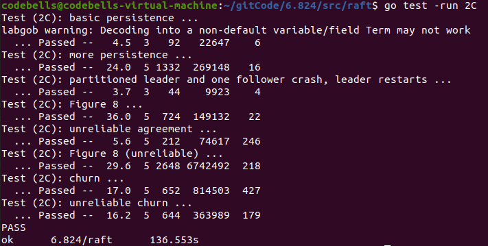

继续上次，将lab2C部分实现，2C部分C虽然只是持久化，代码量很小，但是测试数据变强了很多，想要通过2C的测试，需要对前两个lab的实验做到基本无错。记录一下踩的坑。

<!-- more -->

# 思路

做到这一步的时候，对于Lab2应该已经是思路十分清晰了，对于2C来说实现的话就是其状态的persist(持久化）为了能在机器crash的时候能够restore原来的状态。在论文中也指出了，需要持久化的只有这三个变量，日志，VotedFor还有CurrentTerm，其他不需要持久化，因为都可以根据这三个计算出来。

在这里的Figure 8 (unreliable)会测试之前的[冲突优化](https://codebells.github.io/post/raft-mit6-824-2b.html#%E6%97%A5%E5%BF%97%E5%A2%9E%E9%87%8FRPC%E5%AE%9E%E7%8E%B0)有没有完成。也就是在RPC的时候，如果有冲突，直接返回冲突的下标，或者term，然后返回冲突的下标，进行修改nextIndex[i]亦或者是term，达到减少RPC的次数。原文在page7最下方的引用。

>If desired, the protocol can be optimized to reduce thenumber of rejected AppendEntries RPCs. For example,when rejecting an AppendEntries request, the follower.can include the term of the conflicting entry and the first index it stores for that term. With this information, the leader can decrement nextIndex to bypass all of the conflicting entries in that term; one AppendEntries RPC will be required for each term with conflicting entries, rather than one RPC per entry. In practice, we doubt this optimization is necessary, since failures happen infrequently and it is unlikely that there will be many inconsistent entries.

代码上实现persist、与readPersist函数即可。


# 代码实现

实际上这实现的persist和readPersist没啥看的，就是个编码解码的过程，编码后调用实现好的SaveRaftState即可。

```go
func (rf *Raft) persistData() []byte {
	w := new(bytes.Buffer)
	e := labgob.NewEncoder(w)
	e.Encode(rf.currentTerm)
	e.Encode(rf.votedFor)
	e.Encode(rf.logs)
	e.Encode(rf.lastIncludedIndex)
	e.Encode(rf.lastIncludedTerm)
	data := w.Bytes()
	return data
}
func (rf *Raft) persist() {
	data :=rf.persistData()
	rf.persister.SaveRaftState(data)
}
func (rf *Raft) readPersist(data []byte) {
	if data == nil || len(data) < 1 { // bootstrap without any state?
		return
	}
	r := bytes.NewBuffer(data)
	d := labgob.NewDecoder(r)
	var currentTerm 		int
	var votedFor			int 
	var logs				[]LogEntry
	var lastIncludedIndex	int
	var lastIncludedTerm	int
	if d.Decode(&currentTerm) != nil ||
	   d.Decode(&votedFor) != nil || d.Decode(&logs) != nil || 
	   d.Decode(&lastIncludedIndex) != nil|| d.Decode(&lastIncludedTerm) != nil{
		log.Println("DecodeError")
	} else {
	  rf.currentTerm = currentTerm
	  rf.votedFor = votedFor
	  rf.logs=make([]LogEntry, len(logs))
	  rf.lastIncludedIndex=lastIncludedIndex
	  rf.lastIncludedTerm=lastIncludedTerm
	  copy(rf.logs,logs)
	}
}
```

# Debug

在lab2C里面，出现的错会很多，一遍一遍的捋，找到自己并发的错误，有时候就是某个数据没有及时更新的问题，一定要注意nextindex数组和MatchIndex数组还有commitIndex及时更新，否则会出现奇奇怪怪的错误。网络不稳定，可能会延迟、RPC乱序、丢失等因素。

处理乱序RPC可以在接收到RPC回复的时候，还要检查一下自己的状态。比如是不是还是leader；比如leader发送时候的term和收到时候的term是否一致，如果不符合，就说明由于延时等情况，收到了过期的RPC消息，这时候不应该处理任何消息

> TestPersist12C：基础测试，就是全部crash掉，然后再起来，看看你的数据掉没掉
>
> TestPersist22C：网络整乱一点，多台机器起了又宕，宕了又起
>
> TestPersist32C：3节点，网络分区，然后把2个节点的分区crash掉，边重启边插数据
>
> TestFigure82C：测试Figure 8 的安全提交
>
> TestUnreliableAgree2C：乱序提交
>
> TestFigure8Unreliable2C：疯狂乱序网络分区，整的一团糟，再测试你的Figure8，并且必须10s内选出主节点
>
> internalChurn：RPC不能太多，RPC检查




附上我的[Github实现代码](https://github.com/Codebells/Raft/tree/go_imp)仅供参考
