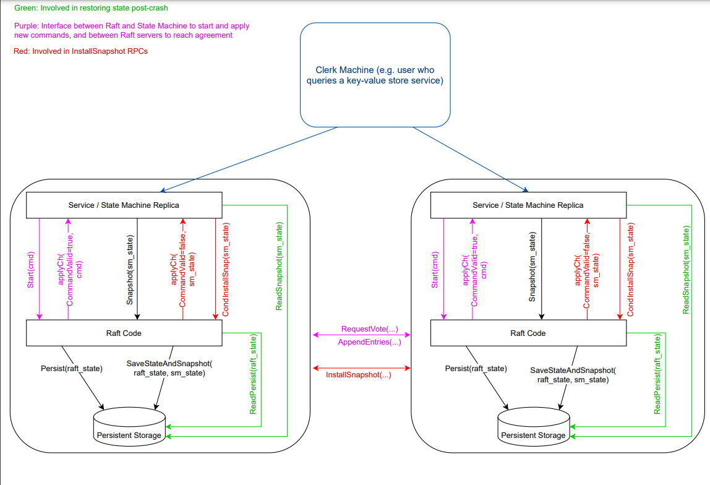

将lab2最后一个部分结束，经过前三个部分，Raft基本已经实现，还剩一个2D，保存快照，其实实现起来并不困难，但是目前还存在Bug没有找到，仅Pass一个，等有时间再来吧，Debug太痛苦了，完成这一个lab，花了一个多礼拜，期间写代码的时间不长，Debug的时间占据大部分。写完之后，对并发以及raft有了更深的了解。

<!-- more -->

# 思路

实现快照的思路也很简单，在前面的[论文部分](https://codebells.github.io/post/raft-paper.html#%E5%BF%AB%E7%85%A7)也说到过了，Raft 的日志在正常运行时会增长，以容纳更多的客户端请求，但在实际系统中，**它不能无限制地增长**。 随着日志变长，它会占用更多空间并需要更多时间来重播。 如果没有某种机制来丢弃日志中积累的过时信息，这最终会导致**可用性问题**。因此我们使用Snapshot（快照）来简单的实现日志压缩。在快照部分，除了客户端会主动发起快照请求，当follower节点的日志小于Leader节点的快照时，那么直接通过同步快照，将Follower节点同步，同步时将快照index之前的日志删除，对于日志所代表的index也得变成快照的index+日志index，才是真实的index。


# 代码实现

这一章仅作参考，因为我自己也没有通过测试，希望发现代码问题的朋友评论交流一下。

InstallSnapshot和LeaderSendSnapshot是RPC函数，这时2D实现比较多坑的点，目前我报的错是failed to reach agreement,2D的测试会将网络和RPC都搞的乱七八糟，而且日志很多，查起来很困难，暂时先写到这吧。详细思路还是看代码注释

再说一点，在2D，日志真实Index会根据快照的lastIncludedIndex计算，所以在使用时，需要进行一个index的转换，代码得改动

```go
//结构体的含义见上图
type InstallSnapshotArgs struct{
	Term 				int 
	LeaderId			int
	LastIncludedIndex	int
	LastIncludedTerm	int
	// Offset				int//Figure 13 对快照进行拆分需要Offset
	Data				[]byte
	// Done				bool	
}
type InstallSnapshotReply struct{
	Term			int
}
func (rf *Raft) CondInstallSnapshot(lastIncludedTerm int, lastIncludedIndex int, snapshot []byte) bool {
    //测试用的函数，如果其他的Leadersnapshot实现的完整，这个可以不用实现
    //to avoid the requirement that snapshots and log entries sent on applyCh are coordinated。
    //你发送了快照，那么你发送的快照就要上传到applyCh，而同时你的appendEntries也需要进行上传日志，可能会导致冲突。
	return true
}
func (rf *Raft) InstallSnapshot(args *InstallSnapshotArgs,reply *InstallSnapshotReply){
	rf.mu.Lock()
	defer rf.mu.Unlock()
	if args.Term<rf.currentTerm||args.LastIncludedIndex<rf.lastIncludedIndex{  
        // 正常情况不会出现，但是乱七八糟的并发时有可能出现发过来的快照是旧快照
		reply.Term=rf.currentTerm
		return 
	}
	rf.currentTerm=args.Term//更新Term
	reply.Term=args.Term
	if args.LastIncludedIndex<rf.getLastIndex(){
        //如果快照的index比server的最后一条entry的index小，说明server应用了快照之后，日志还存在数据
		rf.lastIncludedIndex=args.LastIncludedIndex
		rf.lastIncludedTerm=args.LastIncludedTerm
		newLogs := make([]LogEntry,0)
		newLogs = append(newLogs,LogEntry{
			Term:	rf.lastIncludedTerm,
		})
		for snapIndex:=1;snapIndex<rf.getLogLenth();snapIndex++{
			if rf.getReorderedLogIndex(snapIndex)>args.LastIncludedIndex{
                //getReorderdLogIndex(i)就是 lastIncludedIndex+i，得到应用snapshot后的index
				newLogs=append(newLogs,rf.logs[snapIndex])
			}
		}
		if rf.commitIndex<args.LastIncludedIndex{
			rf.commitIndex=args.LastIncludedIndex
		}
		if rf.lastApplied<args.LastIncludedIndex{
			rf.lastApplied=args.LastIncludedIndex
		}
		rf.logs=newLogs
	}else{
		// 如果快照的index不小于server的最后一条entry的index，说明server应用了快照之后，日志不存在数据，直接清空即可
		rf.lastIncludedIndex=args.LastIncludedIndex
		rf.lastIncludedTerm=args.LastIncludedTerm
		newLogs := make([]LogEntry,0)
		newLogs = append(newLogs,LogEntry{
			Term:	rf.lastIncludedTerm,
		})
		if rf.commitIndex<args.LastIncludedIndex{
			rf.commitIndex=args.LastIncludedIndex
		}
		if rf.lastApplied<args.LastIncludedIndex{
			rf.lastApplied=args.LastIncludedIndex
		}
		rf.logs=newLogs
	}
    //应用快照后，发送ApplyMsg
	msg := ApplyMsg{
		SnapshotValid: true,
		Snapshot:      args.Data,
		SnapshotTerm:  rf.lastIncludedTerm,
		SnapshotIndex: rf.lastIncludedIndex,
	}
	rf.applyCh<-msg
	rf.persister.SaveStateAndSnapshot(rf.persistData(),args.Data)
}

func (rf *Raft) leaderSendInstallSnapshot(server int){
	args:=InstallSnapshotArgs{
		Term :				rf.currentTerm,
		LeaderId:			rf.me,
		LastIncludedIndex:	rf.lastIncludedIndex,
		LastIncludedTerm:	rf.lastIncludedTerm,
		Data:				rf.persister.ReadSnapshot(),
	}
	reply:=InstallSnapshotReply{}
	ok := rf.peers[server].Call("Raft.InstallSnapshot", &args, &reply)
	if rf.state != Leader || rf.currentTerm != args.Term {
		return
        //防止并发修改问题
	}
	if reply.Term > rf.currentTerm{//发送了旧快照，当前是旧leader，变为follower
		rf.becomeFollower()
		rf.currentTerm=reply.Term
		rf.persist()
	}
	rf.updateNextAndMatch()//next和match数组记得更新
	if !ok{
		return 
	}
}
//index代表是快照apply应用的index,而snapshot代表的是上层service传来的快照字节流，包括了Index之前的数据
// 这个函数的目的是把安装到快照里的日志抛弃，并安装快照数据，同时更新快照下标，属于peers自身主动更新，与leader发送快照不冲突
func (rf *Raft) Snapshot(index int, snapshot []byte) { 
	rf.mu.Lock()
	defer rf.mu.Unlock()
	if rf.commitIndex<index || rf.lastIncludedIndex>=index{  
        // 如果commitIndex < index ，那就不能打快照，因为还没提交到这个位置
		//如果rf.lastIncludedIndex>=index，那就是已经打过这个快照或者更新的快照了，不需要再打这个快照了
		return 
	}
	newLogs := make([]LogEntry,0)
	newLogs = append(newLogs,LogEntry{Term : rf.getLogTerm(index)})
	for i:=index+1;i<=rf.getLastIndex();i++{
		newLogs=append(newLogs,rf.logs[rf.getLogIndex(i)])
	}
    //丢弃index之前的日志
	rf.lastIncludedTerm=rf.getLogTerm(index)
	rf.lastIncludedIndex=index
	if rf.commitIndex<index{
		rf.commitIndex=index
	}
	if rf.lastApplied<index{
		rf.lastApplied=index
	}
    //更新commitIndex和lastApplied
	rf.logs=newLogs
	rf.persister.SaveStateAndSnapshot(rf.persistData(), snapshot)
}
```

还有一点就是Leader发送快照的时机需要把握，我的判断是当nextIndex[]小于rf.lastIncludedIndex时就发送快照，快速同步，这个判断在发送日志同步的RPC中进行，也就是sendAppendEntries。

```go
if rf.nextIndex[server]-1 < rf.lastIncludedIndex{
	go rf.leaderSendInstallSnapshot(server)
	return 
}
```

# 框架总览

多理解Raft的框架，还是有助于理解整个raft集群的交互过程的，首先是客户机会发送查询给状态机，在单个节点上状态机会根据客户机的请求以及节点状态判断发送命令。我们编写的代码就是单个节点Service和RaftCode以及Persistent Storage的交互过程，主要还是RaftCode，剩下的大部分都是框架自己实现的。对于2D，Service节点调用Snapshot、与CondInstallSnap两个函数，所以需要我们来编写这个进行测试。对于2B，Service发送Start(cmd)，RaftCode接收到，和其他节点进行RPC调用，可能当前节点超时了，那就变为Candidate发送RequestVote，进行选举。要不然就是Leader节点进行发送AppendEntriesRPC进行广播同步数据。期间，RaftNode会对数据和快照持久化到Persistent Storage中，当有需要的时候，就会读取持久化的数据，读快照的过程由状态机完成。



因为snapshot其实就是service对raft节点调用的，使raft节点更新自身的快照信息。这样有的人可能会认为这样违反了Raft的强领导者原则。 因为跟随者可以在领导者不知情的情况下更新自己的快照。但是其实这种情况其实是合理的，更新快照只是为了更新数据，与达成共识并不冲突。数据仍然只是从领导者流向下层，followers只是通过快照去减轻它们的存储负担。这个在论文中有提到。

# Debug踩坑

对于2D，花了很多时间Debug，但是找出来的bug寥寥无几，2D的代码其实并不难，只能说是比较繁琐，对于ABC中使用的下标的更改，改完进行回归测试，然后对于SendSnapshot的时机需要把握

1. NextIndex数组更改的时机，其实这个bug，我很困惑，为什么在发送日志同步的时候同步nextIndex还有在Leader发送快照时更新发送目标节点的nextIndex还不够，需要将整个nextIndex都更新才能通过，这个bug倒是好找，但是不理解
2. 还是要细心吧，apply了snapshot之后，新的日志的第0个也应该是空，并且最好设为lastIncludedTerm

没有通过全部测试，不放截图了

放个自己实现的[Github链接](https://github.com/Codebells/Raft/tree/go_imp)仅供参考吧
