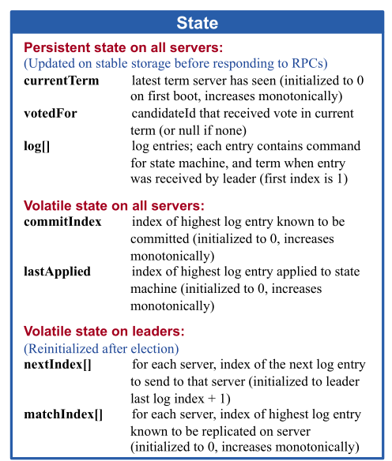
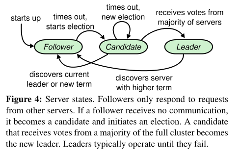

​		Raft属于是分布式领域非常常见的一个共识算法了，上一篇也对其进行比较详细的介绍，其实就是对论文的思路进行理解，这次借着课程作业来对其实现一下，Raft的思路很简单，实现之前，我以为会很容易，但是上手写的时候，发现特别多的问题，尤其是并发，下面几篇记录一下我踩得坑，以及详细的思路解释。对于2A，因为跑的速度比较快，跑了5000次没有出错，应该还算是稳健。

<!-- more -->

# 思路

推荐几个有助于实现Raft的网站
先推荐一个[Raft动态展示](https://raft.github.io/)的网站，可以点击看每次发送的RPC数据是什么，相当清晰，对于实现Raft很有用
一个帮助[Go入门](https://gobyexample.com/)的学习网站，主要看Channel和Time还有Goroutine
Mit的[StudentGuide](https://thesquareplanet.com/blog/students-guide-to-raft/)可以看看，顺便[Lab2主页](http://nil.csail.mit.edu/6.824/2021/labs/lab-raft.html)
这个[Raft动态展示](http://thesecretlivesofdata.com/raft/)也不错

写之前强烈建议看一遍论文，论文已经提到很多细节的设计。之前的博客是基于论文写的。

StudentGuide提到Channel传递消息和Locking两个代码组织方式，他更推荐 shared structure + lock，因为”Experience suggests that for Raft it is most straightforward to use shared data and locks“，但是我还是使用了Channel消息驱动的方式实现。

# 结构体

结构体，论文中已经设计好了，直接拿来用即可，中间加点自己实现时需要的成员变量



```go
type Raft struct {
	mu        			sync.Mutex          // Lock to protect shared access to this peer's state
	peers     			[]*labrpc.ClientEnd // RPC end points of all peers
	persister 			*Persister          // Object to hold this peer's persisted state
	me        			int                 // this peer's index into peers[]
	dead      			int32               // set by Kill()

	// Your data here (2A, 2B, 2C).
	// Look at the paper's Figure 2 for a description of what
	// state a Raft server must maintain.
	currentTerm int
	votedFor    int
    voteCount   int
    state       NodeState
    //对于2A下面的没有什么作用，是2B和2C使用的变量
	logs        []LogEntry
	commitIndex int
	lastApplied int
	nextIndex  []int
	matchIndex []int
    //下列自定义，看个人实现方法
	applyCh     chan ApplyMsg
	winElectCh  chan bool
	grantVoteCh chan bool
	heartbeatCh chan bool
	//这是2D使用的变量
	lastIncludedIndex	int
	lastIncludedTerm 	int
}
```


```go
type AppendEntriesArgs struct{
	Term 			int
	LeaderId		int
	//2B 2C使用
	PrevLogIndex	int
	PrevLogTerm		int
	Entries			[]LogEntry
	LeaderCommit	int
}
type AppendEntriesReply struct{
	Term 			int
	Success			bool
    //2B 2C使用
	RollBackIndex 	int
	RollBackTerm  	int
}
```

RPC所传输数据记得大写字母开头，否则报错


```go
type RequestVoteArgs struct {
	// Your data here (2A, 2B).
	Term			int
	CandidateId		int
	//下列2B使用
	LastLogIndex	int
	LastLogTerm		int
}
// field names must start with capital letters!
type RequestVoteReply struct {
	// Your data here (2A).
	Term 			int
	VoteGranted		bool
}
```


# 领导者选举

首先对于各个节点的状态转换要了解，下面捋一遍节点选举流程。



当集群刚启动时，整个集群不存在Leader，在节点的各自等待时间超时后，那么这个节点成为Candidate开始选举，触发了选举条件后，该节点的Term需要加1，以此表明该轮投票是较新的，成为Candidate后会立刻广播请求其他节点投票的RPC，其他节点会根据Term的大小和日志的大小进行判断，如果接收节点的Term比Candidate大，那么拒绝投票，如果接受节点Term和Candidate一致，但是日志比Candidate的新，那么也拒绝投票，满足上述条件后，如果该节点没有对其他Candidate投票，那么对其进行投票。

当Candidate节点收到的投票数超过一半时，立刻成为Leader，成为Leader后立刻对其他所有节点发送心跳包，表明Leader身份，选举成功。当有节点等待超时后，就会再次触发选举操作。

要注意一些细节就是超时时间的重置问题，我因为使用了简单的阻塞Channel，导致后续代码的死锁，应该使用非阻塞Channel通信，超时时间在两个地方重置

1. 收到Leader的心跳包时
2. 成功投票时

下面看看代码实现

# 源代码实现

## 入口函数Make

在lab6.824中，所有Raft节点初始化都需要通过入口函数，初始化后会建立主体的心跳ticker

```go
func Make(peers []*labrpc.ClientEnd, me int,
	persister *Persister, applyCh chan ApplyMsg) *Raft {
	rf := &Raft{}
	rf.peers = peers
	rf.persister = persister
	rf.me = me
	// log.Printf("")
	// Your initialization code here (2A, 2B, 2C).
	rf.state = Follower
	rf.currentTerm = 0
	rf.votedFor = -1
	rf.voteCount = 0
	rf.commitIndex = 0
	rf.lastApplied = 0
	rf.applyCh = applyCh
	rf.lastIncludedIndex=0
	rf.lastIncludedTerm=0
	rf.resetChannels()
	rf.logs = append(rf.logs, LogEntry{Term: 0}) // 日志第一个为空

	// initialize from state persisted before a crash
	rf.readPersist(persister.ReadRaftState()) //2C实现

	// start ticker goroutine to start elections
	go rf.ticker()
	return rf
}
```

## 主体循环函数ticker

建立心跳后，会接收节点运行中Goroutine发送的Channel消息，通过接收消息来达到触发某段代码的目的。

```go
// The ticker go routine starts a new election if this peer hasn't received
// heartsbeats recently.
func (rf *Raft) ticker() {
	for rf.killed() == false {
		rf.mu.Lock()
		state := rf.state
		rf.mu.Unlock()
		switch state {
		case Leader:
			select {
			case <-rf.heartbeatCh://一般不会出现这种情况，因为心跳一般由Leader发送，Followers接收
			//这有可能是存在旧Leader的情况，收到新Leader的心跳包，正在变成Followers但是还没来得及变的情况
			case <-time.After(100 * time.Millisecond)://每过一段时间，Leader给其他节点发送心跳包
				rf.mu.Lock()
				rf.broadcastAppendEntries()
				rf.mu.Unlock()
			}
		case Follower:
			select {
			case <-rf.grantVoteCh://之前在领导者选举中提及的Follower两种重置超时时间的情况
			case <-rf.heartbeatCh:
			case <-time.After(rf.getTimeout() * time.Millisecond):
				rf.becomeCandidate()
			}
		case Candidate:
			select {
			case <-rf.heartbeatCh://当成为Candidate时，需要重置超时时间
			case <-rf.winElectCh://赢得选举时，成为Leader
				rf.becomeLeader()
			case <-time.After(rf.getTimeout() * time.Millisecond):
				rf.becomeCandidate()
			}
		}
		// Your code here to check if a leader election should
		// be started and to randomize sleeping time using
		// time.Sleep().
	}
}
```

## RequestVoteRpc实现

这是领导者选举最主要的代码，Candidate发送RPC，Follower接收RPC，最终Candidate归拢投票，判断自己是否选举成功

```go
func (rf *Raft) isLogTheLatest(LastIndex int, LastTerm int) bool {
    //判断rf日志是否比参数更新，如果更新返回False
	if LastTerm == rf.getLastTerm() {
		return LastIndex >= rf.getLastIndex()
	}
	return LastTerm > rf.getLastTerm()
}
func (rf *Raft) VoteCheck(args *RequestVoteArgs) bool{
	if rf.votedFor < 0 || rf.votedFor == args.CandidateId{
        //投票检查，判断是否投过票了，或给这个Candidate投过票了，防止存在RequestVote重复请求的问题
		if rf.isLogTheLatest(args.LastLogIndex, args.LastLogTerm){
            //如果没投过票，或者给这个Candidate投了票，进行判断，如果Candidate的日志更新，那就可以投票
			return true
		}
	}
	return false 
}
func (rf *Raft) RequestVote(args *RequestVoteArgs, reply *RequestVoteReply) {
	// Your code here (2A, 2B).
	rf.mu.Lock()
	defer rf.mu.Unlock()
	defer rf.persist()

	if args.Term < rf.currentTerm {//当前节点的Term比Candidate更大，不进行投票，更新reply的Term
		reply.Term = rf.currentTerm
		reply.VoteGranted = false
		return
	}else if args.Term > rf.currentTerm {//当前节点是旧Term节点，已经过时
		rf.becomeFollower()//不管当前什么状态，更新当前节点状态成为Follower
		rf.currentTerm=args.Term
		reply.Term = rf.currentTerm
		reply.VoteGranted = false
		if rf.VoteCheck(args){//投票检查，若可以投票，更新心跳及其他信息
			reply.VoteGranted = true
			rf.votedFor = args.CandidateId
			rf.noBlockChan(rf.grantVoteCh, true)
		}
	}else{//当前节点Term和Candidate相同，一般情况下不会投票了，因为成为Candidate时Term会加1，
        //当前的节点Term和Candidate相同，有几种情况，
        //1.同为Candidate 2.已经给Candidate投过票了 3.选举成功的Leader
        //这个判断用于处理同一个Candidate重复发起投票请求
		reply.Term = rf.currentTerm
		reply.VoteGranted = false
		if rf.VoteCheck(args){
			reply.VoteGranted = true
			rf.votedFor = args.CandidateId
			rf.noBlockChan(rf.grantVoteCh, true)
		}
	}
	
}

func (rf *Raft) sendRequestVote(server int, args *RequestVoteArgs, reply *RequestVoteReply) {
	ok := rf.peers[server].Call("Raft.RequestVote", args, reply)//RPC调用
	if !ok {
		return
	}
	rf.mu.Lock()
	defer rf.mu.Unlock()
	if rf.state == Candidate && args.Term == rf.currentTerm{
        //当节点状态没有改变才进行下列步骤，防止并发时，节点状态已经更改，当前args过时
		if reply.Term > rf.currentTerm {//Candidate不够新，没有Follower新，降级为Follower
			rf.becomeFollower()
			rf.currentTerm = reply.Term
			rf.persist()//2C持久化状态
			return
		}else if reply.Term == rf.currentTerm{
			if reply.VoteGranted {//如果Server节点投票给Candidate，检查当前得票是否已经超过半数了
				rf.voteCount++
				if rf.voteCount == len(rf.peers)/2 +1 {
                    //超过半数立刻赢得选举，==因为只发送以此赢得选举Channel信息
					rf.noBlockChan(rf.winElectCh, true)
				}
			}
		}
	}
}
func (rf *Raft) broadcastRequestVote() { 
	if rf.state == Candidate {//必须是Candidate才能广播投票
		for server := range rf.peers {
			if server != rf.me {
				args := RequestVoteArgs{//初始化
					Term:         	rf.currentTerm,
					CandidateId:  	rf.me,
					LastLogIndex: 	rf.getLastIndex(),
					LastLogTerm:  	rf.getLastTerm(),
				}
				reply := RequestVoteReply{
					Term:			rf.currentTerm,
					VoteGranted:	false,
				}
				go rf.sendRequestVote(server, &args, &reply)
			}
		}
	}
}
```

## 心跳建立

其实对于2A而言，只需要Follower收到后进行重置超时时间即可，并不需要实现日志增量的过程比较简单

下列是我的第一版代码，很多东西还是存在bug的，仅够通过2A，后续这个AppendEntries还会更改

```go
func (rf *Raft) AppendEntries(args *AppendEntriesArgs, reply *AppendEntriesReply) {
	rf.mu.Lock()
	defer rf.mu.Unlock()
	reply.Success=false
	if rf.currentTerm>args.Term{//判断Leader是否为最新的Term，即是否过时Leader
		reply.Term =rf.currentTerm
		return
	}
	if rf.currentTerm<args.Term{//不是过时Leader，那么更新心跳
		if rf.state!=Follower{//如果不是Follower，收到Leader的广播后，成为Follower
			rf.currentTerm=args.Term
			rf.becomeFollowerFlag<-true//成为Follower的Channel信息
		}
		//rf.Logcheck()
        rf.heartbeat<-true
		reply.Success=true
	}
	
}
func (rf *Raft) sendAppendEntries(server int,args *AppendEntriesArgs, reply *AppendEntriesReply) bool {
	ok := rf.peers[server].Call("Raft.AppendEntries", args, reply)
	//heartbeat
	if reply.Term>rf.currentTerm{//如果reply的Term大于当前节点Term，那么当前节点是过时节点，成为Follower
		rf.currentTerm=reply.Term
		rf.becomeFollowerFlag<-true
		return ok
	}
	if reply.Success{
		//log
	}
	return ok
}
```


## 状态变化代码

```go
func (rf *Raft) becomeLeader() {
	rf.mu.Lock()
	defer rf.mu.Unlock()
	if rf.state == Candidate {//Leader只能由Candidate转换
		rf.state = Leader
		rf.resetChannels()
		rf.nextIndex = make([]int, len(rf.peers))
		rf.matchIndex = make([]int, len(rf.peers))
		for server := range rf.peers {
			rf.nextIndex[server] = rf.getLastIndex() + 1
		}
		rf.broadcastAppendEntries()//成为Leader后立刻广播一次心跳
	}
}
func (rf *Raft) becomeCandidate() {
	rf.mu.Lock()
	defer rf.mu.Unlock()
	rf.resetChannels()
	rf.state = Candidate
	rf.noBlockChan(rf.heartbeatCh, true)
	rf.currentTerm++
	rf.votedFor = rf.me
	rf.voteCount = 1
	rf.persist()
	rf.broadcastRequestVote()
	
}
func (rf *Raft) becomeFollower() {
	rf.state = Follower
	rf.votedFor = -1
	// rf.persist()
	rf.noBlockChan(rf.heartbeatCh, true)
}
```


# Debug及踩坑

1. 使用Channel时，我一开始使用的是阻塞方式Channel，当数据消息传输不频繁时，不会出现什么问题，但是当并发度提高后，问题就出现了，会导致无限等待的情况，因为当这边的Channel发送后，那边的Channel还没接收到，在运行别的地方的代码，mutex.Lock锁就会有死锁的可能，造成无限等待。后续改成非阻塞Channel，就能解决这个问题，猜测使用缓冲区应该也可，但是有可能出现传递旧消息的情况，有风险，不推荐使用缓冲区。
2. 领导者选举时，需要尽快选出新Leader，在后续Test中出现 failed to reach agreement，需要合理的重置ElectionTimeout的时间，否则很可能造成长时间等待，除此之外，设置心跳超时时间也是很重要的，不能太长，也不能太短。后续测试时，会将网络搞的很乱，一下这个宕机，一下那个宕机，写一堆日志，在这种测试下，10s内没选出Leader，就会导致Failed to reach agreement。(我的实现不完美，ABC能稳过，D会出现这个问题)
3. 各个参数的初始化的位置一定不能搞错，我因为将args初始化，放在了Broadcast中for循环外边导致错误，整整debug了一整个下午。因为当args初始化在for循环外边的时候，当发送了一个Rpc后，可能会将args更改。

>- TestInitialElection2A：选举过程检查，3个节点，检查是否只有一个Leader，相同的Term，并且Term>=1
>- TestReElection2A：超时后重新选举过程，第一轮选举后，断开Leader，再看集群是否只存在一个Leader，再连接旧Leader，查看是否存在一个Leader，再断开两个，查看是否没有Leader
>- TestManyElections2A：7个节点随机断开三个节点再连接，重复，期间检查选举是否正确


附上我的[Github实现代码](https://github.com/Codebells/Raft/tree/go_imp)仅供参考
