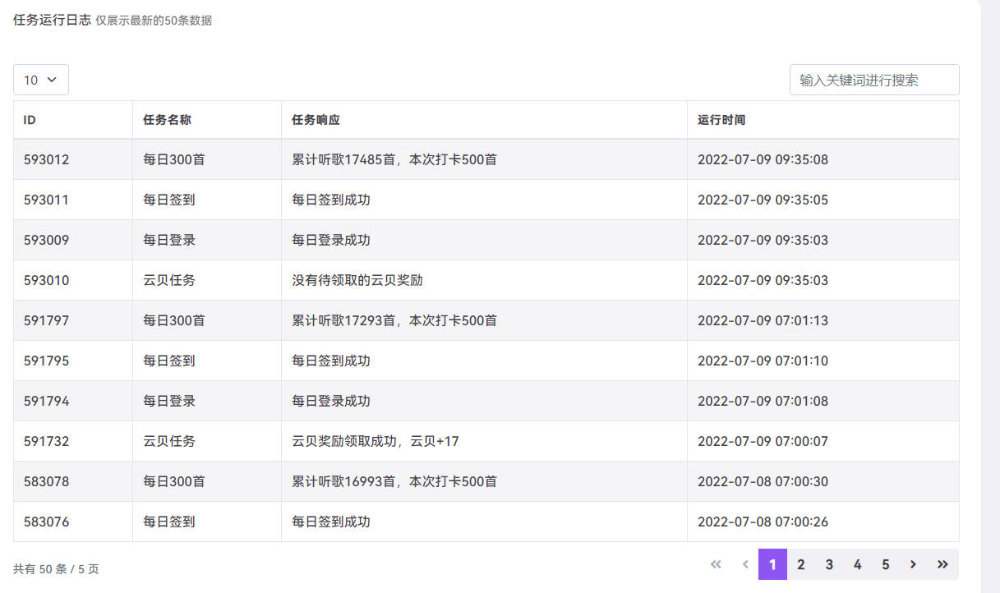
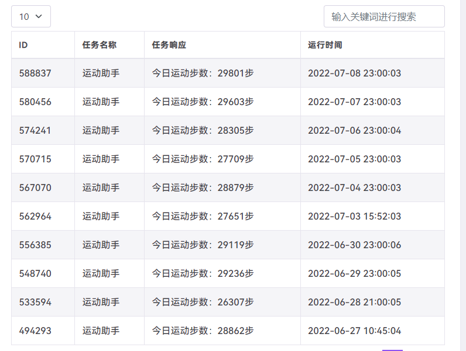

一些自己用的脚本，网易云日常及单曲听歌次数，微信步数，贴吧签到，B站日常等

没啥用，但是挂着玩玩

尽量使用真实QQ注册吧，当账号失效时会发送QQ邮件提醒

**仅自用，非盈利，勿分享**，注册送3个月使用，到期可以给我发邮件，**免费**给续

<!-- more -->

**1347103071@qq.com**

网站的支付功能没开，本来想收费的，但是需要易支付的API，要花钱，想想估计也没啥人买，就懒得搞了，有啥需求邮件联系

刚开始挂的时候，自己的网易云音乐会经常掉线，重新登陆一下即可，后面就不会了

# 网易云日常

# 微信支付宝步数

我主要是为了搞蚂蚁森林能量

# 网址

http://codebells.uvgg.com/

使用不收费，支持运行服务器可以随缘给个噢

