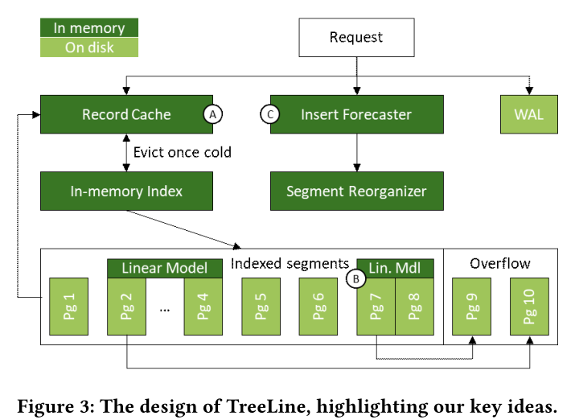
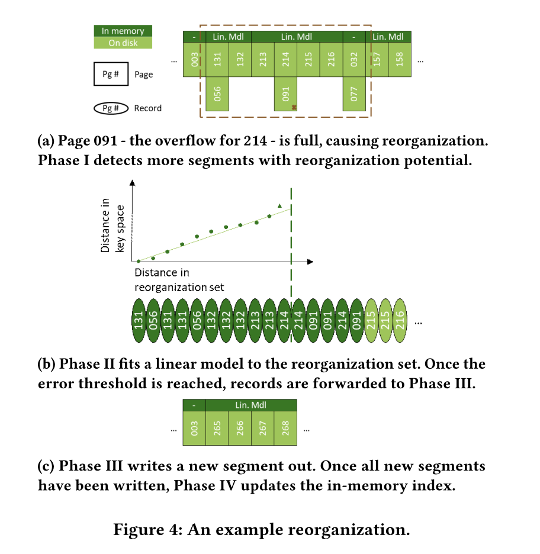
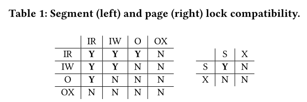
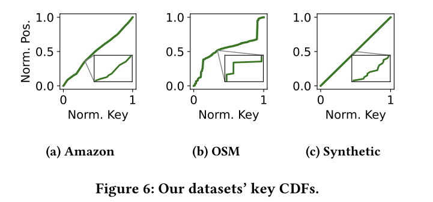
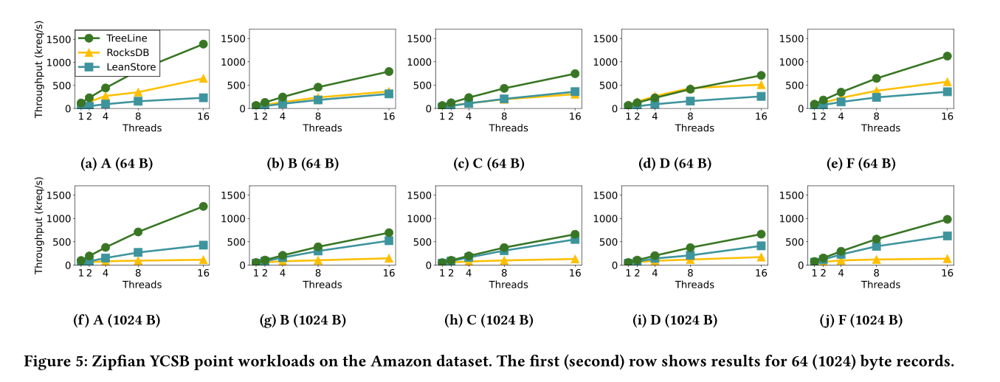
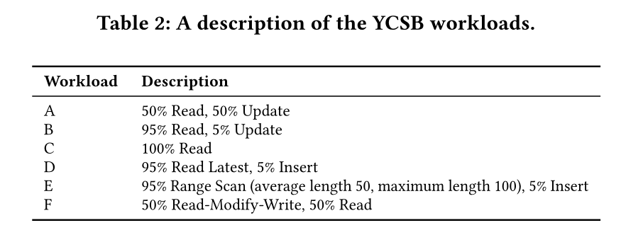
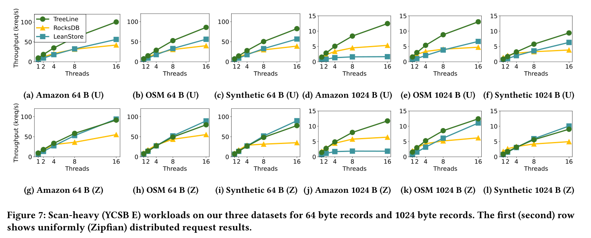
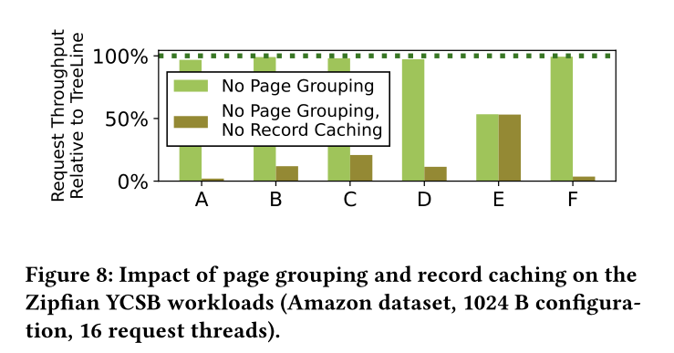
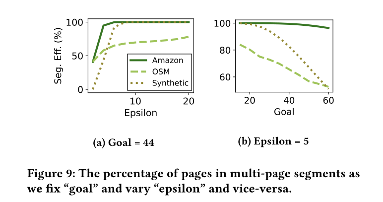
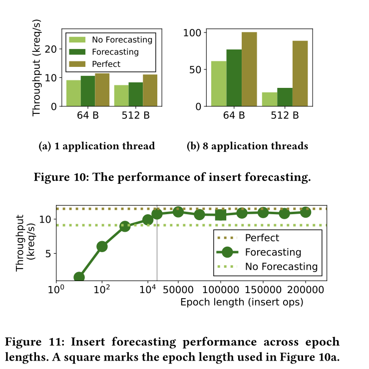

# 摘要

LSM Tree将随机写变为顺序写，提高了写性能，但是它必须依赖于压缩以及布隆过滤器来维持读性能。但是NVMe SSD的出现，读写性能的Tradeoff就不需要再考虑了，在并发的情况下，在原地更新的方案也可以提供优异的读写性能，是一个可以替代LSM Tree的方案。

3个点

1. record caching for efficient point operation
   - 将热数据记录尽可能缓存，并且存储到尽可能一个page上
2. page grouping for high-performance range scans
   - 对page分组，将key值相邻的优先分到一起，让他们连续存储，对scan更友好。
   - 对于索引只需要存page group的索引，可以让内存中的索引表变得更小
3. insert forecasting to reduce the reorganization costs of accommodating new records
   - 根据观察到的插入，预测在page需要预留出多大的空间

---

RocksDB和LevelDB都是使用LSM树的，LSM树的基础概念就是writebatch，先在内存写，memtable到一定规模了再全部写入到存储，到存储就不可变了，并且存储会进行异步的压缩。核心思想就是将随机写变为顺序写，但是影响读性能，一条记录可能出现在多个块上。但是这种trade off在传统磁盘是个很好的选择，但是现在NVMe SSD，在并行度足够高时，随机写是可以达到顺序写入吞吐量峰值的。

# TreeLine

**查询流程**：先查内存的缓存，如果缓存未命中那么查内存index，映射到对应的数据段，把对应的page读到内存，如果还是没找到，就去OverFlow page找，如果还是没找到，就返回未找到。

**数据更改流程**：insert，update，delete先创建或者更新缓存中的record的entry，如果没在内存，那TreeLine先用index找对应的page，读入内存，然后执行操作

**范围查询**：和查询一样，但是缓存和磁盘都得查，然后以key的顺序来合并，如果有重复的，缓存数据将覆盖disk的数据

## 1. Record Cache(Key Idea A)

### Cache Admittance

当TreeLine同意记录进入缓存时，都会给一个优先级$0\rightarrow P_{max} $后续的每次访问都会增加优先级。

数据记录在三种情况下可以进入缓存，

> 1. 用户的任意数据修改（insert，update，delete），赋予初始优先级$P_{mid}=P_{max}/2$，如果缓存未缓存这个entry，TreeLine会清理一些entry
> 2. 查询未缓存的记录，赋予初始优先级$P_{mid}$并缓存
> 3. 在查询或修改时，缓存同一个page的数据，赋予初始优先级$P_1$

### Cache Evivtion

使用clock algorithm，周期性的降低优先级直到找到一个entry优先级为0，如果该entry被修改过，那么找下一个，因为如果被修改过，就需要先IO将其刷回到磁盘，我们希望减少IO操作，如果entry全是脏的，就把所有脏entry一起写入，到一个page

## 2. In-Memory Index

B+树索引，在换出脏页时会映射到合适的位置去写，以及查询时，映射到合适的位置去读

index存在$key \rightarrow segment$的映射segment到page直接用二分查，因为是线性模型，segment有序

index的更新只在reorganization时发生

### Pages and Segments

Page，沿用LeanStore的Page设计，该Page负责一个范围的key值，该范围在创建时定义

Segment是1个或多个page组成

## 3. Supproting a Growing Database(Key Idea B)

### Overflow Pages

当data page满了，TreeLine分配一个Overflow page，这个page不被index索引，这个Overflow page布局类似base page，继承负责相同的key range，当Overflow page满了，这个Segment就得reorganized

### Page Orderings

physical order，物理存储的顺序

logical order ，ssd driver自己抽象出来的逻辑上的顺序

key order，TreeLine中每个page负责一个key range，以这个key的下界排序

### Reorganization

4个阶段，range detection后是一次或者多次model building和segment write-out，再是index update

#### Phase 1：Range detection

在某个Segment的overflow page满了之后需要reorganization，会将相邻的r(默认为5)个Segment检查，如果存在overflow page就一起reorganize，也就是一次性最多reorganization 2r+1个segment

#### Phase 2：Model building

PGM index’s piecewise linear regression algorithm，我的理解是用这个可以将page更合理的放在尽可能少的Segment中。

线性模型让空间效率提高，并且提供了可接受的准确率。我们可以通过配置错误阈值 epsilon来实现一个正确率和空间利用率的trade off

一旦到错误阈值，Phase 2结束，已经处理过的数据records会发送到Phase 3作为write out set，并且在重复Phase 2之前移出reorganization set。

第二阶段的迭代会在3个情况下停止

1. reorganization set适合单个页面，无需任何模型，直接转发到Phase3
2. 已经超过为reorganization预留的内存空间了，在模型构建期间，保存处理过record的page都在内存里，此时直接转发records和模型到Phase3
3. 处理了足够的record来适应16 page segment

#### Phase 3： Segment Write-out

从Phase2接收到Write out set和model，一个linear model就是一个segment，在磁盘上找一个连续空间将其存储。page数量由write out set 和自定义参数goal来确定，goal的含义是，一个page的存储率，也就是刚重组时填多少个record。而且Treeline的Segment大小只能为1，2，4，8，16pages，所以如果发过来10个page，只会分配8page的segment，将剩下的两个page的record返回reorganization set。并且生成segmentID

#### Phase 4：Index Update

当reorganization set为空时则更新in-memory index，表明reorganization结束了。之前的所有entries相关的数据全部删除，将SegmentID标为0，并加入到free list中，以后reorganization可能会将其覆盖

## 4. Insert Forecasting(Key Idea C)

### Tracking Insert

把Workload分为Epochs，每x个insert(默认100000)为一个epoch，每个epoch建立b个partitions的直方图，每个epoch使用前一个epoch生成的直方图预测未来的可能插入，分区按照上一个epoch的数据来确定上下界。

### Generating Forecasts

通过这个直方图预测未来f个epoch的直方图

### Utilizing Forecast

设置目标Goal，尽可能减少reorganization的同时减少空间浪费

### Interaction with Page Grouping

预测插入可能会影响Goal参数的设定，进而影响epsilon参数，再影响到线性模型的构建

## 5. Thread Synchronization

两种锁，Segment lock和Page lock

Segment locks can be acquired in **I**ntention **R**ead, **I**ntention **W**rite, re**O**rganization or re**O**rganization e**X**clusive mode. Page locks can be acquired in **S**hared or e**X**clusive mode.

reorganization在第一阶段结束加O锁，第四阶段开始加OX锁

# Evaluation

和LSM-Based system及其他update in place system比较

数据集线性与否，累计分布函数，越是一条直线，越容易被linear model拟合

## 系统对比

RocksDB：LSM-Based system
LeanStore：先进的 update-in-place KV system

1. 利用缓存record来减少写放大问题
2. 提供高效的读

hot key不在同一个page，并且record 64B，page4KB，读写放大太严重，hot key的record不全在内存。

RocksDB的LSM设计导致需要读放大

**三个真实数据集下跑YCSB E**

当record是1024B，page是4KB的时候，LeanStore的性能就上来了，因为读写放大问题不再严重

## Record Cache和Page Grouping的性能提升

AMZON的数据集，Record大小为1024，16个线程

结论

1. Record Cache在读写负载中减少了读写放大
2. Page grouping的开销不大，不会造成性能影响
3. Page grouping可以加速Scan

## Page Grouping的两个参数对性能的影响

Epsilon越大，意味着错误阈值越高，可以有更多的record来拟合模型，并且可以一个Segment可以有更多的page

Goal越大，意味着一个page预留的位置越小，后续reorganization次数越多

## Insert forecasting的影响

50读50插入，Epoch为100000，直方图分区数b为20000，预测的为未来100个epoch。

在record为64B时更有效，这意味着，reorganization次数会因为预测减少的效果更显著。

epoch粒度越细，不仅预测不准而且影响性能
